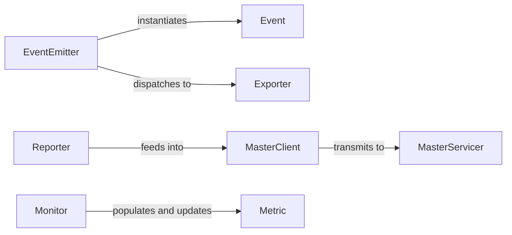

## Details

The `Event & Metrics Bus` subsystem provides a standardized mechanism for emitting, collecting, and exporting structured events and performance metrics across the DLRover system. It acts as a central channel for various components to report their status and activities, crucial for monitoring and diagnostics in a distributed ML environment.

### EventEmitter
The primary component for generating and dispatching structured events within the training system. It acts as the entry point for components to report their activities.

**Related Classes/Methods**:

- <a href="https://github.com/intelligent-machine-learning/dlrover/blob/master/dlrover/python/training_event/emitter.py" target="_blank" rel="noopener noreferrer">`dlrover.python.training_event.emitter`</a>

### Exporter
An abstract interface defining the contract for exporting events and metrics to various destinations. AsyncExporter is a concrete, asynchronous implementation that buffers events and exports them in a separate thread to minimize performance impact.

**Related Classes/Methods**:

- <a href="https://github.com/intelligent-machine-learning/dlrover/blob/master/dlrover/python/training_event/exporter.py" target="_blank" rel="noopener noreferrer">`dlrover.python.training_event.exporter`</a>

### Reporter
A general-purpose utility function for low-level event reporting, often used for direct logging or feeding events to the MasterClient for centralized collection.

**Related Classes/Methods**:

- <a href="https://github.com/intelligent-machine-learning/dlrover/blob/master/dlrover/python/common/event/reporter.py" target="_blank" rel="noopener noreferrer">`dlrover.python.common.event.reporter:report`</a>

### Monitor
Responsible for actively collecting and aggregating performance metrics from various nodes, populating and updating Metric instances.

**Related Classes/Methods**:

- <a href="https://github.com/intelligent-machine-learning/dlrover/blob/master/dlrover/python/common/metric/monitor.py" target="_blank" rel="noopener noreferrer">`dlrover.python.common.metric.monitor`</a>

### MasterClient
The client-side component on agent nodes responsible for transmitting events and metrics to the DLRover master, facilitating distributed data collection.

**Related Classes/Methods**:

- <a href="https://github.com/intelligent-machine-learning/dlrover/blob/master/dlrover/python/elastic_agent/master_client.py" target="_blank" rel="noopener noreferrer">`dlrover.python.elastic_agent.master_client`</a>

### MasterServicer
The server-side component on the master node responsible for receiving and processing events and metrics reported by agent MasterClient instances, acting as the central aggregation point.

**Related Classes/Methods**:

- <a href="https://github.com/intelligent-machine-learning/dlrover/blob/master/dlrover/python/master/servicer.py" target="_blank" rel="noopener noreferrer">`dlrover.python.master.servicer`</a>

### Event
The fundamental data structure encapsulating details for any event within the training system, providing a standardized format for reported activities.

**Related Classes/Methods**:

- <a href="https://github.com/intelligent-machine-learning/dlrover/blob/master/dlrover/python/training_event/event.py" target="_blank" rel="noopener noreferrer">`dlrover.python.training_event.event`</a>

### Metric
Defines the structure and behavior for individual performance metrics, ensuring consistency in collected data.

**Related Classes/Methods**:

- <a href="https://github.com/intelligent-machine-learning/dlrover/blob/master/dlrover/python/common/metric/metric.py" target="_blank" rel="noopener noreferrer">`dlrover.python.common.metric.metric`</a>

### [FAQ](https://github.com/CodeBoarding/GeneratedOnBoardings/tree/main?tab=readme-ov-file#faq)