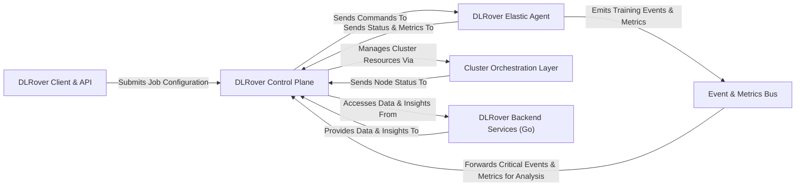

## Details

DLRover is a robust system designed for orchestrating distributed deep learning training jobs. At its core, the DLRover Control Plane acts as the central intelligence, managing the entire job lifecycle, from resource allocation and fault tolerance to coordination across distributed components. Users interact with the system via the DLRover Client & API, which facilitates job definition and submission.

The Control Plane delegates execution and monitoring to the DLRover Elastic Agent, a lightweight process deployed on each training worker node. This agent executes commands from the Control Plane and reports back vital status and metrics. For cluster resource management, the Control Plane interfaces with the Cluster Orchestration Layer, an abstraction that interacts with underlying systems like Kubernetes or Ray, receiving node status updates to inform its scaling decisions.

Persistent data storage, advanced optimization algorithms, and real-time cluster monitoring are handled by the DLRover Backend Services (Go), which provide critical insights and data to the Control Plane. All components leverage the Event & Metrics Bus for standardized emission and collection of events and performance metrics, ensuring the Control Plane has a comprehensive view of the training environment. This architecture ensures efficient, resilient, and scalable distributed deep learning operations.

### DLRover Client & API [[Expand]](./DLRover_Client_API.md)
The user-facing interface for defining, configuring, and submitting distributed deep learning jobs. It handles job definition parsing and initial submission.

**Related Classes/Methods**:

- <a href="https://github.com/intelligent-machine-learning/dlrover/blob/master/dlrover/python/unified/api/base.py" target="_blank" rel="noopener noreferrer">`dlrover/python/unified/api/base.py`</a>
- <a href="https://github.com/intelligent-machine-learning/dlrover/blob/master/dlrover/python/unified/driver/main.py" target="_blank" rel="noopener noreferrer">`dlrover/python/unified/driver/main.py`</a>
- <a href="https://github.com/intelligent-machine-learning/dlrover/blob/master/dlrover/client/platform/ray/ray_job_submitter.py" target="_blank" rel="noopener noreferrer">`dlrover/client/platform/ray/ray_job_submitter.py`</a>

### DLRover Control Plane [[Expand]](./DLRover_Control_Plane.md)
The central orchestration component managing the entire lifecycle of distributed training jobs. It handles job state, resource management, fault tolerance, and coordination across all distributed components.

**Related Classes/Methods**:

- <a href="https://github.com/intelligent-machine-learning/dlrover/blob/master/dlrover/python/master/dist_master.py" target="_blank" rel="noopener noreferrer">`dlrover/python/master/dist_master.py`</a>
- <a href="https://github.com/intelligent-machine-learning/dlrover/blob/master/dlrover/python/unified/master/master.py" target="_blank" rel="noopener noreferrer">`dlrover/python/unified/master/master.py`</a>
- <a href="https://github.com/intelligent-machine-learning/dlrover/blob/master/dlrover/python/master/servicer.py" target="_blank" rel="noopener noreferrer">`dlrover/python/master/servicer.py`</a>
- <a href="https://github.com/intelligent-machine-learning/dlrover/blob/master/dlrover/python/master/node/job_auto_scaler.py" target="_blank" rel="noopener noreferrer">`dlrover/python/master/node/job_auto_scaler.py`</a>
- <a href="https://github.com/intelligent-machine-learning/dlrover/blob/master/dlrover/python/master/shard/task_manager.py" target="_blank" rel="noopener noreferrer">`dlrover/python/master/shard/task_manager.py`</a>
- <a href="https://github.com/intelligent-machine-learning/dlrover/blob/master/dlrover/python/master/diagnosis/diagnosis_master.py" target="_blank" rel="noopener noreferrer">`dlrover/python/master/diagnosis/diagnosis_master.py`</a>

### DLRover Elastic Agent [[Expand]](./DLRover_Elastic_Agent.md)
A lightweight, resilient process deployed on each training worker node. It acts as the primary interface between the training framework and the DLRover Control Plane, executing commands, reporting status, and managing local resources and data.

**Related Classes/Methods**:

- <a href="https://github.com/intelligent-machine-learning/dlrover/blob/master/dlrover/python/elastic_agent/master_client.py" target="_blank" rel="noopener noreferrer">`dlrover/python/elastic_agent/master_client.py`</a>
- <a href="https://github.com/intelligent-machine-learning/dlrover/blob/master/dlrover/python/elastic_agent/monitor/resource.py" target="_blank" rel="noopener noreferrer">`dlrover/python/elastic_agent/monitor/resource.py`</a>
- <a href="https://github.com/intelligent-machine-learning/dlrover/blob/master/dlrover/python/elastic_agent/sharding/client.py" target="_blank" rel="noopener noreferrer">`dlrover/python/elastic_agent/sharding/client.py`</a>
- <a href="https://github.com/intelligent-machine-learning/dlrover/blob/master/dlrover/python/elastic_agent/torch/training.py" target="_blank" rel="noopener noreferrer">`dlrover/python/elastic_agent/torch/training.py`</a>
- <a href="https://github.com/intelligent-machine-learning/dlrover/blob/master/dlrover/trainer/torch/elastic_run.py" target="_blank" rel="noopener noreferrer">`dlrover/trainer/torch/elastic_run.py`</a>
- <a href="https://github.com/intelligent-machine-learning/dlrover/blob/master/dlrover/python/elastic_agent/tensorflow" target="_blank" rel="noopener noreferrer">`dlrover/python/elastic_agent/tensorflow`</a>

### Cluster Orchestration Layer [[Expand]](./Cluster_Orchestration_Layer.md)
An abstraction layer for DLRover to interact with various underlying cluster management systems (e.g., Kubernetes, Ray). It handles the provisioning, scaling, and monitoring of compute resources.

**Related Classes/Methods**:

- <a href="https://github.com/intelligent-machine-learning/dlrover/blob/master/dlrover/python/scheduler/kubernetes.py" target="_blank" rel="noopener noreferrer">`dlrover/python/scheduler/kubernetes.py`</a>
- <a href="https://github.com/intelligent-machine-learning/dlrover/blob/master/dlrover/python/scheduler/ray.py" target="_blank" rel="noopener noreferrer">`dlrover/python/scheduler/ray.py`</a>

### DLRover Backend Services (Go) [[Expand]](./DLRover_Backend_Services_Go_.md)
A collection of Go-based services providing critical backend functionalities, including persistent data storage for job metadata, advanced optimization algorithms, and real-time Kubernetes cluster monitoring.

**Related Classes/Methods**:

- <a href="https://github.com/intelligent-machine-learning/dlrover/blob/master/dlrover/go/brain/pkg/datastore/api/datastore.go" target="_blank" rel="noopener noreferrer">`dlrover/go/brain/pkg/datastore/api/datastore.go`</a>
- <a href="https://github.com/intelligent-machine-learning/dlrover/blob/master/dlrover/go/brain/pkg/optimizer/api/optimizer.go" target="_blank" rel="noopener noreferrer">`dlrover/go/brain/pkg/optimizer/api/optimizer.go`</a>
- <a href="https://github.com/intelligent-machine-learning/dlrover/blob/master/dlrover/go/brain/cmd/k8smonitor/main.go" target="_blank" rel="noopener noreferrer">`dlrover/go/brain/cmd/k8smonitor/main.go`</a>

### Event & Metrics Bus [[Expand]](./Event_Metrics_Bus.md)
A system-wide utility for standardized emission, collection, and export of structured events and performance metrics. It serves as a central channel for components to report their status and activities.

**Related Classes/Methods**:

- <a href="https://github.com/intelligent-machine-learning/dlrover/blob/master/dlrover/python/common/event/reporter.py" target="_blank" rel="noopener noreferrer">`dlrover/python/common/event/reporter.py`</a>
- <a href="https://github.com/intelligent-machine-learning/dlrover/blob/master/dlrover/python/training_event/emitter.py" target="_blank" rel="noopener noreferrer">`dlrover/python/training_event/emitter.py`</a>
- <a href="https://github.com/intelligent-machine-learning/dlrover/blob/master/dlrover/python/training_event/exporter.py" target="_blank" rel="noopener noreferrer">`dlrover/python/training_event/exporter.py`</a>

### [FAQ](https://github.com/CodeBoarding/GeneratedOnBoardings/tree/main?tab=readme-ov-file#faq)