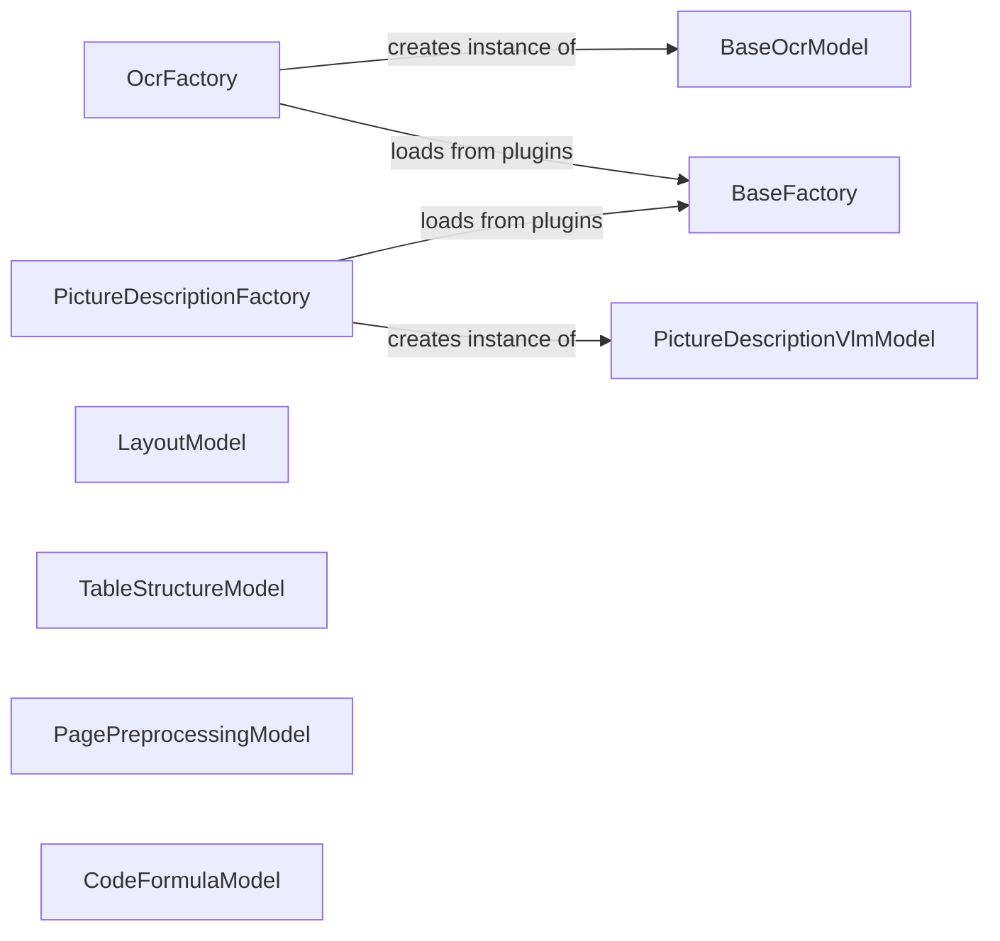

## Component Details

### BaseFactory
Serves as a base class for factories, providing common functionality for creating model instances and managing plugins. It handles plugin registration and loading, allowing for dynamic extension of the available models.
- **Related Classes/Methods**: `repos.docling.docling.models.factories.base_factory.BaseFactory`

### OcrFactory
Responsible for creating OCR model instances. It likely inherits from `BaseFactory` and specializes in loading and managing OCR models from plugins.
- **Related Classes/Methods**: `repos.docling.docling.models.factories.get_ocr_factory`

### PictureDescriptionFactory
Responsible for creating picture description model instances. It likely inherits from `BaseFactory` and specializes in loading and managing picture description models from plugins.
- **Related Classes/Methods**: `repos.docling.docling.models.factories.get_picture_description_factory`

### LayoutModel
Detects the layout of the document, including clusters and cells. It provides the structural information necessary for subsequent processing steps.
- **Related Classes/Methods**: `repos.docling.docling.models.layout_model.LayoutModel`

### TableStructureModel
Identifies and extracts table structures from the document. It enables the system to understand and process tabular data effectively.
- **Related Classes/Methods**: `repos.docling.docling.models.table_structure_model.TableStructureModel`

### BaseOcrModel
Serves as a base class for OCR models, providing common functionality for OCR tasks. Different OCR implementations can inherit from this class.
- **Related Classes/Methods**: `repos.docling.docling.models.base_ocr_model.BaseOcrModel`

### PagePreprocessingModel
Prepares the page for further analysis by populating page images and parsing page cells. It ensures that the page is in a suitable format for subsequent processing.
- **Related Classes/Methods**: `repos.docling.docling.models.page_preprocessing_model.PagePreprocessingModel`

### CodeFormulaModel
Identifies and extracts code and formulas from the document. It allows the system to recognize and handle technical content.
- **Related Classes/Methods**: `repos.docling.docling.models.code_formula_model.CodeFormulaModel`

### PictureDescriptionVlmModel
Uses a VLM to generate descriptions for images in the document. It provides a textual understanding of the images present in the document.
- **Related Classes/Methods**: `repos.docling.docling.models.picture_description_vlm_model.PictureDescriptionVlmModel`
