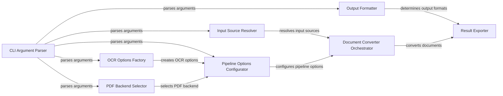

## Component Details

### CLI Argument Parser
The CLI Argument Parser component is responsible for defining and parsing command-line arguments using the `typer` library. It structures the `convert` command, specifying input sources, output formats, and processing options. It also handles callbacks for displaying the Docling logo, version information, and available external plugins, providing a user-friendly interface for interacting with the Docling library.
- **Related Classes/Methods**: `docling.cli.main`

### Input Source Resolver
The Input Source Resolver component resolves the input sources provided by the user, which can be local file paths, directory paths, or URLs. It uses the `resolve_source_to_path` function to fetch remote URLs and handles potential errors such as file not found or directory errors. It expands directory paths to include all files with supported extensions, ensuring that all relevant documents are processed.
- **Related Classes/Methods**: `docling.cli.main`

### Output Formatter
The Output Formatter component determines the output formats based on the user's command-line arguments. It sets boolean flags for exporting to JSON, HTML, Markdown, Text, and DocTags formats. These flags are then used by the `export_documents` function to save the conversion results in the desired formats, allowing users to choose the most suitable output format for their needs.
- **Related Classes/Methods**: `docling.cli.main`

### OCR Options Factory
The OCR Options Factory component creates OCR options based on the user-specified OCR engine and language. It uses the `get_ocr_factory` function to obtain an OCR factory and then calls the `create_options` method to generate an `OcrOptions` object. It also handles splitting the OCR language string into a list of languages, enabling users to customize the OCR process for different languages and engines.
- **Related Classes/Methods**: `docling.cli.main`

### Pipeline Options Configurator
The Pipeline Options Configurator component configures the pipeline options based on the user's command-line arguments. It creates an `AcceleratorOptions` object and a `PdfPipelineOptions` or `VlmPipelineOptions` object, depending on the selected pipeline. It sets various options such as OCR, table structure, code enrichment, formula enrichment, picture description, and picture classification, allowing users to fine-tune the document processing pipeline.
- **Related Classes/Methods**: `docling.cli.main`

### PDF Backend Selector
The PDF Backend Selector component selects the PDF backend based on the user's command-line arguments. It chooses between `DoclingParseDocumentBackend`, `DoclingParseV2DocumentBackend`, `DoclingParseV4DocumentBackend`, and `PyPdfiumDocumentBackend`. The selected backend is then used to create a `PdfFormatOption` object, allowing users to choose the most appropriate PDF processing engine.
- **Related Classes/Methods**: `docling.cli.main`

### Document Converter Orchestrator
The Document Converter Orchestrator component orchestrates the document conversion process. It creates a `DocumentConverter` object with the allowed input formats and format options. It then calls the `convert_all` method to convert the input documents. Finally, it calls the `export_documents` function to save the conversion results in the desired formats, managing the overall document conversion workflow.
- **Related Classes/Methods**: `docling.cli.main`

### Result Exporter
The Result Exporter component exports the conversion results to the specified output directory in various formats, including JSON, HTML, Markdown, Text, and DocTags. It iterates through the conversion results and calls the appropriate `save_as_*` methods on the `DoclingDocument` object to save the results in each format, ensuring that the converted documents are saved in the desired formats.
- **Related Classes/Methods**: `docling.cli.main`
