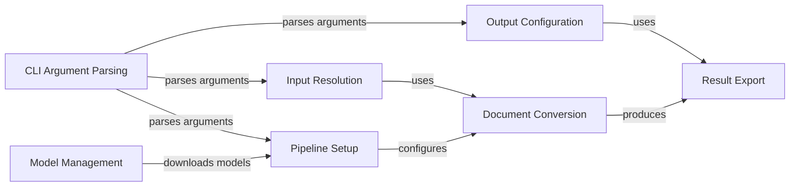

## Component Details

### CLI Argument Parsing
This component is responsible for parsing command-line arguments using the `typer` library. It defines the structure of the `convert` command, including options for input sources, output formats, pipeline configurations, and debugging flags. It also includes callbacks for displaying the Docling logo and version information.
- **Related Classes/Methods**: `docling.cli.main`

### Input Resolution
This component resolves the input source provided by the user, whether it's a local file path, a directory, or a URL. It fetches remote URLs and handles potential file-related errors.
- **Related Classes/Methods**: `docling.cli.main`

### Output Configuration
This component configures the output format based on the user's command-line arguments, setting flags for exporting to JSON, HTML, Markdown, and other formats.
- **Related Classes/Methods**: `docling.cli.main`

### Pipeline Setup
This component sets up the document conversion pipeline options based on the user's command-line arguments, including OCR configuration, table structure mode, and other enrichment options.
- **Related Classes/Methods**: `docling.cli.main`

### Document Conversion
This component orchestrates the document conversion process using the `DocumentConverter` class, handling input documents and pipeline options to perform the conversion.
- **Related Classes/Methods**: `docling.cli.main`

### Result Export
This component exports the conversion results to the specified output directory in the desired formats, such as JSON, HTML, and Markdown.
- **Related Classes/Methods**: `docling.cli.main`

### Model Management
This component handles the downloading of models required by the docling project.
- **Related Classes/Methods**: `docling.cli.models`
