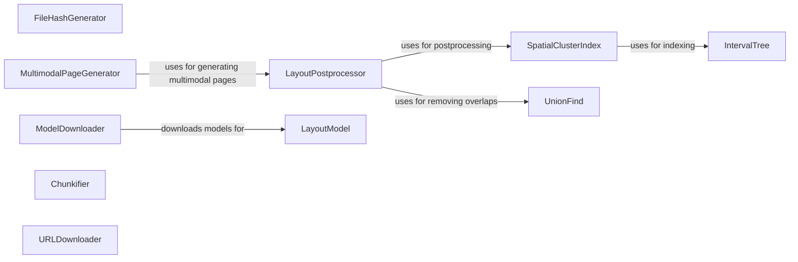

## Component Details

### FileHashGenerator
Generates a unique SHA256 hash for a given file or stream. This hash is used for identifying and comparing documents, ensuring that changes to the file content are detected. It reads the file in chunks to handle large files efficiently.
- **Related Classes/Methods**: `repos.docling.docling.utils.utils:create_file_hash`, `repos.docling.docling.utils.utils:create_hash`, `repos.docling.docling.utils.utils:_hash_buf`

### LayoutPostprocessor
Post-processes the layout of a document, refining the arrangement of clusters (groups of cells) and assigning cells to clusters. It handles both regular clusters (e.g., text) and special clusters (e.g., pictures, tables). It uses spatial indexing to efficiently detect overlapping clusters and resolves these overlaps based on cluster type and confidence scores.
- **Related Classes/Methods**: `repos.docling.docling.utils.layout_postprocessor.LayoutPostprocessor:__init__`, `repos.docling.docling.utils.layout_postprocessor.LayoutPostprocessor:postprocess`, `repos.docling.docling.utils.layout_postprocessor.LayoutPostprocessor:_process_regular_clusters`, `repos.docling.docling.utils.layout_postprocessor.LayoutPostprocessor:_process_special_clusters`, `repos.docling.docling.utils.layout_postprocessor.LayoutPostprocessor:_select_best_cluster_from_group`, `repos.docling.docling.utils.layout_postprocessor.LayoutPostprocessor:_remove_overlapping_clusters`, `repos.docling.docling.utils.layout_postprocessor.LayoutPostprocessor:_assign_cells_to_clusters`

### SpatialClusterIndex
Indexes clusters spatially to enable efficient overlap detection during layout post-processing. It uses an R-tree and interval trees to quickly find candidate clusters that may overlap a given bounding box. This allows the LayoutPostprocessor to efficiently resolve overlapping clusters.
- **Related Classes/Methods**: `repos.docling.docling.utils.layout_postprocessor.SpatialClusterIndex:__init__`, `repos.docling.docling.utils.layout_postprocessor.SpatialClusterIndex:add_cluster`, `repos.docling.docling.utils.layout_postprocessor.SpatialClusterIndex:find_candidates`

### IntervalTree
A data structure used by SpatialClusterIndex for efficient interval searching. It allows for quickly finding all intervals (representing cluster boundaries) that contain a given point. This is used to speed up the process of finding overlapping clusters during layout post-processing.
- **Related Classes/Methods**: `repos.docling.docling.utils.layout_postprocessor.IntervalTree:insert`, `repos.docling.docling.utils.layout_postprocessor.IntervalTree:find_containing`

### UnionFind
A data structure used for finding connected components, used in removing overlapping clusters. It efficiently determines which clusters should be merged together.
- **Related Classes/Methods**: `repos.docling.docling.utils.layout_postprocessor.UnionFind:find`, `repos.docling.docling.utils.layout_postprocessor.UnionFind:union`, `repos.docling.docling.utils.layout_postprocessor.UnionFind:get_groups`

### MultimodalPageGenerator
Generates multimodal pages from document content, processing cells and segments. It converts the document into a format suitable for display, including text, bounding boxes, and other metadata. It exports the document content to various formats, including Markdown and document tokens.
- **Related Classes/Methods**: `repos.docling.docling.utils.export:generate_multimodal_pages`, `repos.docling.docling.utils.export.generate_multimodal_pages._process_page_cells`, `repos.docling.docling.utils.export.generate_multimodal_pages._process_page_segments`, `repos.docling.docling.utils.export.generate_multimodal_pages._process_page`

### ModelDownloader
Downloads necessary models for various document processing tasks, such as layout analysis, table structure recognition, and picture classification. It ensures that the required models are available locally before the document processing pipeline is executed.
- **Related Classes/Methods**: `repos.docling.docling.utils.model_downloader:download_models`

### Chunkifier
Splits an iterator into smaller chunks of a specified size. This is useful for processing large documents in smaller batches, improving performance and reducing memory usage.
- **Related Classes/Methods**: `repos.docling.docling.utils.utils:chunkify`

### URLDownloader
Downloads content from a given URL with a progress bar. It handles redirects and provides feedback on the download progress.
- **Related Classes/Methods**: `repos.docling.docling.utils.utils:download_url_with_progress`
