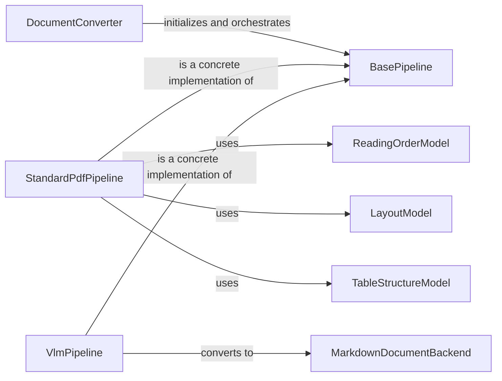

## Component Details

### DocumentConverter
The DocumentConverter class serves as the entry point for converting documents from one format to another. It orchestrates the entire conversion process by initializing a suitable pipeline based on the document type and desired output, processing the document through the pipeline, and handling any exceptions that may arise during the conversion. It acts as a facade, hiding the complexity of the underlying pipelines and models from the user.
- **Related Classes/Methods**: `repos.docling.docling.document_converter.DocumentConverter`

### BasePipeline
The BasePipeline class defines the abstract execution flow for document processing. It outlines the steps involved in building, assembling, enriching, and determining the status of a document. Concrete pipeline implementations, such as StandardPdfPipeline and VlmPipeline, inherit from BasePipeline and implement these steps according to their specific conversion strategies. It provides a common interface for different conversion pipelines.
- **Related Classes/Methods**: `repos.docling.docling.pipeline.base_pipeline.BasePipeline`

### StandardPdfPipeline
The StandardPdfPipeline class is a concrete implementation of BasePipeline tailored for processing PDF documents. It initializes and orchestrates a series of models, including those for reading order, page preprocessing, layout analysis, table structure recognition, page assembly, picture description, code/formula recognition, and document picture classification. It defines the specific steps and models used to convert PDF documents into a structured format.
- **Related Classes/Methods**: `repos.docling.docling.pipeline.standard_pdf_pipeline.StandardPdfPipeline`

### VlmPipeline
The VlmPipeline class is another concrete implementation of BasePipeline that leverages Visual Language Models (VLMs) for document processing. It integrates with different VLM backends, such as those provided by Hugging Face, to extract text and structure from the document. It offers an alternative approach to document conversion by utilizing the capabilities of VLMs.
- **Related Classes/Methods**: `repos.docling.docling.pipeline.vlm_pipeline.VlmPipeline`

### ReadingOrderModel
The ReadingOrderModel class is responsible for determining the logical reading order of elements within a document. It analyzes the layout and structure of the document to establish the correct sequence in which the elements should be read. This is crucial for ensuring that the converted document retains its original meaning and flow.
- **Related Classes/Methods**: `docling.models.readingorder_model.ReadingOrderModel`

### LayoutModel
The LayoutModel class performs layout analysis to identify the structure and organization of elements on a page. It detects elements such as paragraphs, headings, images, and tables, and determines their spatial relationships. This information is used to reconstruct the document's layout in the converted format.
- **Related Classes/Methods**: `docling.models.layout_model.LayoutModel`

### TableStructureModel
The TableStructureModel class is responsible for recognizing and extracting table structures from a document. It identifies the rows, columns, and cells of tables, and extracts the data contained within them. This allows for the accurate representation of tabular data in the converted document.
- **Related Classes/Methods**: `docling.models.table_structure_model.TableStructureModel`

### MarkdownDocumentBackend
The MarkdownDocumentBackend class handles the conversion of documents to and from Markdown format. It provides the functionality to serialize the processed document into a Markdown string, allowing for easy storage and manipulation of the converted document. It acts as the final stage in the conversion pipeline, producing the desired output format.
- **Related Classes/Methods**: `docling.backend.md_backend.MarkdownDocumentBackend`
