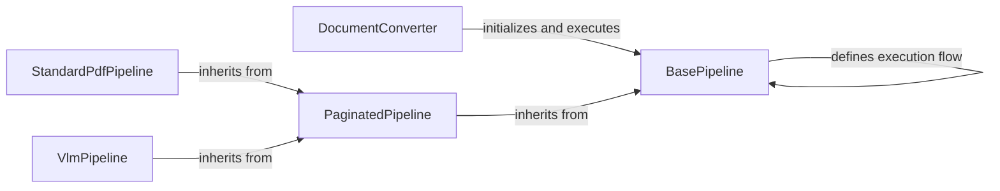

## Component Details

### DocumentConverter
The DocumentConverter class serves as the entry point for document conversion. It receives a document and determines the appropriate pipeline to execute based on the document type. It orchestrates the entire conversion process, handing off the document to the selected pipeline and returning the converted document.
- **Related Classes/Methods**: `repos.docling.docling.document_converter.DocumentConverter`

### BasePipeline
BasePipeline is an abstract class that defines the core execution flow for all document processing pipelines. It outlines the steps involved in document conversion, including building, assembling, enriching, and determining the status of the document. Concrete pipeline implementations inherit from BasePipeline and implement these abstract methods to provide specific conversion logic.
- **Related Classes/Methods**: `repos.docling.docling.pipeline.base_pipeline.BasePipeline`

### PaginatedPipeline
PaginatedPipeline is a specialized pipeline that extends BasePipeline to process documents page by page. This is particularly useful for large documents or documents where page-level processing is required. It provides a mechanism to iterate through the pages of a document and apply specific operations to each page.
- **Related Classes/Methods**: `repos.docling.docling.pipeline.base_pipeline.PaginatedPipeline`

### StandardPdfPipeline
StandardPdfPipeline is a concrete pipeline implementation tailored for processing PDF documents. It leverages OCR (Optical Character Recognition) and picture description models to extract text and other information from the PDF. It inherits from PaginatedPipeline to enable page-level processing and applies OCR and picture description models to each page to enrich the document.
- **Related Classes/Methods**: `repos.docling.docling.pipeline.standard_pdf_pipeline.StandardPdfPipeline`

### VlmPipeline
VlmPipeline is another concrete pipeline implementation that utilizes a Vision Language Model (VLM) to process documents. It extracts text and converts it into a structured document format. It inherits from PaginatedPipeline and uses a VLM to understand the content of each page and generate a corresponding text representation.
- **Related Classes/Methods**: `repos.docling.docling.pipeline.vlm_pipeline.VlmPipeline`
