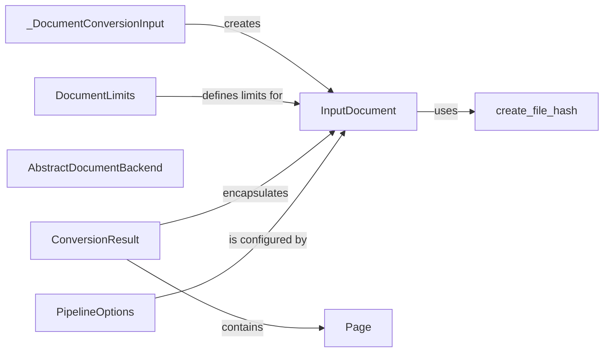

## Component Details

### InputDocument
Represents a document to be processed, handling initialization, document limits, and format detection. It encapsulates the document's content, metadata, and any associated limits. It uses DocumentLimits and PipelineOptions to configure processing.
- **Related Classes/Methods**: `repos.docling.docling.datamodel.document.InputDocument`

### _DocumentConversionInput
Handles the conversion of various document formats into a standardized InputDocument format suitable for processing. It iterates through potential document sources (paths or streams) and yields InputDocument instances.
- **Related Classes/Methods**: `repos.docling.docling.datamodel.document._DocumentConversionInput`

### DocumentLimits
Defines the limits and constraints for document processing, such as maximum size or number of pages. It ensures that documents adhere to predefined boundaries to prevent resource exhaustion or performance issues. These limits are applied to InputDocument.
- **Related Classes/Methods**: `docling.datamodel.settings.DocumentLimits`

### create_file_hash
Generates a unique hash for a given file, used for identifying and tracking documents. This hash can be used to detect duplicate documents or to verify the integrity of a document. InputDocument uses this to create a unique ID.
- **Related Classes/Methods**: `docling.utils.utils.create_file_hash`

### AbstractDocumentBackend
Abstract base class for document backends, defining common methods for document processing. It provides a consistent interface for interacting with different document formats and processing engines. It's a base for different backends.
- **Related Classes/Methods**: `docling.backend.abstract_backend.AbstractDocumentBackend`

### Page
Represents a single page within a document, containing content and image data. It encapsulates the page's content, layout information, and any associated predictions. ConversionResult contains a list of Page objects.
- **Related Classes/Methods**: `repos.docling.docling.datamodel.base_models.Page`

### ConversionResult
Represents the result of a document conversion process, containing the input document, processed pages, status, and timings. It encapsulates the outcome of the conversion pipeline. It contains the InputDocument and a list of Page objects.
- **Related Classes/Methods**: `docling.datamodel.document.ConversionResult`

### PipelineOptions
Defines the options and settings for the document processing pipeline. It configures the behavior of various processing stages, such as OCR, layout analysis, and VLM. InputDocument is configured by PipelineOptions.
- **Related Classes/Methods**: `docling.datamodel.pipeline_options.PipelineOptions`
