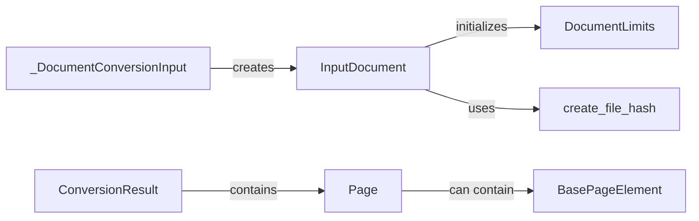

## Component Details

### InputDocument
Represents a document to be processed. It handles document initialization, including setting document limits and creating a file hash. It also initializes the document's internal representation. This class serves as the primary data structure for holding document-related information during processing.
- **Related Classes/Methods**: `repos.docling.docling.datamodel.document.InputDocument`

### _DocumentConversionInput
Handles the conversion of various document types into a standardized format. It includes methods for guessing the document format based on file extension, content, or MIME type. This component ensures that different document formats can be uniformly processed by the system.
- **Related Classes/Methods**: `repos.docling.docling.datamodel.document._DocumentConversionInput`

### DocumentLimits
Defines the limits for document processing, such as maximum size or number of pages. This component is crucial for controlling resource usage and preventing the system from being overwhelmed by excessively large or complex documents.
- **Related Classes/Methods**: `docling.datamodel.settings.DocumentLimits`

### create_file_hash
Generates a hash for a given file, likely used for identifying and comparing documents. This utility function provides a mechanism for uniquely identifying documents based on their content, which is useful for caching and duplicate detection.
- **Related Classes/Methods**: `docling.utils.utils.create_file_hash`

### Page
Represents a single page within a document and provides access to its image representation. The Page class encapsulates the data and functionality associated with a single page, allowing for individual page-level processing and analysis.
- **Related Classes/Methods**: `repos.docling.docling.datamodel.base_models.Page`

### ConversionResult
Represents the result of a document conversion, including the input document, pages, status, and timings. This component aggregates all the information related to a single document conversion process, providing a comprehensive view of the conversion outcome.
- **Related Classes/Methods**: `docling.datamodel.document.ConversionResult`

### BasePageElement
Base class for elements that can be found on a page, such as text, figures and tables. This abstract class defines the common interface and attributes for all page elements, enabling consistent handling and processing of different element types.
- **Related Classes/Methods**: `docling.datamodel.base_models.BasePageElement`
