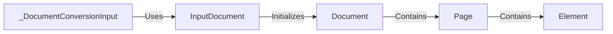

## Component Details

The Data Model component defines the structure for representing documents and their contents within the docling system. It provides a consistent and organized way to access and manipulate document data, including pages, elements, and predictions. The data model ensures that all components are working with a consistent representation of the document and its contents, facilitating seamless data exchange and processing throughout the system.

### InputDocument
Represents the initial input document and handles loading and format detection. It serves as the primary interface for interacting with document data before it's further processed.
- **Related Classes/Methods**: `docling.docling.datamodel.document.InputDocument`

### _DocumentConversionInput
Manages the input for document conversion, including accessing the documents and guessing their format. It prepares documents for further processing within the data model.
- **Related Classes/Methods**: `docling.docling.datamodel.document._DocumentConversionInput`

### Document
Represents the overall document structure, aggregating pages and other document elements. It provides a high-level view of the document, enabling operations such as content extraction and analysis.
- **Related Classes/Methods**: `docling.docling.datamodel.document.Document`

### Page
Represents a single page within a document, containing information such as text, images, and layout. It serves as a container for document content, facilitating access and manipulation of individual pages.
- **Related Classes/Methods**: `docling.docling.datamodel.base_models.Page`

### Element
Represents a generic element within a document, such as a paragraph, table, or image. It provides a base class for specific element types, enabling consistent handling of document content.
- **Related Classes/Methods**: `docling.docling.datamodel.base_models.Element`
