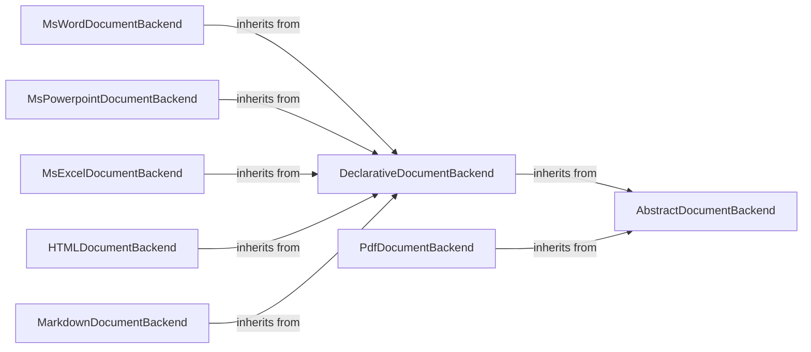

## Component Details

### AbstractDocumentBackend
Defines the interface for all document backends, providing methods for checking validity and supported formats. It serves as the base class for all specific document format backends, ensuring a consistent API for document processing.
- **Related Classes/Methods**: `repos.docling.docling.backend.abstract_backend.AbstractDocumentBackend`

### DeclarativeDocumentBackend
A subclass of AbstractDocumentBackend that provides a declarative approach to document processing. It simplifies the creation of document backends by allowing developers to define the structure and content of documents using a declarative syntax.
- **Related Classes/Methods**: `repos.docling.docling.backend.abstract_backend.DeclarativeDocumentBackend`

### PdfDocumentBackend
Base class for PDF document backends. It provides common functionality for handling PDF documents, such as loading and parsing PDF files. It serves as a base for more specific PDF processing implementations.
- **Related Classes/Methods**: `repos.docling.docling.backend.pdf_backend.PdfDocumentBackend`

### MsWordDocumentBackend
Handles the conversion of MS Word documents (.docx) to a structured data model. It extracts text, tables, and other elements from Word documents, converting them into a format suitable for further processing and analysis.
- **Related Classes/Methods**: `repos.docling.docling.backend.msword_backend.MsWordDocumentBackend`

### MsPowerpointDocumentBackend
Handles the conversion of MS PowerPoint documents (.pptx) to a structured data model. It extracts text, images, and other elements from PowerPoint presentations, converting them into a structured format.
- **Related Classes/Methods**: `repos.docling.docling.backend.mspowerpoint_backend.MsPowerpointDocumentBackend`

### MsExcelDocumentBackend
Handles the conversion of MS Excel documents (.xlsx) to a structured data model. It extracts data, formulas, and other elements from Excel spreadsheets, converting them into a structured format.
- **Related Classes/Methods**: `repos.docling.docling.backend.msexcel_backend.MsExcelDocumentBackend`

### HTMLDocumentBackend
Handles the conversion of HTML documents to a structured data model. It parses HTML content, extracting text, links, and other elements, and converting them into a structured format.
- **Related Classes/Methods**: `repos.docling.docling.backend.html_backend.HTMLDocumentBackend`

### MarkdownDocumentBackend
Handles the conversion of Markdown documents to a structured data model. It parses Markdown syntax, extracting text, headings, lists, and other elements, and converting them into a structured format.
- **Related Classes/Methods**: `repos.docling.docling.backend.md_backend.MarkdownDocumentBackend`
