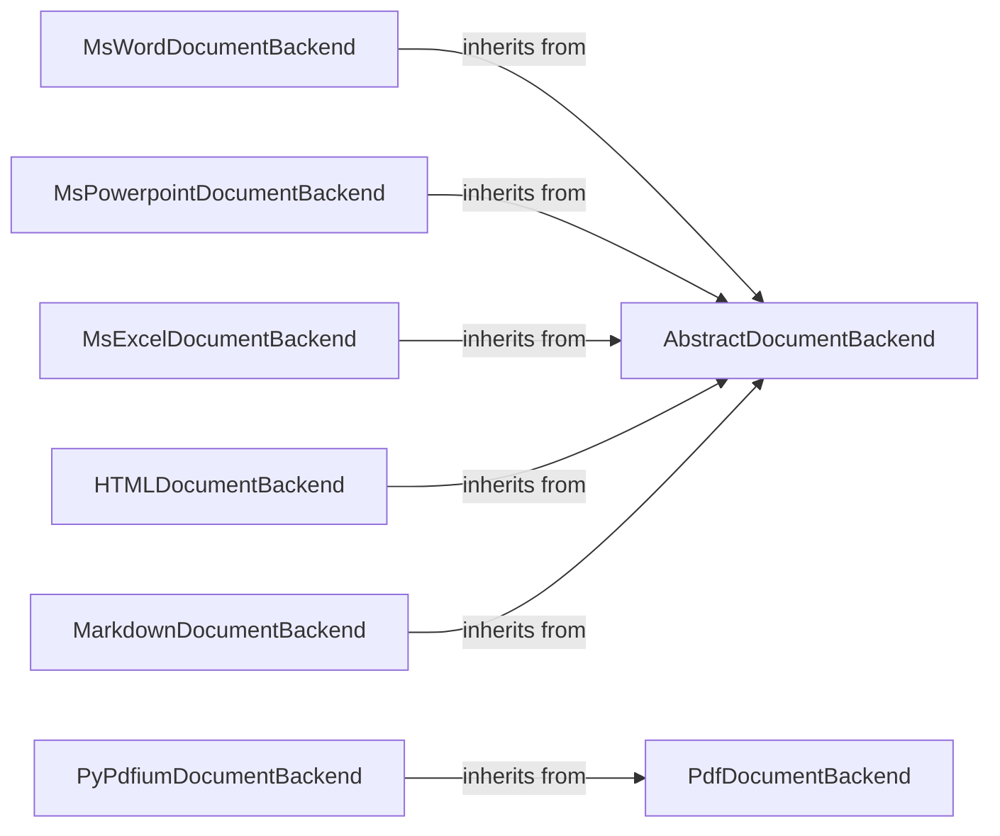

## Component Details

The Document Backends subsystem is responsible for parsing and extracting content from various file formats. It provides a unified interface for accessing text, images, and other elements within a document, regardless of its format. The subsystem utilizes a hierarchy of backend classes, with an abstract base class defining the common interface and concrete subclasses implementing the format-specific parsing logic. The main flow involves selecting the appropriate backend based on the file type, using it to parse the document, and then extracting the desired content.

### AbstractDocumentBackend
Defines the interface for all document backends. It specifies the methods that all backends must implement, such as extracting text, images, and other elements. It serves as a base class for concrete backend implementations, ensuring consistency across different file formats.
- **Related Classes/Methods**: `docling.docling.backend.abstract_backend.AbstractDocumentBackend`

### MsWordDocumentBackend
Handles the parsing and extraction of content from MS Word documents. It uses libraries like python-docx to parse the document structure and extract text, tables, images, and equations. It also handles headers, lists, and textboxes, providing a comprehensive extraction of content from Word files.
- **Related Classes/Methods**: `docling.docling.backend.msword_backend.MsWordDocumentBackend`

### MsPowerpointDocumentBackend
Handles the parsing and extraction of content from MS PowerPoint documents. It extracts text, titles, pictures, and tables from the slides, enabling the retrieval of information from PowerPoint presentations.
- **Related Classes/Methods**: `docling.docling.backend.mspowerpoint_backend.MsPowerpointDocumentBackend`

### MsExcelDocumentBackend
Handles the parsing and extraction of content from MS Excel documents. It converts workbooks and sheets, and finds tables within the sheets, allowing for the extraction of data from spreadsheets.
- **Related Classes/Methods**: `docling.docling.backend.msexcel_backend.MsExcelDocumentBackend`

### HTMLDocumentBackend
Handles the parsing and extraction of content from HTML documents. It walks through the HTML structure, analyzes tags, extracts text recursively, and handles details, lists, and tables, providing a robust extraction of content from web pages.
- **Related Classes/Methods**: `docling.docling.backend.html_backend.HTMLDocumentBackend`

### MarkdownDocumentBackend
Handles the parsing and extraction of content from Markdown documents. It iterates through the elements and converts the document, enabling the retrieval of information from Markdown files.
- **Related Classes/Methods**: `docling.docling.backend.md_backend.MarkdownDocumentBackend`

### PdfDocumentBackend
Base class for PDF document backends. It provides common functionality for PDF backends.
- **Related Classes/Methods**: `docling.docling.backend.pdf_backend.PdfDocumentBackend`

### PyPdfiumDocumentBackend
Handles the parsing and extraction of content from PDF documents using the pypdfium2 library. It loads pages, checks document validity, and unloads the document, providing a reliable extraction of content from PDF files.
- **Related Classes/Methods**: `docling.docling.backend.pypdfium2_backend.PyPdfiumDocumentBackend`
