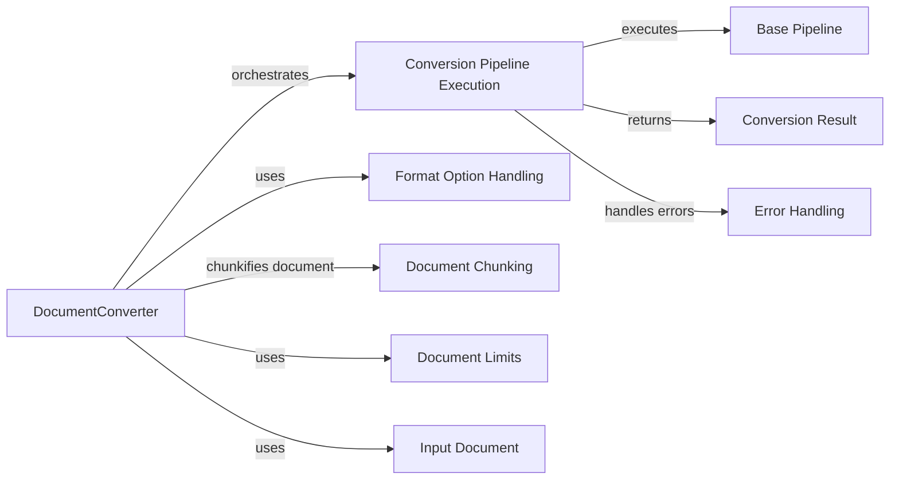

## Component Details

### DocumentConverter
The central component responsible for orchestrating the document conversion process. It handles document loading, format detection, pipeline selection, and output generation. It initializes and executes the conversion pipeline, managing document limits and error handling to ensure correct processing and transformation into the desired Docling format.
- **Related Classes/Methods**: `repos.docling.docling.document_converter.DocumentConverter`

### Conversion Pipeline Execution
This component focuses on the execution of the selected conversion pipeline. It takes a document and runs it through the pipeline, managing the flow of data and transformations. It also handles potential errors during pipeline execution and returns the conversion result.
- **Related Classes/Methods**: `repos.docling.docling.document_converter.DocumentConverter:_execute_pipeline`

### Format Option Handling
This component manages the options for different document formats, including the selection of the appropriate conversion pipeline. It determines which pipeline to use based on the document's format and any specified options, ensuring that the correct pipeline is applied for each document type.
- **Related Classes/Methods**: `repos.docling.docling.document_converter.FormatOption`, `repos.docling.docling.document_converter.DocumentConverter:_get_pipeline`, `repos.docling.docling.document_converter._get_default_option`

### Document Chunking
This component is responsible for splitting a document into smaller chunks for processing. It divides the document into manageable pieces for conversion, allowing the system to handle large documents efficiently.
- **Related Classes/Methods**: `docling.utils.utils.chunkify`

### Conversion Result
This component represents the outcome of a document conversion, including the converted content, status, and any errors encountered. It encapsulates the result of the conversion process, providing a structured way to access the converted document and any associated information.
- **Related Classes/Methods**: `docling.datamodel.document.ConversionResult`

### Error Handling
This component manages errors that occur during the document conversion process. It includes the ConversionError exception class, which is raised when an error occurs, and the ErrorItem data model, which provides details about specific errors.
- **Related Classes/Methods**: `docling.exceptions.ConversionError`, `docling.datamodel.base_models.ErrorItem`

### Document Limits
This component defines the constraints on document size and other parameters. It ensures that the documents being converted adhere to the specified limits, preventing the system from being overloaded or processing excessively large files.
- **Related Classes/Methods**: `docling.datamodel.settings.DocumentLimits`

### Input Document
This component represents the document to be converted, including its format and limits. It encapsulates the input document and its associated metadata, providing a structured way to access the document's content and properties.
- **Related Classes/Methods**: `docling.datamodel.document.InputDocument`

### Base Pipeline
This component serves as the base class for all conversion pipelines. It defines the basic structure and methods for a conversion pipeline, providing a common interface for all pipeline implementations.
- **Related Classes/Methods**: `docling.pipeline.base_pipeline.BasePipeline`
