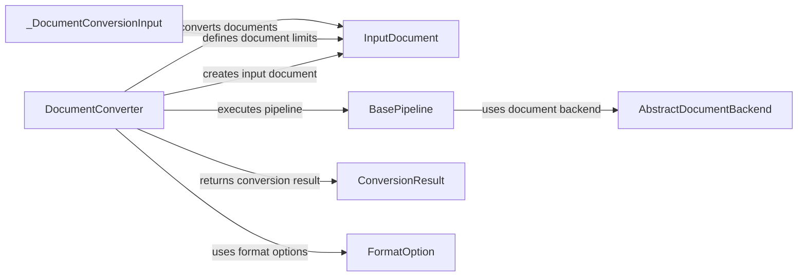

## Component Details

### DocumentConverter
The central component responsible for orchestrating the document conversion process. It receives a document as input, determines its format, selects the appropriate conversion pipeline based on the format, and executes the pipeline. It manages the overall flow of the conversion, handling errors and returning the converted output or any errors encountered.
- **Related Classes/Methods**: `repos.docling.docling.document_converter.DocumentConverter`

### InputDocument
Represents the document to be converted, encapsulating its source (path or stream), format, and any specified limits (size, page count). It's created from the initial input and passed to the conversion pipeline. It provides a structured way to access document-related information during the conversion process.
- **Related Classes/Methods**: `docling.datamodel.document.InputDocument`

### BasePipeline
An abstract base class that defines the interface and common structure for all document conversion pipelines. Concrete pipeline implementations inherit from this class and implement the specific conversion logic for different document formats. It ensures that all pipelines adhere to a consistent structure and provide the necessary methods for conversion.
- **Related Classes/Methods**: `docling.pipeline.base_pipeline.BasePipeline`

### ConversionResult
Represents the outcome of the document conversion process. It contains the converted content (e.g., text, images), any errors that occurred during conversion, and timing information. It provides a standardized way to return the results of the conversion, regardless of the specific pipeline used.
- **Related Classes/Methods**: `docling.datamodel.document.ConversionResult`

### AbstractDocumentBackend
An abstract base class that defines the interface for document backends. Document backends are responsible for loading and parsing documents of specific formats. Concrete backend implementations inherit from this class and provide the format-specific logic for accessing the document's content and structure.
- **Related Classes/Methods**: `docling.backend.abstract_backend.AbstractDocumentBackend`

### FormatOption
A data model that encapsulates the pipeline class and pipeline options for a specific document format. It's used to configure the conversion process for different file types. The DocumentConverter uses FormatOption to select the appropriate pipeline for a given document format.
- **Related Classes/Methods**: `docling.document_converter.FormatOption`

### _DocumentConversionInput
A data model representing the input to the document conversion process. It encapsulates the document source (path or stream) and any associated limits on document size or number of pages. It's used to pass the input parameters to the DocumentConverter.
- **Related Classes/Methods**: `docling.datamodel.document._DocumentConversionInput`
