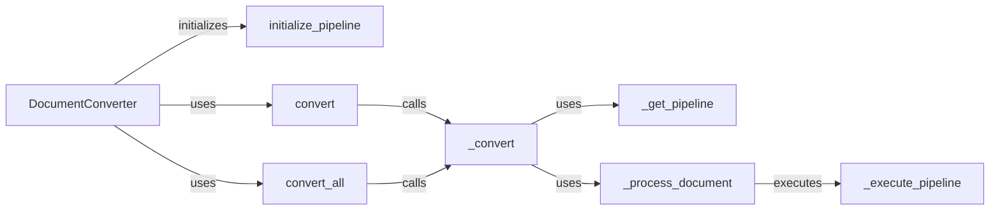

## Component Details

The Document Conversion Orchestrator manages the conversion of documents from one format to another. It initializes a conversion pipeline based on the document type, processes documents individually or in batches, and handles any errors that occur during the conversion process. The central class is the DocumentConverter, which orchestrates the entire process by selecting the appropriate pipeline and executing the conversion steps.

### DocumentConverter
The central class responsible for managing the document conversion process. It initializes the conversion pipeline, orchestrates the conversion of individual documents or batches, and handles error management.
- **Related Classes/Methods**: `docling.docling.document_converter.DocumentConverter`

### initialize_pipeline
Initializes the conversion pipeline with the necessary processing steps based on the document type and specified options. This involves selecting and configuring the appropriate tools and processors for the conversion task.
- **Related Classes/Methods**: `docling.docling.document_converter.DocumentConverter:initialize_pipeline`

### convert
Converts a single document using the initialized pipeline. This method takes a document as input and applies the conversion steps defined in the pipeline to produce the converted output.
- **Related Classes/Methods**: `docling.docling.document_converter.DocumentConverter:convert`

### convert_all
Converts a list of documents using the initialized pipeline. This method processes multiple documents in a batch, applying the same conversion steps to each document in the list.
- **Related Classes/Methods**: `docling.docling.document_converter.DocumentConverter:convert_all`

### _convert
An internal method that handles the conversion of a single document. It retrieves the appropriate pipeline for the document and then processes the document through that pipeline.
- **Related Classes/Methods**: `docling.docling.document_converter.DocumentConverter:_convert`

### _get_pipeline
Retrieves the appropriate conversion pipeline based on the document type or other criteria. This method determines which pipeline is best suited for the given document and returns it for use in the conversion process.
- **Related Classes/Methods**: `docling.docling.document_converter.DocumentConverter:_get_pipeline`

### _process_document
Processes the document through the conversion pipeline. This involves applying a series of transformations and processing steps to the document to convert it to the desired output format.
- **Related Classes/Methods**: `docling.docling.document_converter.DocumentConverter:_process_document`

### _execute_pipeline
Executes the individual steps within the conversion pipeline. This method iterates through the pipeline and applies each step to the document, transforming it along the way.
- **Related Classes/Methods**: `docling.docling.document_converter.DocumentConverter:_execute_pipeline`
