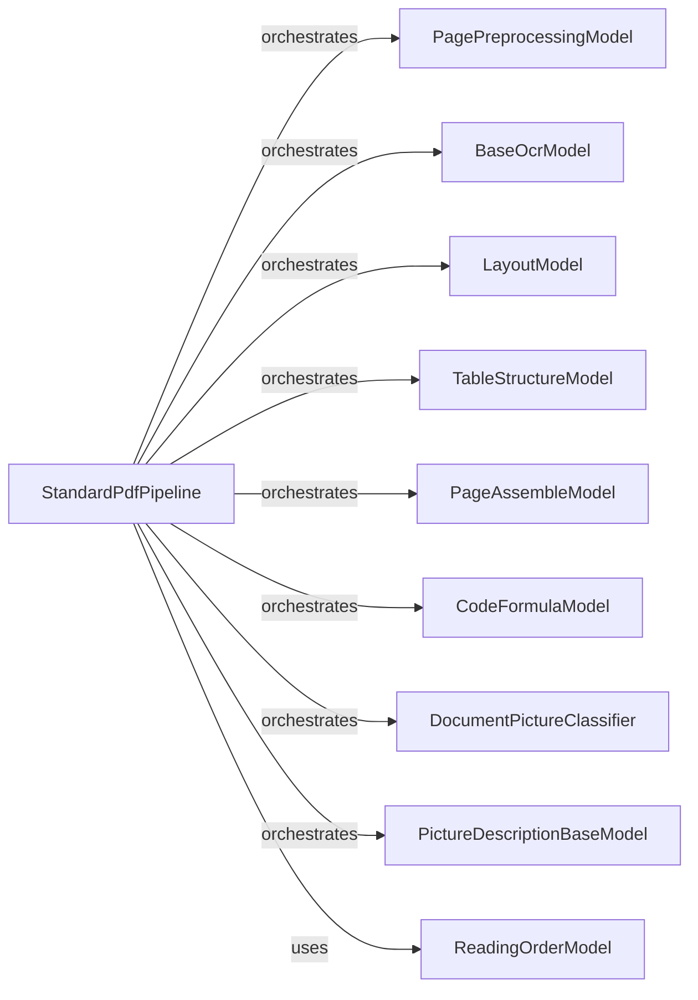

## Component Details

### StandardPdfPipeline
The StandardPdfPipeline is the central orchestrator for processing PDF documents. It manages the document processing workflow by calling different models for layout analysis, reading order detection, OCR, table structure recognition, code/formula detection, picture description, and document picture classification. It inherits from PaginatedPipeline and implements the core document processing logic.
- **Related Classes/Methods**: `docling.pipeline.standard_pdf_pipeline.StandardPdfPipeline`

### PagePreprocessingModel
The PagePreprocessingModel is responsible for preparing document pages for subsequent processing. This includes tasks such as scaling images and creating parsed pages, ensuring that the pages are in a suitable format for the other models in the pipeline.
- **Related Classes/Methods**: `docling.models.page_preprocessing_model.PagePreprocessingModel`

### BaseOcrModel
The BaseOcrModel serves as an abstract base class for OCR models. It defines the interface for performing Optical Character Recognition (OCR) on document pages, allowing for different OCR implementations to be used within the pipeline.
- **Related Classes/Methods**: `docling.models.base_ocr_model.BaseOcrModel`

### LayoutModel
The LayoutModel is responsible for analyzing the layout of document pages. This includes tasks such as clustering and cell detection, which are crucial for understanding the structure of the document and identifying different elements on the page.
- **Related Classes/Methods**: `docling.models.layout_model.LayoutModel`

### TableStructureModel
The TableStructureModel is responsible for detecting and analyzing table structures within a document. It identifies tables and their structure on the page, enabling the pipeline to extract tabular data from the document.
- **Related Classes/Methods**: `docling.models.table_structure_model.TableStructureModel`

### PageAssembleModel
The PageAssembleModel is responsible for assembling the different elements on a page, such as text, tables, and figures. It combines the identified elements into a coherent page structure, providing a complete representation of the page.
- **Related Classes/Methods**: `docling.models.page_assemble_model.PageAssembleModel`

### CodeFormulaModel
The CodeFormulaModel is responsible for identifying and processing code and formulas within a document. It enriches the document with information about code and formulas, allowing for specialized processing of these elements.
- **Related Classes/Methods**: `docling.models.code_formula_model.CodeFormulaModel`

### DocumentPictureClassifier
The DocumentPictureClassifier is responsible for classifying document pictures. It categorizes images within the document, enabling the pipeline to understand the content of the images and process them accordingly.
- **Related Classes/Methods**: `docling.models.document_picture_classifier.DocumentPictureClassifier`

### PictureDescriptionBaseModel
The PictureDescriptionBaseModel serves as an abstract base class for picture description models. It defines the interface for generating descriptions of images within the document, allowing for different image description implementations to be used within the pipeline.
- **Related Classes/Methods**: `docling.models.picture_description_base_model.PictureDescriptionBaseModel`

### ReadingOrderModel
The ReadingOrderModel is responsible for determining the reading order of elements within a document. It orders the elements for proper reading flow, ensuring that the document can be read in a logical sequence.
- **Related Classes/Methods**: `docling.models.readingorder_model.ReadingOrderModel`
