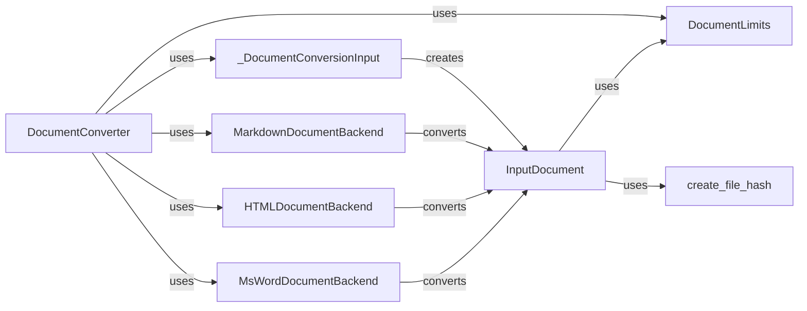

## Component Details

### InputDocument
Represents a single document to be converted, storing its content, format, and metadata. It handles initial processing like file hash calculation and interacts with DocumentLimits to enforce constraints. It uses create_file_hash to generate a unique identifier for the document.
- **Related Classes/Methods**: `repos.docling.docling.datamodel.document.InputDocument`

### _DocumentConversionInput
Handles the initial processing of input documents, including format detection and creation of InputDocument instances. It acts as a factory for InputDocument objects, using methods to determine the document's format from content and extensions.
- **Related Classes/Methods**: `docling.datamodel.document._DocumentConversionInput`

### DocumentConverter
Responsible for converting documents from various formats into a unified data model. It orchestrates the conversion process by utilizing different document backends based on the input document type and uses DocumentLimits to enforce constraints.
- **Related Classes/Methods**: `repos.docling.docling.document_converter.DocumentConverter`

### DocumentLimits
Defines the constraints and limitations applied during document processing, such as maximum file size or number of pages. It ensures that the conversion process stays within acceptable boundaries and is used by InputDocument and DocumentConverter.
- **Related Classes/Methods**: `docling.datamodel.settings.DocumentLimits`

### create_file_hash
Generates a unique hash for a given file. This hash is used to identify and track documents and is used by InputDocument.
- **Related Classes/Methods**: `repos.docling.docling.utils.utils.create_file_hash`

### MarkdownDocumentBackend
A specific document backend responsible for converting Markdown documents. It implements the conversion logic for Markdown files and converts to InputDocument.
- **Related Classes/Methods**: `repos.docling.docling.backend.md_backend.MarkdownDocumentBackend`

### HTMLDocumentBackend
A document backend responsible for converting HTML documents. It parses HTML content and converts it into a DoclingDocument.
- **Related Classes/Methods**: `docling.backend.html_backend.HTMLDocumentBackend`

### MsWordDocumentBackend
A document backend responsible for converting MS Word documents. It extracts content and structure from Word files.
- **Related Classes/Methods**: `docling.backend.msword_backend.MsWordDocumentBackend`
