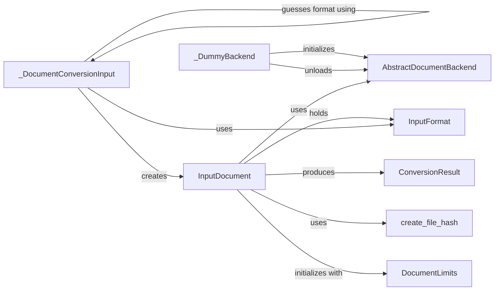

## Component Details

### InputDocument
Represents a document to be processed, encapsulating its content, metadata, and processing backend. It handles document initialization, including setting document limits, format, file size, page count, and creating a file hash for identification. The InputDocument acts as a central hub, providing access to the document's properties and methods for interacting with its content.
- **Related Classes/Methods**: `docling.datamodel.document.InputDocument`

### DocumentLimits
Defines the constraints applied to a document, such as maximum size, maximum number of pages, and allowed page ranges. These limits are enforced during document processing to prevent excessive resource consumption and ensure compatibility with the system's capabilities. DocumentLimits provides a way to configure and manage the boundaries within which documents are processed.
- **Related Classes/Methods**: `docling.datamodel.settings.DocumentLimits`

### create_file_hash
Generates a unique hash for a given file or stream, serving as a fingerprint for identifying the document. This hash is used to detect duplicate documents and ensure data integrity throughout the processing pipeline. The create_file_hash function provides a reliable mechanism for distinguishing between different documents based on their content.
- **Related Classes/Methods**: `docling.utils.utils.create_file_hash`

### _DocumentConversionInput
Facilitates the conversion of various document types into a standardized input format suitable for processing. It includes logic for guessing the document format and creating InputDocument objects. This component acts as a bridge between different document formats and the core processing pipeline, ensuring that all documents are handled consistently.
- **Related Classes/Methods**: `docling.datamodel.document._DocumentConversionInput`

### _DummyBackend
Serves as a fallback backend for document processing when the document format is not supported or an error occurs during format detection. It provides a minimal implementation of the AbstractDocumentBackend interface, allowing the system to gracefully handle unsupported documents without crashing. The _DummyBackend ensures that the processing pipeline remains functional even in the presence of unexpected document types.
- **Related Classes/Methods**: `docling.datamodel.document._DummyBackend`

### AbstractDocumentBackend
Defines the interface for document backends, specifying common methods like `unload` and properties like `is_valid`, `supported_formats`, and `supports_pagination`. Concrete document backends implement this interface to provide format-specific processing capabilities. The AbstractDocumentBackend promotes code reuse and ensures consistency across different document formats.
- **Related Classes/Methods**: `docling.backend.abstract_backend.AbstractDocumentBackend`

### ConversionResult
Encapsulates the outcome of a document conversion process, including the input document, status, errors, pages, assembled units, timings, and the DoclingDocument. It provides a comprehensive record of the conversion process, allowing for error analysis and performance monitoring. The ConversionResult serves as a central repository for all information related to a specific document conversion.
- **Related Classes/Methods**: `docling.datamodel.document.ConversionResult`

### InputFormat
An enumeration of supported input document formats, providing a standardized way to represent the different types of documents that the system can process. This enumeration is used to determine the appropriate backend for processing a given document. The InputFormat ensures that the system can correctly identify and handle a wide range of document types.
- **Related Classes/Methods**: `docling.datamodel.base_models`
