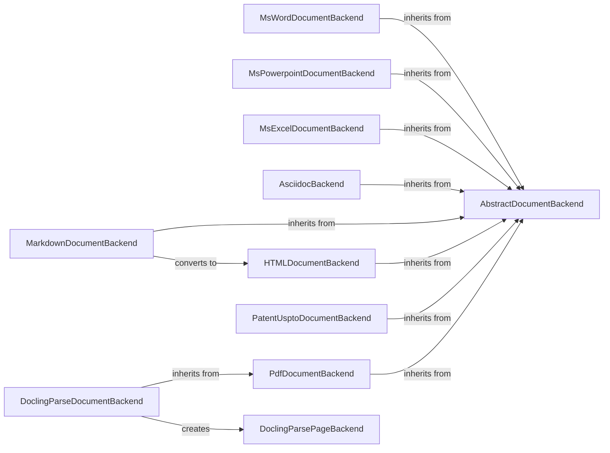

## Component Details

### AbstractDocumentBackend
Defines the interface for all document backends. It provides methods for checking if a document is valid, listing supported formats, and converting the document into a structured format. All concrete document backends inherit from this class and implement its abstract methods to handle specific document types.
- **Related Classes/Methods**: `repos.docling.docling.backend.abstract_backend.AbstractDocumentBackend`

### MsWordDocumentBackend
Handles the conversion of MS Word documents (.docx). It extracts text, tables, pictures, and equations, and structures the document content. It uses `oMath2Latex` to convert mathematical equations to LaTeX format. This backend inherits from `AbstractDocumentBackend` and implements the conversion logic specific to Word documents.
- **Related Classes/Methods**: `repos.docling.docling.backend.msword_backend.MsWordDocumentBackend`

### MsPowerpointDocumentBackend
Handles the conversion of MS PowerPoint documents (.pptx). It extracts text, tables, and pictures from slides, generating a structured representation of the document. It iterates through slides and shapes, extracting relevant information. This backend inherits from `AbstractDocumentBackend` and implements the conversion logic specific to PowerPoint documents.
- **Related Classes/Methods**: `repos.docling.docling.backend.mspowerpoint_backend.MsPowerpointDocumentBackend`

### MsExcelDocumentBackend
Handles the conversion of MS Excel documents (.xlsx). It extracts data and images from worksheets, identifying tables and their boundaries. It creates `ExcelCell` and `ExcelTable` objects to represent the data. This backend inherits from `AbstractDocumentBackend` and implements the conversion logic specific to Excel documents.
- **Related Classes/Methods**: `repos.docling.docling.backend.msexcel_backend.MsExcelDocumentBackend`

### AsciidocBackend
Handles the conversion of AsciiDoc documents. It parses the AsciiDoc markup to identify titles, sections, lists, tables, pictures, and captions. This backend inherits from `AbstractDocumentBackend` and implements the conversion logic specific to AsciiDoc documents.
- **Related Classes/Methods**: `repos.docling.docling.backend.asciidoc_backend.AsciiDocBackend`

### MarkdownDocumentBackend
Handles the conversion of Markdown documents. It parses Markdown syntax to extract text, tables, and other elements, converting the document into a structured format. It can convert the markdown to HTML using `HTMLDocumentBackend`. This backend inherits from `AbstractDocumentBackend` and implements the conversion logic specific to Markdown documents.
- **Related Classes/Methods**: `repos.docling.docling.backend.md_backend.MarkdownDocumentBackend`

### PdfDocumentBackend
Base class for PDF document backends. Provides common functionalities for handling PDF documents. It serves as a parent class for more specialized PDF backends like `DoclingParseDocumentBackend`. This backend inherits from `AbstractDocumentBackend`.
- **Related Classes/Methods**: `repos.docling.docling.backend.pdf_backend.PdfDocumentBackend`

### DoclingParseDocumentBackend
Handles the conversion of PDF documents using a parsing-based approach. It creates `DoclingParsePageBackend` objects to process individual pages. This backend inherits from `PdfDocumentBackend`.
- **Related Classes/Methods**: `repos.docling.docling.backend.docling_parse_backend.DoclingParseDocumentBackend`

### HTMLDocumentBackend
Handles the conversion of HTML documents. It parses HTML tags and extracts relevant content, such as text, tables, and images. This backend inherits from `AbstractDocumentBackend` and implements the conversion logic specific to HTML documents.
- **Related Classes/Methods**: `repos.docling.docling.backend.html_backend.HTMLDocumentBackend`

### PatentUsptoDocumentBackend
Handles the conversion of Patent USPTO XML documents. It parses the XML structure to extract patent information. This backend inherits from `AbstractDocumentBackend` and implements the conversion logic specific to Patent USPTO XML documents.
- **Related Classes/Methods**: `repos.docling.docling.backend.xml.uspto_backend.PatentUsptoDocumentBackend`
