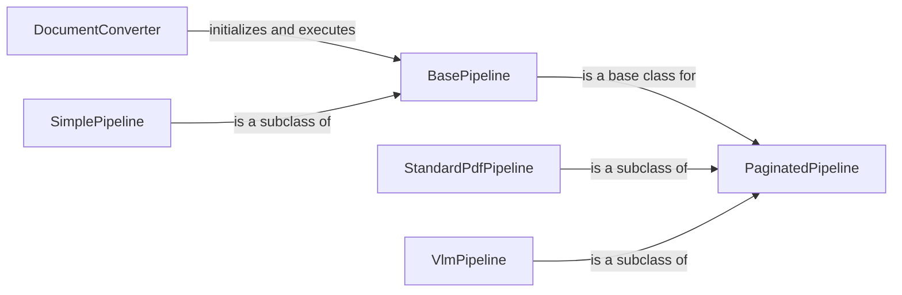

## Component Details

The Document Pipelines subsystem is responsible for orchestrating the conversion of various document types into a structured format suitable for further processing. It defines the execution flow for document conversion, manages the execution of enrichment models, and ensures that the document is properly processed. Different pipelines exist for different document types, such as PDF, Word, and VLM-enhanced documents. The core functionality involves selecting the appropriate pipeline based on the document type, executing the pipeline's steps, and handling any necessary pre-processing or post-processing tasks.

### DocumentConverter
The DocumentConverter class serves as the entry point for document conversion. It determines the appropriate pipeline to use based on the input document type and then initiates the execution of that pipeline. It acts as a central coordinator, delegating the actual conversion process to the selected pipeline.
- **Related Classes/Methods**: `docling.docling.document_converter.DocumentConverter`

### BasePipeline
BasePipeline is an abstract base class that defines the common structure and execution flow for all document processing pipelines. It provides a template for how pipelines should be implemented, including methods for enriching the document with additional information and handling common tasks. Subclasses inherit from BasePipeline to implement specific document processing workflows.
- **Related Classes/Methods**: `docling.docling.pipeline.base_pipeline.BasePipeline`

### PaginatedPipeline
PaginatedPipeline is an abstract base class extending BasePipeline, designed for processing documents page by page. It provides functionalities for building the document structure and determining the processing status of each page. This pipeline is suitable for document types where page-level processing is required, such as PDFs.
- **Related Classes/Methods**: `docling.docling.pipeline.base_pipeline.PaginatedPipeline`

### StandardPdfPipeline
StandardPdfPipeline is a concrete pipeline implementation specifically designed for processing PDF documents. It extends PaginatedPipeline and incorporates functionalities for OCR (Optical Character Recognition), image description, and assembling the final document from the processed pages. It leverages various models and backends to extract information from PDFs.
- **Related Classes/Methods**: `docling.docling.pipeline.standard_pdf_pipeline.StandardPdfPipeline`

### VlmPipeline
VlmPipeline is a concrete pipeline implementation that utilizes a Vision Language Model (VLM) for document processing. It extends PaginatedPipeline and includes functionalities for initializing pages, assembling the document, and converting markdown to document format. This pipeline is suitable for documents where visual understanding and language processing are crucial.
- **Related Classes/Methods**: `docling.docling.pipeline.vlm_pipeline.VlmPipeline`

### SimplePipeline
SimplePipeline is a concrete pipeline implementation that provides a basic document processing workflow. It extends BasePipeline and focuses on building the document structure. This pipeline is suitable for simple document types or scenarios where minimal processing is required.
- **Related Classes/Methods**: `docling.docling.pipeline.simple_pipeline.SimplePipeline`
