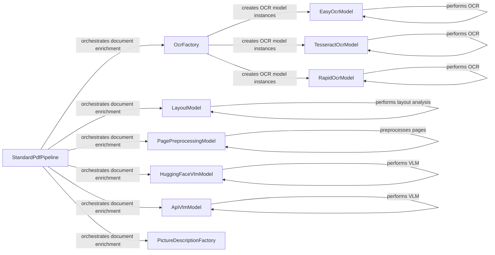

## Component Details

The Enrichment Models subsystem focuses on enhancing document content through various processing techniques. It incorporates OCR models for extracting text from images, layout analysis models for detecting document structure, and VLM models for enriching documents with contextual information. The core flow involves the StandardPdfPipeline utilizing factories to instantiate specific models like OCR engines (Tesseract, EasyOCR, RapidOCR) and visual understanding models (HuggingFaceVlmModel, ApiVlmModel). These models are applied to the document content to extract, analyze, and enrich the data, ultimately providing a more comprehensive understanding of the document.

### StandardPdfPipeline
The StandardPdfPipeline orchestrates the document enrichment process specifically for PDF files. It manages the flow of data through various models, including OCR, layout analysis, and visual language understanding models, to extract and enrich the document content.
- **Related Classes/Methods**: `docling.docling.pipeline.standard_pdf_pipeline.StandardPdfPipeline`

### OcrFactory
The OcrFactory is responsible for creating instances of different OCR models (Tesseract, EasyOCR, RapidOCR) based on configuration. It encapsulates the logic for instantiating the appropriate OCR engine based on the specified settings.
- **Related Classes/Methods**: `docling.docling.models.factories.ocr_factory.OcrFactory`

### EasyOcrModel
The EasyOcrModel performs OCR using the EasyOCR library. It extracts text from images within the document using the EasyOCR engine.
- **Related Classes/Methods**: `docling.docling.models.easyocr_model.EasyOcrModel`

### TesseractOcrModel
The TesseractOcrModel performs OCR using the Tesseract OCR engine. It extracts text from images within the document using the Tesseract OCR engine.
- **Related Classes/Methods**: `docling.docling.models.tesseract_ocr_model.TesseractOcrModel`

### RapidOcrModel
The RapidOcrModel performs OCR using the RapidOCR library. It extracts text from images within the document using the RapidOCR library.
- **Related Classes/Methods**: `docling.docling.models.rapid_ocr_model.RapidOcrModel`

### LayoutModel
The LayoutModel performs layout analysis on document pages. It identifies text regions, tables, and other structural elements within the document.
- **Related Classes/Methods**: `docling.docling.models.layout_model.LayoutModel`

### PagePreprocessingModel
The PagePreprocessingModel preprocesses document pages, including cell parsing. It prepares the document pages for further processing by cleaning, normalizing, and segmenting the content.
- **Related Classes/Methods**: `docling.docling.models.page_preprocessing_model.PagePreprocessingModel`

### HuggingFaceVlmModel
The HuggingFaceVlmModel performs visual language understanding using Hugging Face Transformers. It leverages Hugging Face Transformers to enrich the document with contextual information.
- **Related Classes/Methods**: `docling.docling.models.hf_vlm_model.HuggingFaceVlmModel`

### ApiVlmModel
The ApiVlmModel performs visual language understanding using an external API. It interacts with an external API to enrich the document with contextual information.
- **Related Classes/Methods**: `docling.docling.models.api_vlm_model.ApiVlmModel`

### PictureDescriptionFactory
The PictureDescriptionFactory creates instances of picture description models. It is responsible for creating instances of picture description models.
- **Related Classes/Methods**: `docling.docling.models.factories.picture_description_factory.PictureDescriptionFactory`
