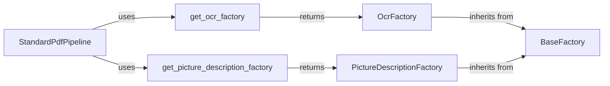

## Component Details

The Model Factories subsystem provides a mechanism for creating and managing model instances, specifically for OCR and picture description tasks. It uses a factory pattern to abstract the creation process, allowing for different implementations to be used interchangeably. The factories are designed as singletons, ensuring a central point for model creation. The StandardPdfPipeline utilizes these factories to obtain the necessary models for processing PDF documents.

### BaseFactory
The `BaseFactory` class serves as a base class for other factories. It provides common functionality for creating, registering, and loading model instances, potentially including plugin support. It defines the basic interface for all factories.
- **Related Classes/Methods**: `docling.docling.models.factories.base_factory.BaseFactory`

### OcrFactory
The `OcrFactory` class is responsible for creating and managing OCR (Optical Character Recognition) model instances. It inherits from `BaseFactory` and likely uses a factory pattern to abstract the creation process, allowing for different OCR implementations to be used interchangeably. It is implemented as a singleton.
- **Related Classes/Methods**: `docling.docling.models.factories.ocr_factory.OcrFactory`

### PictureDescriptionFactory
The `PictureDescriptionFactory` class is responsible for creating and managing Picture Description model instances. Similar to the `OcrFactory`, it inherits from `BaseFactory` and likely employs a factory pattern to abstract the creation of picture description models, enabling the use of various implementations. It is implemented as a singleton.
- **Related Classes/Methods**: `docling.docling.models.factories.picture_description_factory.PictureDescriptionFactory`

### get_ocr_factory
This function provides access to the singleton instance of the `OcrFactory`. It ensures that only one instance of the factory exists, providing a central point for creating OCR models.
- **Related Classes/Methods**: `docling.docling.models.factories:get_ocr_factory`

### get_picture_description_factory
This function provides access to the singleton instance of the `PictureDescriptionFactory`. It ensures that only one instance of the factory exists, providing a central point for creating picture description models.
- **Related Classes/Methods**: `docling.docling.models.factories:get_picture_description_factory`

### StandardPdfPipeline
The `StandardPdfPipeline` class represents a pipeline for processing PDF documents. It utilizes the `OcrFactory` and `PictureDescriptionFactory` to obtain OCR and picture description models, respectively, as part of its processing workflow. It orchestrates the use of the factories to process PDFs.
- **Related Classes/Methods**: `docling.pipeline.standard_pdf_pipeline.StandardPdfPipeline`
