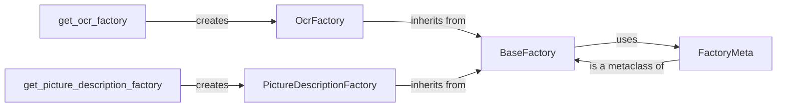

## Component Details

### BaseFactory
The BaseFactory class serves as an abstract factory for creating model instances. It provides a common interface for registering, creating, and loading models, including the capability to load models from external plugins. It uses FactoryMeta metaclass to define the class behavior.
- **Related Classes/Methods**: `repos.docling.docling.models.factories.base_factory.BaseFactory`

### OcrFactory
The OcrFactory class is a concrete implementation of the BaseFactory, specialized for creating OCR (Optical Character Recognition) model instances. It inherits the registration and creation mechanisms from BaseFactory and is responsible for managing available OCR models.
- **Related Classes/Methods**: `repos.docling.docling.models.factories.ocr_factory.OcrFactory`

### PictureDescriptionFactory
The PictureDescriptionFactory class is a concrete implementation of the BaseFactory, specialized for creating picture description model instances. It inherits the registration and creation mechanisms from BaseFactory and manages available picture description models.
- **Related Classes/Methods**: `repos.docling.docling.models.factories.picture_description_factory.PictureDescriptionFactory`

### FactoryMeta
The FactoryMeta class is a metaclass for BaseFactory. Metaclasses are classes of classes. They define how a class behaves. In this case it is used to define the behaviour of the BaseFactory, specifically handling model registration.
- **Related Classes/Methods**: `repos.docling.docling.models.factories.base_factory.FactoryMeta`

### get_ocr_factory
The `get_ocr_factory` function returns an instance of the `OcrFactory`. This function serves as a simple way to access the OCR model factory, ensuring that the factory is readily available when needed.
- **Related Classes/Methods**: `repos.docling.docling.models.factories:get_ocr_factory`

### get_picture_description_factory
The `get_picture_description_factory` function returns an instance of the `PictureDescriptionFactory`. This function serves as a simple way to access the picture description model factory, ensuring that the factory is readily available when needed.
- **Related Classes/Methods**: `repos.docling.docling.models.factories:get_picture_description_factory`
