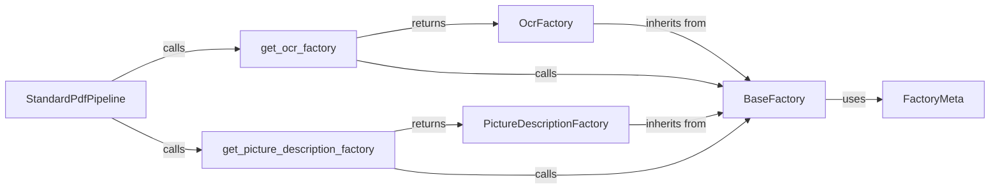

## Component Details

### BaseFactory
The BaseFactory class serves as an abstract factory for creating instances of models. It handles model registration, creation, and loading from plugins, providing a centralized mechanism for managing different AI models within the docling system. It defines the interface for concrete factories and interacts with the FactoryMeta metaclass to customize class creation.
- **Related Classes/Methods**: `repos.docling.docling.models.factories.base_factory.BaseFactory`, `repos.docling.docling.models.factories.base_factory.FactoryMeta`

### OcrFactory
The OcrFactory class is a concrete implementation of the BaseFactory, specialized for creating OCR (Optical Character Recognition) model instances. It inherits the base functionality for model management and focuses on registering and instantiating OCR-specific models. It interacts with BaseFactory by inheriting its methods and StandardPdfPipeline to provide OCR models.
- **Related Classes/Methods**: `repos.docling.docling.models.factories.ocr_factory.OcrFactory`

### PictureDescriptionFactory
The PictureDescriptionFactory class is a concrete implementation of the BaseFactory, specialized for creating picture description model instances. It inherits the base functionality for model management and focuses on registering and instantiating picture description-specific models. It interacts with BaseFactory by inheriting its methods and StandardPdfPipeline to provide picture description models.
- **Related Classes/Methods**: `repos.docling.docling.models.factories.picture_description_factory.PictureDescriptionFactory`

### get_ocr_factory
This function returns the singleton instance of the OcrFactory, ensuring that only one OCR factory exists within the application. It also handles loading OCR models from plugins. It interacts with OcrFactory by returning its instance and BaseFactory by calling load_from_plugins.
- **Related Classes/Methods**: `repos.docling.docling.models.factories:get_ocr_factory`

### get_picture_description_factory
This function returns the singleton instance of the PictureDescriptionFactory, ensuring that only one picture description factory exists within the application. It also handles loading picture description models from plugins. It interacts with PictureDescriptionFactory by returning its instance and BaseFactory by calling load_from_plugins.
- **Related Classes/Methods**: `repos.docling.docling.models.factories:get_picture_description_factory`

### StandardPdfPipeline
The StandardPdfPipeline class defines a pipeline for processing PDF documents, utilizing the model factories to obtain OCR and picture description models. It orchestrates the extraction of text and images from PDFs and uses the models to generate a structured representation of the document. It interacts with the model factories to create model instances and backend components to process the document.
- **Related Classes/Methods**: `repos.docling.docling.pipeline.standard_pdf_pipeline.StandardPdfPipeline`
