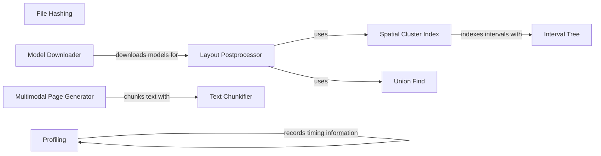

## Component Details

### File Hashing
This component provides the functionality to generate a SHA256 hash of a file. This hash is used for document identification and comparison, ensuring that the system can uniquely identify and track documents throughout the processing pipeline.
- **Related Classes/Methods**: `repos.docling.docling.utils.utils:create_file_hash`

### Model Downloader
The Model Downloader component is responsible for downloading necessary machine learning models from Hugging Face Model Hub or other sources. It ensures that the required models are available locally before processing documents, handling the retrieval and storage of these models.
- **Related Classes/Methods**: `repos.docling.docling.utils.model_downloader:download_models`

### Layout Postprocessor
The Layout Postprocessor component refines the layout of detected elements on a page to improve structure and readability. It merges overlapping or nearby elements and corrects layout inconsistencies, enhancing the quality of the document layout for downstream tasks.
- **Related Classes/Methods**: `repos.docling.docling.utils.layout_postprocessor.LayoutPostprocessor:__init__`, `repos.docling.docling.utils.layout_postprocessor.LayoutPostprocessor:postprocess`

### Spatial Cluster Index
This component indexes spatial clusters (bounding boxes) for efficient overlap detection. It uses an interval tree to quickly find candidate clusters that might overlap with a given bounding box, optimizing the performance of layout postprocessing.
- **Related Classes/Methods**: `repos.docling.docling.utils.layout_postprocessor.SpatialClusterIndex:__init__`, `repos.docling.docling.utils.layout_postprocessor.SpatialClusterIndex:add_cluster`, `repos.docling.docling.utils.layout_postprocessor.SpatialClusterIndex:find_candidates`

### Union Find
The Union-Find component implements the Union-Find data structure to group overlapping clusters during layout postprocessing. It efficiently merges clusters that are found to overlap, facilitating the grouping of related elements in the document layout.
- **Related Classes/Methods**: `repos.docling.docling.utils.layout_postprocessor.UnionFind:find`, `repos.docling.docling.utils.layout_postprocessor.UnionFind:union`, `repos.docling.docling.utils.layout_postprocessor.UnionFind:get_groups`

### Interval Tree
The Interval Tree component is a data structure for efficiently finding intervals that contain a given point. It's used in the SpatialClusterIndex to speed up overlap detection, improving the performance of spatial indexing.
- **Related Classes/Methods**: `repos.docling.docling.utils.layout_postprocessor.IntervalTree:insert`, `repos.docling.docling.utils.layout_postprocessor.IntervalTree:find_containing`

### Multimodal Page Generator
This component generates multimodal pages from a document, combining text, images, and other elements into a single representation suitable for downstream tasks. It facilitates the creation of rich document representations that integrate various types of content.
- **Related Classes/Methods**: `repos.docling.docling.utils.export:generate_multimodal_pages`

### Text Chunkifier
The Text Chunkifier component splits a long text into smaller chunks based on a maximum length. This is useful for processing large documents in smaller, more manageable pieces, enabling efficient processing of extensive textual content.
- **Related Classes/Methods**: `repos.docling.docling.utils.utils:chunkify`

### Profiling
The Profiling component collects timing information for performance analysis. It records the execution time of different parts of the pipeline, allowing developers to identify performance bottlenecks and optimize the system.
- **Related Classes/Methods**: `docling.utils.profiling.ProfilingItem`, `docling.utils.profiling.ProfilingScope`
