```mermaid
graph LR
    Document_Conversion_Manager["Document Conversion Manager"]
    Document_Model["Document Model"]
    Conversion_Pipeline_Framework["Conversion Pipeline Framework"]
    Document_Backends["Document Backends"]
    AI_Model_Suite["AI Model Suite"]
    Model_Management["Model Management"]
    Command_Line_Interface["Command Line Interface"]
    Data_Abstraction_Layer["Data Abstraction Layer"]
    Utilities["Utilities"]
    Document_Conversion_Manager -- "orchestrates" --> Conversion_Pipeline_Framework
    Document_Conversion_Manager -- "uses" --> Document_Model
    Document_Conversion_Manager -- "uses" --> Document_Backends
    Document_Backends -- "parses documents" --> Document_Model
    Conversion_Pipeline_Framework -- "uses" --> AI_Model_Suite
    AI_Model_Suite -- "uses" --> Document_Model
    Model_Management -- "creates instances" --> AI_Model_Suite
    Command_Line_Interface -- "provides interface" --> Document_Conversion_Manager
    Data_Abstraction_Layer -- "defines data structures" --> Document_Conversion_Manager
    Data_Abstraction_Layer -- "defines data structures" --> Conversion_Pipeline_Framework
    Data_Abstraction_Layer -- "defines data structures" --> Document_Backends
    Data_Abstraction_Layer -- "defines data structures" --> AI_Model_Suite
    Data_Abstraction_Layer -- "defines data structures" --> Model_Management
    Data_Abstraction_Layer -- "defines data structures" --> Command_Line_Interface
    Utilities -- "provides utilities" --> Document_Conversion_Manager
    Utilities -- "provides utilities" --> Conversion_Pipeline_Framework
    Utilities -- "provides utilities" --> Document_Backends
    Utilities -- "provides utilities" --> AI_Model_Suite
    Utilities -- "provides utilities" --> Model_Management
    Utilities -- "provides utilities" --> Command_Line_Interface
    Utilities -- "provides utilities" --> Data_Abstraction_Layer
    Document_Conversion_Manager -- "uses" --> Data_Abstraction_Layer
    Conversion_Pipeline_Framework -- "uses" --> Data_Abstraction_Layer
    Document_Backends -- "uses" --> Data_Abstraction_Layer
    AI_Model_Suite -- "uses" --> Data_Abstraction_Layer
    Model_Management -- "uses" --> Data_Abstraction_Layer
    Command_Line_Interface -- "uses" --> Data_Abstraction_Layer
    click Document_Conversion_Manager href "https://github.com/CodeBoarding/GeneratedOnBoardings/blob/main/docling/Document Conversion Manager.md" "Details"
    click Document_Model href "https://github.com/CodeBoarding/GeneratedOnBoardings/blob/main/docling/Document Model.md" "Details"
    click Conversion_Pipeline_Framework href "https://github.com/CodeBoarding/GeneratedOnBoardings/blob/main/docling/Conversion Pipeline Framework.md" "Details"
    click Document_Backends href "https://github.com/CodeBoarding/GeneratedOnBoardings/blob/main/docling/Document Backends.md" "Details"
    click AI_Model_Suite href "https://github.com/CodeBoarding/GeneratedOnBoardings/blob/main/docling/AI Model Suite.md" "Details"
    click Model_Management href "https://github.com/CodeBoarding/GeneratedOnBoardings/blob/main/docling/Model Management.md" "Details"
    click Command_Line_Interface href "https://github.com/CodeBoarding/GeneratedOnBoardings/blob/main/docling/Command Line Interface.md" "Details"
    click Data_Abstraction_Layer href "https://github.com/CodeBoarding/GeneratedOnBoardings/blob/main/docling/Data Abstraction Layer.md" "Details"
    click Utilities href "https://github.com/CodeBoarding/GeneratedOnBoardings/blob/main/docling/Utilities.md" "Details"
```

## Component Details

### Document Conversion Manager
This component orchestrates the entire document conversion process. It handles input document loading, format detection, pipeline selection, and output generation. It acts as the central control point, coordinating the interactions between other components to achieve the desired conversion outcome.
- **Related Classes/Methods**: `repos.docling.docling.document_converter.DocumentConverter`, `repos.docling.docling.document_converter._get_default_option`, `repos.docling.docling.document_converter.FormatOption`

### Document Model
This component represents the document being processed, providing a unified interface for accessing document content and metadata. It handles document loading, format detection, and page segmentation, ensuring that the document is properly prepared for subsequent analysis and conversion steps. It also enforces document limits and provides access to document content and metadata.
- **Related Classes/Methods**: `repos.docling.docling.datamodel.document.InputDocument`, `repos.docling.docling.datamodel.document._DocumentConversionInput`

### Conversion Pipeline Framework
This component defines the abstract execution flow for document conversion, providing a common interface for different conversion strategies. It manages document building, enrichment, assembly, and status determination, orchestrating the execution of AI models and document backends to transform the input document into the desired output format.
- **Related Classes/Methods**: `repos.docling.docling.pipeline.base_pipeline.BasePipeline`, `repos.docling.docling.pipeline.base_pipeline.PaginatedPipeline`, `repos.docling.docling.pipeline.standard_pdf_pipeline.StandardPdfPipeline`, `repos.docling.docling.pipeline.vlm_pipeline.VlmPipeline`

### Document Backends
This component provides specialized implementations for parsing various document formats. Each backend is responsible for extracting text, tables, figures, and other elements from a specific document type, acting as an adapter between the raw document format and the internal Docling representation.
- **Related Classes/Methods**: `repos.docling.docling.backend.abstract_backend.AbstractDocumentBackend`, `repos.docling.docling.backend.pdf_backend.PdfDocumentBackend`, `repos.docling.docling.backend.msword_backend.MsWordDocumentBackend`, `repos.docling.docling.backend.mspowerpoint_backend.MsPowerpointDocumentBackend`, `repos.docling.docling.backend.msexcel_backend.MsExcelDocumentBackend`, `repos.docling.docling.backend.html_backend.HTMLDocumentBackend`, `repos.docling.docling.backend.md_backend.MarkdownDocumentBackend`, `repos.docling.docling.backend.asciidoc_backend.AsciiDocBackend`, `repos.docling.docling.backend.xml.jats_backend.JatsDocumentBackend`, `repos.docling.docling.backend.xml.uspto_backend.PatentUsptoDocumentBackend`

### AI Model Suite
This component encompasses all the AI models used for document analysis and enrichment. It includes models for layout analysis, table structure recognition, OCR, page preprocessing, code/formula detection, picture description, document picture classification, reading order determination, and page assembly. These models provide the intelligence for understanding the document's content and structure.
- **Related Classes/Methods**: `repos.docling.docling.models.layout_model.LayoutModel`, `repos.docling.docling.models.table_structure_model.TableStructureModel`, `repos.docling.docling.models.base_ocr_model.BaseOcrModel`, `repos.docling.docling.models.tesseract_ocr_model.TesseractOcrModel`, `repos.docling.docling.models.easyocr_model.EasyOcrModel`, `repos.docling.docling.models.rapid_ocr_model.RapidOcrModel`, `repos.docling.docling.models.tesseract_ocr_cli_model.TesseractOcrCliModel`, `repos.docling.docling.models.ocr_mac_model.OcrMacModel`, `repos.docling.docling.models.page_preprocessing_model.PagePreprocessingModel`, `repos.docling.docling.models.code_formula_model.CodeFormulaModel`, `repos.docling.docling.models.picture_description_base_model.PictureDescriptionBaseModel`, `repos.docling.docling.models.picture_description_vlm_model.PictureDescriptionVlmModel`, `repos.docling.docling.models.picture_description_api_model.PictureDescriptionApiModel`, `repos.docling.docling.models.hf_vlm_model.HuggingFaceVlmModel`, `repos.docling.docling.models.api_vlm_model.ApiVlmModel`, `repos.docling.docling.models.document_picture_classifier.DocumentPictureClassifier`, `repos.docling.docling.models.readingorder_model.ReadingOrderModel`, `repos.docling.docling.models.page_assemble_model.PageAssembleModel`

### Model Management
This component provides a centralized mechanism for creating and managing instances of different AI models. It supports loading models from plugins and registering custom models, allowing for easy extension and customization of the document analysis pipeline.
- **Related Classes/Methods**: `repos.docling.docling.models.factories.base_factory.BaseFactory`, `repos.docling.docling.models.factories.ocr_factory.OcrFactory`, `repos.docling.docling.models.factories.picture_description_factory.PictureDescriptionFactory`

### Command Line Interface
This component provides a command-line interface for interacting with the Docling library. It allows users to convert documents, download models, and perform other tasks from the command line, providing a convenient way to automate document processing workflows.
- **Related Classes/Methods**: `repos.docling.docling.cli.main.convert`, `repos.docling.docling.cli.models.download`

### Data Abstraction Layer
This component defines the data structures used throughout the Docling library. It includes models for representing documents, pages, elements, predictions, and other data, providing a consistent and well-defined data representation for all components.
- **Related Classes/Methods**: `repos.docling.docling.datamodel.base_models`, `repos.docling.docling.datamodel.document`, `repos.docling.docling.datamodel.pipeline_options`, `repos.docling.docling.datamodel.settings`

### Utilities
This component provides a collection of utility functions and classes used throughout the Docling library. It includes functions for file handling, image processing, layout postprocessing, model downloading, profiling, and exporting, providing reusable functionality for various tasks.
- **Related Classes/Methods**: `repos.docling.docling.utils.utils`, `repos.docling.docling.utils.layout_postprocessor`, `repos.docling.docling.utils.model_downloader`, `repos.docling.docling.utils.profiling`, `repos.docling.docling.utils.export`