```mermaid
graph LR
    Document_Conversion_Manager["Document Conversion Manager"]
    Document_Model_and_Input["Document Model and Input"]
    Conversion_Pipeline_Framework["Conversion Pipeline Framework"]
    Document_Parsing_Backends["Document Parsing Backends"]
    Document_Enrichment_Models_Suite["Document Enrichment Models Suite"]
    Model_Instantiation_Factory["Model Instantiation Factory"]
    Command_Line_Interface_CLI_["Command-Line Interface (CLI)"]
    Core_Data_Definitions["Core Data Definitions"]
    Common_Utility_Functions["Common Utility Functions"]
    Document_Conversion_Manager -- "orchestrates" --> Document_Model_and_Input
    Document_Conversion_Manager -- "uses" --> Conversion_Pipeline_Framework
    Document_Conversion_Manager -- "uses" --> Document_Parsing_Backends
    Document_Parsing_Backends -- "parses documents" --> Document_Model_and_Input
    Conversion_Pipeline_Framework -- "defines execution flow" --> Document_Enrichment_Models_Suite
    Conversion_Pipeline_Framework -- "uses" --> Document_Model_and_Input
    Model_Instantiation_Factory -- "creates model instances" --> Document_Enrichment_Models_Suite
    Command_Line_Interface_CLI_ -- "provides interface" --> Document_Conversion_Manager
    Core_Data_Definitions -- "defines data structures" --> Document_Conversion_Manager
    Core_Data_Definitions -- "defines data structures" --> Document_Model_and_Input
    Core_Data_Definitions -- "defines data structures" --> Conversion_Pipeline_Framework
    Core_Data_Definitions -- "defines data structures" --> Document_Parsing_Backends
    Core_Data_Definitions -- "defines data structures" --> Document_Enrichment_Models_Suite
    Core_Data_Definitions -- "defines data structures" --> Model_Instantiation_Factory
    Core_Data_Definitions -- "defines data structures" --> Command_Line_Interface_CLI_
    Common_Utility_Functions -- "provides utilities" --> Document_Conversion_Manager
    Common_Utility_Functions -- "provides utilities" --> Document_Model_and_Input
    Common_Utility_Functions -- "provides utilities" --> Conversion_Pipeline_Framework
    Common_Utility_Functions -- "provides utilities" --> Document_Parsing_Backends
    Common_Utility_Functions -- "provides utilities" --> Document_Enrichment_Models_Suite
    Common_Utility_Functions -- "provides utilities" --> Model_Instantiation_Factory
    Common_Utility_Functions -- "provides utilities" --> Command_Line_Interface_CLI_
    click Document_Conversion_Manager href "https://github.com/CodeBoarding/GeneratedOnBoardings/blob/main/docling/Document Conversion Manager.md" "Details"
    click Document_Model_and_Input href "https://github.com/CodeBoarding/GeneratedOnBoardings/blob/main/docling/Document Model and Input.md" "Details"
    click Conversion_Pipeline_Framework href "https://github.com/CodeBoarding/GeneratedOnBoardings/blob/main/docling/Conversion Pipeline Framework.md" "Details"
    click Document_Parsing_Backends href "https://github.com/CodeBoarding/GeneratedOnBoardings/blob/main/docling/Document Parsing Backends.md" "Details"
    click Document_Enrichment_Models_Suite href "https://github.com/CodeBoarding/GeneratedOnBoardings/blob/main/docling/Document Enrichment Models Suite.md" "Details"
    click Model_Instantiation_Factory href "https://github.com/CodeBoarding/GeneratedOnBoardings/blob/main/docling/Model Instantiation Factory.md" "Details"
    click Command_Line_Interface_CLI_ href "https://github.com/CodeBoarding/GeneratedOnBoardings/blob/main/docling/Command-Line Interface (CLI).md" "Details"
    click Core_Data_Definitions href "https://github.com/CodeBoarding/GeneratedOnBoardings/blob/main/docling/Core Data Definitions.md" "Details"
    click Common_Utility_Functions href "https://github.com/CodeBoarding/GeneratedOnBoardings/blob/main/docling/Common Utility Functions.md" "Details"
```

## Component Details

### Document Conversion Manager
This component orchestrates the entire document conversion process. It handles input document loading, format detection, pipeline selection, and output generation. It ensures that the document is correctly processed and transformed into the desired Docling format, managing document limits and error handling along the way.
- **Related Classes/Methods**: `repos.docling.docling.document_converter.DocumentConverter`, `repos.docling.docling.document_converter._get_default_option`, `repos.docling.docling.document_converter.FormatOption`

### Document Model and Input
This component represents the document being converted and manages the initial input. It handles document loading, format detection, and page segmentation. It enforces document limits and provides access to document content and metadata, serving as the foundation for subsequent processing stages.
- **Related Classes/Methods**: `repos.docling.docling.datamodel.document.InputDocument`, `repos.docling.docling.datamodel.document._DocumentConversionInput`

### Conversion Pipeline Framework
This component defines the abstract execution flow for document conversion. It manages document building, enrichment, assembly, and status determination. It also orchestrates the execution of enrichment models and provides a base class for specific pipeline implementations, ensuring a consistent and extensible conversion process.
- **Related Classes/Methods**: `repos.docling.docling.pipeline.base_pipeline.BasePipeline`, `repos.docling.docling.pipeline.base_pipeline.PaginatedPipeline`, `repos.docling.docling.pipeline.standard_pdf_pipeline.StandardPdfPipeline`, `repos.docling.docling.pipeline.vlm_pipeline.VlmPipeline`

### Document Parsing Backends
This component provides specialized implementations for parsing various document formats. Each backend is responsible for extracting text, tables, figures, and other elements from a specific document type. It acts as an adapter between the input document and the conversion pipeline, enabling the system to handle diverse document types.
- **Related Classes/Methods**: `repos.docling.docling.backend.abstract_backend.AbstractDocumentBackend`, `repos.docling.docling.backend.pdf_backend.PdfDocumentBackend`, `repos.docling.docling.backend.msword_backend.MsWordDocumentBackend`, `repos.docling.docling.backend.mspowerpoint_backend.MsPowerpointDocumentBackend`, `repos.docling.docling.backend.msexcel_backend.MsExcelDocumentBackend`, `repos.docling.docling.backend.html_backend.HTMLDocumentBackend`, `repos.docling.docling.backend.md_backend.MarkdownDocumentBackend`, `repos.docling.docling.backend.asciidoc_backend.AsciiDocBackend`, `repos.docling.docling.backend.xml.jats_backend.JatsDocumentBackend`, `repos.docling.docling.backend.xml.uspto_backend.PatentUsptoDocumentBackend`

### Document Enrichment Models Suite
This component encompasses a suite of models used to enrich the document with additional information. This includes layout analysis, table structure recognition, OCR, page preprocessing, code/formula detection, picture description, document picture classification, reading order determination, and page assembly. These models enhance the document's structure and content, providing a comprehensive understanding of the document.
- **Related Classes/Methods**: `repos.docling.docling.models.layout_model.LayoutModel`, `repos.docling.docling.models.table_structure_model.TableStructureModel`, `repos.docling.docling.models.base_ocr_model.BaseOcrModel`, `repos.docling.docling.models.page_preprocessing_model.PagePreprocessingModel`, `repos.docling.docling.models.code_formula_model.CodeFormulaModel`, `repos.docling.docling.models.picture_description_base_model.PictureDescriptionBaseModel`, `repos.docling.docling.models.document_picture_classifier.DocumentPictureClassifier`, `repos.docling.docling.models.readingorder_model.ReadingOrderModel`, `repos.docling.docling.models.page_assemble_model.PageAssembleModel`

### Model Instantiation Factory
This component provides a centralized mechanism for creating instances of different models. It supports loading models from plugins and registering custom models. It decouples the model creation process from the rest of the system, promoting flexibility and maintainability.
- **Related Classes/Methods**: `repos.docling.docling.models.factories.base_factory.BaseFactory`, `repos.docling.docling.models.factories.ocr_factory.OcrFactory`, `repos.docling.docling.models.factories.picture_description_factory.PictureDescriptionFactory`

### Command-Line Interface (CLI)
This component provides a command-line interface for interacting with the Docling library. It allows users to convert documents, download models, and perform other tasks from the command line. It serves as an entry point for users to access the library's functionality, providing a convenient way to interact with the system.
- **Related Classes/Methods**: `repos.docling.docling.cli.main.convert`, `repos.docling.docling.cli.models.download`

### Core Data Definitions
This component defines the core data structures used throughout the Docling library. It includes models for representing documents, pages, elements, predictions, and other data. It provides a consistent and well-defined data representation for all components, ensuring data integrity and interoperability.
- **Related Classes/Methods**: `repos.docling.docling.datamodel.base_models`, `repos.docling.docling.datamodel.document`, `repos.docling.docling.datamodel.pipeline_options`, `repos.docling.docling.datamodel.settings`

### Common Utility Functions
This component provides a collection of utility functions and classes used throughout the Docling library. It includes functions for file handling, image processing, layout postprocessing, and other tasks. It provides reusable functionality to simplify common tasks, promoting code reuse and reducing redundancy.
- **Related Classes/Methods**: `repos.docling.docling.utils.utils`, `repos.docling.docling.utils.layout_postprocessor`, `repos.docling.docling.utils.model_downloader`, `repos.docling.docling.utils.profiling`, `repos.docling.docling.utils.export`