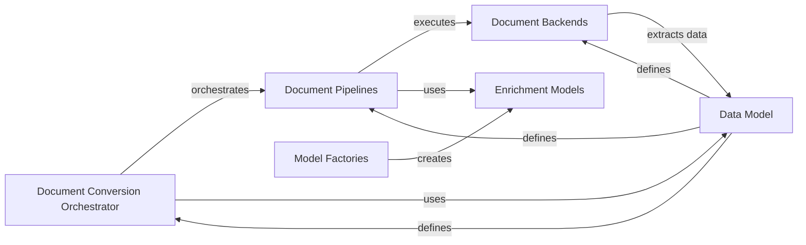

## Component Details

The docling project focuses on converting documents of various formats into structured data. The core flow involves the Document Conversion Orchestrator receiving a document, selecting an appropriate Document Pipeline based on the document type, and then utilizing Document Backends to extract raw data. Enrichment Models are applied within the pipelines to enhance the extracted data with OCR, layout analysis, and contextual information. The Data Model provides a consistent structure for representing document content and analysis results, while Model Factories manage the creation and configuration of Enrichment Models.

### Document Conversion Orchestrator
This component manages the overall document conversion process. It selects the appropriate pipeline based on the input document type, initializes the pipeline, and handles batch processing and error management. It acts as the central control point for document conversion.
- **Related Classes/Methods**: `docling.docling.document_converter.DocumentConverter`

### Document Pipelines
Document Pipelines define the execution flow for document conversion. They manage the execution of enrichment models and ensure that the document is properly processed. Different pipelines exist for different document types, such as PDF, Word, and VLM-enhanced documents. Pipelines are responsible for orchestrating the various models and backends to extract information from the document.
- **Related Classes/Methods**: `docling.docling.pipeline.base_pipeline.BasePipeline`, `docling.docling.pipeline.simple_pipeline.SimplePipeline`, `docling.docling.pipeline.standard_pdf_pipeline.StandardPdfPipeline`, `docling.docling.pipeline.vlm_pipeline.VlmPipeline`

### Document Backends
Document Backends handle the parsing and extraction of content from different file formats. They provide methods for accessing text, images, and other elements within a document. Each backend is specific to a particular file format, such as MS Word, PDF, or HTML. Backends are responsible for extracting the raw data from the document.
- **Related Classes/Methods**: `docling.docling.backend.abstract_backend.AbstractDocumentBackend`, `docling.docling.backend.msword_backend.MsWordDocumentBackend`, `docling.docling.backend.mspowerpoint_backend.MsPowerpointDocumentBackend`, `docling.docling.backend.msexcel_backend.MsExcelDocumentBackend`, `docling.docling.backend.html_backend.HTMLDocumentBackend`, `docling.docling.backend.md_backend.MarkdownDocumentBackend`, `docling.docling.backend.pdf_backend.PdfDocumentBackend`, `docling.docling.backend.pypdfium2_backend.PyPdfiumDocumentBackend`, `docling.docling.backend.docling_parse_v4_backend.DoclingParseV4DocumentBackend`

### Enrichment Models
Enrichment Models provide additional processing and analysis of document content. This includes OCR models for extracting text from images, layout analysis models for detecting the layout of document pages, and VLM models for enriching documents with contextual information. These models enhance the extracted data with semantic understanding.
- **Related Classes/Methods**: `docling.docling.models.easyocr_model.EasyOcrModel`, `docling.docling.models.tesseract_ocr_model.TesseractOcrModel`, `docling.docling.models.rapid_ocr_model.RapidOcrModel`, `docling.docling.models.layout_model.LayoutModel`, `docling.docling.models.page_preprocessing_model.PagePreprocessingModel`, `docling.docling.models.hf_vlm_model.HuggingFaceVlmModel`, `docling.docling.models.api_vlm_model.ApiVlmModel`

### Data Model
Data Models define the structure of the data used throughout the system, including documents, pages, elements, and predictions. They provide a consistent way to represent document content and analysis results. The data model ensures that all components are working with a consistent representation of the document and its contents.
- **Related Classes/Methods**: `docling.docling.datamodel.base_models`, `docling.docling.datamodel.document`

### Model Factories
Model Factories are responsible for creating instances of models, managing their configuration, and loading them from plugins. They provide a flexible way to extend the system with new models. The factories abstract the creation and configuration of models, allowing for easy extension and customization.
- **Related Classes/Methods**: `docling.docling.models.factories.base_factory.BaseFactory`, `docling.docling.models.factories.ocr_factory.OcrFactory`, `docling.docling.models.factories.picture_description_factory.PictureDescriptionFactory`