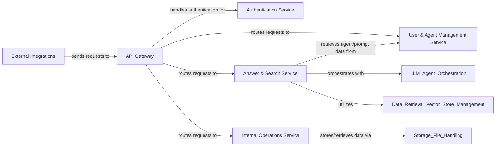

## Component Details

The API & External Interfaces subsystem serves as the primary entry point for all external and internal interactions within the DocsGPT application. It is responsible for handling incoming API requests, authenticating users, and routing these requests to the appropriate internal services. Additionally, it manages integrations with various external platforms, such as chat applications, to extend the application's reach and functionality. This subsystem ensures secure and efficient communication between the DocsGPT core and its users and integrated third-party services.

### API Gateway
This component serves as the central entry point for all incoming API requests, handling initial request processing, routing to specific endpoints, and integrating with the authentication mechanism. It orchestrates the flow of requests to various internal services.

**Related Classes/Methods**:

- <a href="https://github.com/arc53/docsgpt/blob/master/application/app.py#L92-L102" target="_blank" rel="noopener noreferrer">`docsgpt.application.app:authenticate_request` (92:102)</a>
- <a href="https://github.com/arc53/docsgpt/blob/master/application/api/answer/routes.py#L384-L567" target="_blank" rel="noopener noreferrer">`docsgpt.application.api.answer.routes:Stream` (384:567)</a>
- <a href="https://github.com/arc53/docsgpt/blob/master/application/api/answer/routes.py#L576-L774" target="_blank" rel="noopener noreferrer">`docsgpt.application.api.answer.routes:Answer` (576:774)</a>
- <a href="https://github.com/arc53/docsgpt/blob/master/application/api/answer/routes.py#L778-L885" target="_blank" rel="noopener noreferrer">`docsgpt.application.api.answer.routes:Search` (778:885)</a>
- `docsgpt.application.api.user.routes` (full file reference)
- `docsgpt.application.api.internal.routes` (full file reference)

### Authentication Service
This component is dedicated to handling user authentication and authorization, ensuring that only legitimate and authorized requests gain access to the application's resources. It decodes and validates JWT tokens.

**Related Classes/Methods**:

- <a href="https://github.com/arc53/docsgpt/blob/master/application/auth.py#L6-L28" target="_blank" rel="noopener noreferrer">`docsgpt.application.auth.handle_auth` (6:28)</a>
- <a href="https://github.com/arc53/docsgpt/blob/master/application/app.py#L92-L102" target="_blank" rel="noopener noreferrer">`docsgpt.application.app:authenticate_request` (92:102)</a>

### External Integrations
This component manages connections and interactions with third-party platforms, such as chat applications (e.g., Chatwoot, Discord). It facilitates the exchange of messages and data between DocsGPT and these external services.

**Related Classes/Methods**:

- `docsgpt.extensions.chatwoot.app` (full file reference)
- `docsgpt.extensions.discord.bot` (full file reference)

### Answer & Search Service
This component is responsible for processing user questions, generating answers, and performing document searches. It orchestrates interactions with LLM agents, retrievers, and manages conversation history and source logging.

**Related Classes/Methods**:

- <a href="https://github.com/arc53/docsgpt/blob/master/application/api/answer/routes.py#L384-L567" target="_blank" rel="noopener noreferrer">`docsgpt.application.api.answer.routes:Stream` (384:567)</a>
- <a href="https://github.com/arc53/docsgpt/blob/master/application/api/answer/routes.py#L576-L774" target="_blank" rel="noopener noreferrer">`docsgpt.application.api.answer.routes:Answer` (576:774)</a>
- <a href="https://github.com/arc53/docsgpt/blob/master/application/api/answer/routes.py#L778-L885" target="_blank" rel="noopener noreferrer">`docsgpt.application.api.answer.routes:Search` (778:885)</a>
- <a href="https://github.com/arc53/docsgpt/blob/master/application/api/answer/routes.py#L266-L380" target="_blank" rel="noopener noreferrer">`docsgpt.application.api.answer.routes:complete_stream` (266:380)</a>
- <a href="https://github.com/arc53/docsgpt/blob/master/application/api/answer/routes.py#L153-L251" target="_blank" rel="noopener noreferrer">`docsgpt.application.api.answer.routes:save_conversation` (153:251)</a>
- <a href="https://github.com/arc53/docsgpt/blob/master/application/api/answer/routes.py#L89-L118" target="_blank" rel="noopener noreferrer">`docsgpt.application.api.answer.routes:get_agent_key` (89:118)</a>
- <a href="https://github.com/arc53/docsgpt/blob/master/application/api/answer/routes.py#L121-L134" target="_blank" rel="noopener noreferrer">`docsgpt.application.api.answer.routes:get_data_from_api_key` (121:134)</a>
- <a href="https://github.com/arc53/docsgpt/blob/master/application/api/answer/routes.py#L137-L142" target="_blank" rel="noopener noreferrer">`docsgpt.application.api.answer.routes:get_retriever` (137:142)</a>
- <a href="https://github.com/arc53/docsgpt/blob/master/application/api/answer/routes.py#L254-L263" target="_blank" rel="noopener noreferrer">`docsgpt.application.api.answer.routes:get_prompt` (254:263)</a>
- <a href="https://github.com/arc53/docsgpt/blob/master/application/api/answer/routes.py#L888-L916" target="_blank" rel="noopener noreferrer">`docsgpt.application.api.answer.routes:get_attachments_content` (888:916)</a>

### User & Agent Management Service
This component handles all user-related operations, including managing user profiles, conversation history, custom prompts, and the creation, retrieval, updating, and sharing of AI agents.

**Related Classes/Methods**:

- `docsgpt.application.api.user.routes` (full file reference)

### Internal Operations Service
This component manages internal application operations, such as file uploads for indexes and other data, and provides download capabilities for processed files. It interacts with the storage layer.

**Related Classes/Methods**:

- `docsgpt.application.api.internal.routes` (full file reference)

### [FAQ](https://github.com/CodeBoarding/GeneratedOnBoardings/tree/main?tab=readme-ov-file#faq)