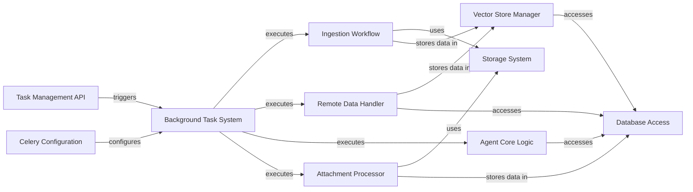

## Component Details

This graph illustrates the architecture of the background task system, highlighting its central role in managing asynchronous operations. The system, primarily powered by Celery, receives task triggers from the Task Management API and is configured by the Celery Configuration component. It then orchestrates and executes various workflows, including local document ingestion, remote data synchronization, agent core logic processing, and attachment handling. These workflows, in turn, interact with specialized components like the Storage System, Vector Store Manager, and Database Access for data persistence and retrieval, ensuring that long-running operations do not impede the main application's responsiveness.

### Background Task System
Manages and executes asynchronous tasks in the background, such as document ingestion, remote content synchronization, and processing agent webhooks, preventing long-running operations from blocking the main application thread.

**Related Classes/Methods**:

- `docsgpt.application.worker` (full file reference)
- `docsgpt.application.api.user.tasks` (full file reference)
- <a href="https://github.com/arc53/docsgpt/blob/master/application/celery_init.py#L17-L20" target="_blank" rel="noopener noreferrer">`docsgpt.application.celery_init:config_loggers` (17:20)</a>

### Ingestion Workflow
This component orchestrates the process of ingesting local documents. It handles reading files, extracting content from zip archives, chunking the text into manageable segments, converting them to a standardized format, calculating token counts, embedding the documents, and finally storing them in the vector store.

**Related Classes/Methods**:

- <a href="https://github.com/arc53/docsgpt/blob/master/application/worker.py#L196-L308" target="_blank" rel="noopener noreferrer">`application.worker.ingest_worker` (196:308)</a>
- <a href="https://github.com/arc53/docsgpt/blob/master/application/worker.py#L58-L86" target="_blank" rel="noopener noreferrer">`application.worker.extract_zip_recursive` (58:86)</a>
- <a href="https://github.com/arc53/docsgpt/blob/master/application/parser/file/bulk.py#L37-L183" target="_blank" rel="noopener noreferrer">`application.parser.file.bulk.SimpleDirectoryReader` (37:183)</a>
- <a href="https://github.com/arc53/docsgpt/blob/master/application/parser/chunking.py#L9-L118" target="_blank" rel="noopener noreferrer">`application.parser.chunking.Chunker` (9:118)</a>
- <a href="https://github.com/arc53/docsgpt/blob/master/application/parser/schema/base.py#L26-L29" target="_blank" rel="noopener noreferrer">`application.parser.schema.base.Document.to_langchain_format` (26:29)</a>
- <a href="https://github.com/arc53/docsgpt/blob/master/application/utils.py#L38-L44" target="_blank" rel="noopener noreferrer">`application.utils.count_tokens_docs` (38:44)</a>

### Remote Data Handler
This component is responsible for ingesting documents from remote sources and managing their synchronization. It creates appropriate loaders for different remote data types, processes the data by chunking and embedding, and handles periodic updates to keep the data current.

**Related Classes/Methods**:

- <a href="https://github.com/arc53/docsgpt/blob/master/application/worker.py#L311-L377" target="_blank" rel="noopener noreferrer">`application.worker.remote_worker` (311:377)</a>
- <a href="https://github.com/arc53/docsgpt/blob/master/application/worker.py#L380-L407" target="_blank" rel="noopener noreferrer">`application.worker.sync` (380:407)</a>
- <a href="https://github.com/arc53/docsgpt/blob/master/application/worker.py#L410-L432" target="_blank" rel="noopener noreferrer">`application.worker.sync_worker` (410:432)</a>
- `application.parser.remote.remote_creator.create_loader` (full file reference)

### Agent Core Logic
This component encapsulates the core functionality for executing AI agents. It involves creating agent and retriever instances based on configuration, fetching prompts, and processing input data to generate intelligent responses, including handling tool calls and source attribution.

**Related Classes/Methods**:

- <a href="https://github.com/arc53/docsgpt/blob/master/application/worker.py#L126-L192" target="_blank" rel="noopener noreferrer">`application.worker.run_agent_logic` (126:192)</a>
- <a href="https://github.com/arc53/docsgpt/blob/master/application/api/answer/routes.py#L254-L263" target="_blank" rel="noopener noreferrer">`application.api.answer.routes.get_prompt` (254:263)</a>
- <a href="https://github.com/arc53/docsgpt/blob/master/application/agents/agent_creator.py#L12-L16" target="_blank" rel="noopener noreferrer">`application.agents.agent_creator.AgentCreator.create_agent` (12:16)</a>
- <a href="https://github.com/arc53/docsgpt/blob/master/application/retriever/retriever_creator.py#L15-L20" target="_blank" rel="noopener noreferrer">`application.retriever.retriever_creator.RetrieverCreator.create_retriever` (15:20)</a>

### Attachment Processor
This component specializes in processing and storing attachments. Unlike other ingestion workflows, it focuses on extracting the raw content and metadata of files and storing them directly in the database without performing vectorization.

**Related Classes/Methods**:

- <a href="https://github.com/arc53/docsgpt/blob/master/application/worker.py#L435-L509" target="_blank" rel="noopener noreferrer">`application.worker.attachment_worker` (435:509)</a>
- <a href="https://github.com/arc53/docsgpt/blob/master/application/utils.py#L18-L24" target="_blank" rel="noopener noreferrer">`application.utils.num_tokens_from_string` (18:24)</a>

### Task Management API
This component provides the external interface for triggering various asynchronous operations within the system. It exposes Celery tasks for initiating local and remote document ingestion, scheduling data synchronizations, storing attachments, and processing agent webhooks.

**Related Classes/Methods**:

- <a href="https://github.com/arc53/docsgpt/blob/master/application/api/user/tasks.py#L14-L16" target="_blank" rel="noopener noreferrer">`application.api.user.tasks.ingest` (14:16)</a>
- <a href="https://github.com/arc53/docsgpt/blob/master/application/api/user/tasks.py#L20-L22" target="_blank" rel="noopener noreferrer">`application.api.user.tasks.ingest_remote` (20:22)</a>
- <a href="https://github.com/arc53/docsgpt/blob/master/application/api/user/tasks.py#L26-L28" target="_blank" rel="noopener noreferrer">`application.api.user.tasks.schedule_syncs` (26:28)</a>
- <a href="https://github.com/arc53/docsgpt/blob/master/application/api/user/tasks.py#L32-L34" target="_blank" rel="noopener noreferrer">`application.api.user.tasks.store_attachment` (32:34)</a>
- <a href="https://github.com/arc53/docsgpt/blob/master/application/api/user/tasks.py#L38-L40" target="_blank" rel="noopener noreferrer">`application.api.user.tasks.process_agent_webhook` (38:40)</a>

### Celery Configuration
This component handles the initialization and configuration of the Celery application, including logging setup, which is crucial for the background task system's operation.

**Related Classes/Methods**:

- `application.celery_init` (full file reference)
- <a href="https://github.com/arc53/docsgpt/blob/master/application/celery_init.py#L17-L20" target="_blank" rel="noopener noreferrer">`application.celery_init.config_loggers` (17:20)</a>

### Storage System
This component provides an abstraction layer for file storage operations, allowing the system to interact with different storage backends, such as local file systems or cloud-based S3 buckets, in a unified manner.

**Related Classes/Methods**:

- <a href="https://github.com/arc53/docsgpt/blob/master/application/storage/storage_creator.py#L19-L24" target="_blank" rel="noopener noreferrer">`application.storage.storage_creator.StorageCreator.get_storage` (19:24)</a>

### Vector Store Manager
This component is responsible for the embedding of processed documents and their subsequent storage and retrieval from the vector database. It handles the creation, updating, and saving of the vector index.

**Related Classes/Methods**:

- <a href="https://github.com/arc53/docsgpt/blob/master/application/parser/embedding_pipeline.py#L26-L86" target="_blank" rel="noopener noreferrer">`application.parser.embedding_pipeline.embed_and_store_documents` (26:86)</a>
- <a href="https://github.com/arc53/docsgpt/blob/master/application/worker.py#L100-L123" target="_blank" rel="noopener noreferrer">`application.worker.upload_index` (100:123)</a>

### Database Access
This component provides a centralized mechanism for establishing and managing connections to the MongoDB database, facilitating the storage and retrieval of various application-related data and configurations.

**Related Classes/Methods**:

- <a href="https://github.com/arc53/docsgpt/blob/master/application/core/mongo_db.py#L9-L15" target="_blank" rel="noopener noreferrer">`application.core.mongo_db.MongoDB.get_client` (9:15)</a>

### [FAQ](https://github.com/CodeBoarding/GeneratedOnBoardings/tree/main?tab=readme-ov-file#faq)