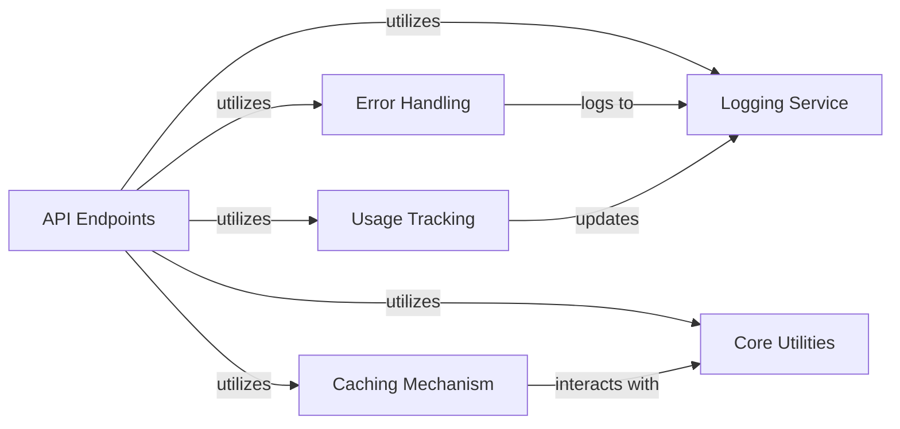

## Component Details

The Core Utilities & Observability component provides essential foundational services to the Docsgpt application. It encompasses general-purpose utility functions for common tasks like token counting and chat history management, robust error handling for consistent API responses, and comprehensive logging for monitoring application activities and errors. Additionally, it includes a caching mechanism to enhance performance. This component serves as a support layer, ensuring the smooth operation, efficient resource utilization, and maintainability of the entire system by providing shared functionalities and observability features.

### Core Utilities
Provides general-purpose utility functions such as token counting, chat history limiting, and data hashing. These utilities are used across various components for common tasks.

**Related Classes/Methods**:

- <a href="https://github.com/arc53/docsgpt/blob/master/application/utils.py#L18-L24" target="_blank" rel="noopener noreferrer">`docsgpt.application.utils:num_tokens_from_string` (18:24)</a>
- <a href="https://github.com/arc53/docsgpt/blob/master/application/utils.py#L27-L35" target="_blank" rel="noopener noreferrer">`docsgpt.application.utils:num_tokens_from_object_or_list` (27:35)</a>
- <a href="https://github.com/arc53/docsgpt/blob/master/application/utils.py#L11-L15" target="_blank" rel="noopener noreferrer">`docsgpt.application.utils:get_encoding` (11:15)</a>
- <a href="https://github.com/arc53/docsgpt/blob/master/application/utils.py#L38-L44" target="_blank" rel="noopener noreferrer">`docsgpt.application.utils:count_tokens_docs` (38:44)</a>
- <a href="https://github.com/arc53/docsgpt/blob/master/application/utils.py#L66-L104" target="_blank" rel="noopener noreferrer">`docsgpt.application.utils:limit_chat_history` (66:104)</a>
- <a href="https://github.com/arc53/docsgpt/blob/master/application/utils.py#L62-L63" target="_blank" rel="noopener noreferrer">`docsgpt.application.utils:get_hash` (62:63)</a>

### Error Handling
Manages the generation and handling of application-specific errors, providing structured error responses to API consumers.

**Related Classes/Methods**:

- <a href="https://github.com/arc53/docsgpt/blob/master/application/error.py#L14-L15" target="_blank" rel="noopener noreferrer">`docsgpt.application.error:bad_request` (14:15)</a>
- <a href="https://github.com/arc53/docsgpt/blob/master/application/error.py#L5-L11" target="_blank" rel="noopener noreferrer">`docsgpt.application.error.response_error` (5:11)</a>

### Usage Tracking
Responsible for tracking and updating token usage across the application, providing insights into resource consumption.

**Related Classes/Methods**:

- <a href="https://github.com/arc53/docsgpt/blob/master/application/usage.py#L30-L47" target="_blank" rel="noopener noreferrer">`docsgpt.application.usage:gen_token_usage` (30:47)</a>
- <a href="https://github.com/arc53/docsgpt/blob/master/application/usage.py#L50-L65" target="_blank" rel="noopener noreferrer">`docsgpt.application.usage:stream_token_usage` (50:65)</a>
- <a href="https://github.com/arc53/docsgpt/blob/master/application/usage.py#L13-L27" target="_blank" rel="noopener noreferrer">`docsgpt.application.usage.update_token_usage` (13:27)</a>

### Caching Mechanism
Implements caching functionalities to improve application performance and responsiveness by storing and retrieving frequently accessed data.

**Related Classes/Methods**:

- <a href="https://github.com/arc53/docsgpt/blob/master/application/cache.py#L36-L43" target="_blank" rel="noopener noreferrer">`docsgpt.application.cache:gen_cache_key` (36:43)</a>
- <a href="https://github.com/arc53/docsgpt/blob/master/application/cache.py#L46-L75" target="_blank" rel="noopener noreferrer">`docsgpt.application.cache:gen_cache` (46:75)</a>
- <a href="https://github.com/arc53/docsgpt/blob/master/application/cache.py#L78-L117" target="_blank" rel="noopener noreferrer">`docsgpt.application.cache:stream_cache` (78:117)</a>
- <a href="https://github.com/arc53/docsgpt/blob/master/application/cache.py#L17-L33" target="_blank" rel="noopener noreferrer">`docsgpt.application.cache.get_redis_instance` (17:33)</a>

### Logging Service
Provides comprehensive logging capabilities for application activities and errors, including structured logging and integration with MongoDB for persistence.

**Related Classes/Methods**:

- <a href="https://github.com/arc53/docsgpt/blob/master/application/logging.py#L71-L94" target="_blank" rel="noopener noreferrer">`docsgpt.application.logging:log_activity` (71:94)</a>
- <a href="https://github.com/arc53/docsgpt/blob/master/application/logging.py#L97-L123" target="_blank" rel="noopener noreferrer">`docsgpt.application.logging:_consume_and_log` (97:123)</a>
- <a href="https://github.com/arc53/docsgpt/blob/master/application/logging.py#L126-L154" target="_blank" rel="noopener noreferrer">`docsgpt.application.logging:_log_to_mongodb` (126:154)</a>
- <a href="https://github.com/arc53/docsgpt/blob/master/application/logging.py#L27-L68" target="_blank" rel="noopener noreferrer">`docsgpt.application.logging.build_stack_data` (27:68)</a>
- <a href="https://github.com/arc53/docsgpt/blob/master/application/logging.py#L17-L24" target="_blank" rel="noopener noreferrer">`docsgpt.application.logging.LogContext` (17:24)</a>

### API Endpoints
This component defines and manages the external-facing API endpoints for the Docsgpt application. It handles incoming HTTP requests, routes them to appropriate handlers, and orchestrates the overall flow for user interactions, including answering questions, managing user data, and handling file uploads.

**Related Classes/Methods**:

- <a href="https://github.com/arc53/docsgpt/blob/master/application/api/answer/routes.py#L570-L572" target="_blank" rel="noopener noreferrer">`docsgpt.application.api.answer.routes.error_stream_generate` (570:572)</a>

### [FAQ](https://github.com/CodeBoarding/GeneratedOnBoardings/tree/main?tab=readme-ov-file#faq)