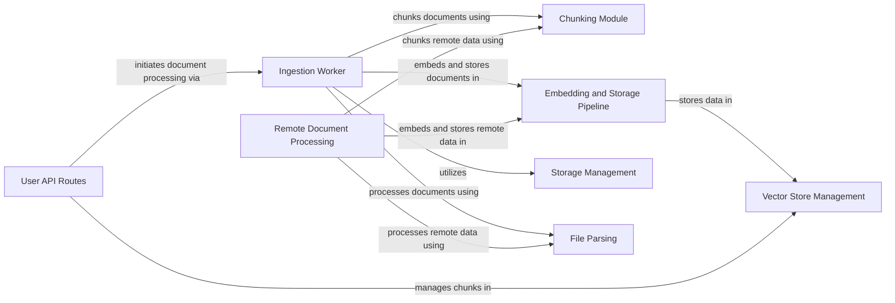

## Component Details

This graph illustrates the architecture of the Data Management & Storage subsystem, detailing how documents are ingested, parsed, chunked, embedded, and persistently stored. It encompasses the flow from initial document processing by ingestion and remote workers, through various parsing and chunking stages, to the final embedding and storage in diverse vector and file storage solutions.

### Ingestion Worker
The Ingestion Worker orchestrates the processing and ingestion of documents from diverse sources. It manages file extraction, document parsing, chunking, embedding, and the storage of processed documents in the vector store, including the upload of the final index.

**Related Classes/Methods**:

- <a href="https://github.com/arc53/docsgpt/blob/master/application/worker.py#L196-L308" target="_blank" rel="noopener noreferrer">`docsgpt.application.worker.ingest_worker` (196:308)</a>
- <a href="https://github.com/arc53/docsgpt/blob/master/application/worker.py#L58-L86" target="_blank" rel="noopener noreferrer">`docsgpt.application.worker.extract_zip_recursive` (58:86)</a>
- <a href="https://github.com/arc53/docsgpt/blob/master/application/worker.py#L100-L123" target="_blank" rel="noopener noreferrer">`docsgpt.application.worker.upload_index` (100:123)</a>

### Chunking Module
The Chunking Module is dedicated to breaking down raw documents into smaller, semantically meaningful chunks. It implements various chunking strategies, adheres to token limits, and handles structural elements like headers to optimize document segmentation for embedding and retrieval.

**Related Classes/Methods**:

- <a href="https://github.com/arc53/docsgpt/blob/master/application/parser/chunking.py#L9-L118" target="_blank" rel="noopener noreferrer">`docsgpt.application.parser.chunking.Chunker` (9:118)</a>
- <a href="https://github.com/arc53/docsgpt/blob/master/application/parser/chunking.py#L111-L118" target="_blank" rel="noopener noreferrer">`docsgpt.application.parser.chunking.Chunker.chunk` (111:118)</a>
- <a href="https://github.com/arc53/docsgpt/blob/master/application/parser/chunking.py#L71-L109" target="_blank" rel="noopener noreferrer">`docsgpt.application.parser.chunking.Chunker.classic_chunk` (71:109)</a>
- <a href="https://github.com/arc53/docsgpt/blob/master/application/parser/chunking.py#L35-L44" target="_blank" rel="noopener noreferrer">`docsgpt.application.parser.chunking.Chunker.combine_documents` (35:44)</a>
- <a href="https://github.com/arc53/docsgpt/blob/master/application/parser/chunking.py#L46-L69" target="_blank" rel="noopener noreferrer">`docsgpt.application.parser.chunking.Chunker.split_document` (46:69)</a>
- <a href="https://github.com/arc53/docsgpt/blob/master/application/parser/chunking.py#L25-L33" target="_blank" rel="noopener noreferrer">`docsgpt.application.parser.chunking.Chunker.separate_header_and_body` (25:33)</a>
- <a href="https://github.com/arc53/docsgpt/blob/master/application/parser/schema/base.py#L9-L34" target="_blank" rel="noopener noreferrer">`docsgpt.application.parser.schema.base.Document` (9:34)</a>

### Embedding and Storage Pipeline
This component is responsible for transforming document chunks into vector embeddings and subsequently storing them in the selected vector store. It incorporates retry mechanisms to ensure robust document addition and manages the local saving of the vector store index.

**Related Classes/Methods**:

- <a href="https://github.com/arc53/docsgpt/blob/master/application/parser/embedding_pipeline.py#L26-L86" target="_blank" rel="noopener noreferrer">`docsgpt.application.parser.embedding_pipeline:embed_and_store_documents` (26:86)</a>
- <a href="https://github.com/arc53/docsgpt/blob/master/application/parser/embedding_pipeline.py#L10-L23" target="_blank" rel="noopener noreferrer">`docsgpt.application.parser.embedding_pipeline:add_text_to_store_with_retry` (10:23)</a>

### Vector Store Management
This component provides a unified interface for interacting with various vector database implementations (e.g., FAISS, MongoDB, Elasticsearch, Qdrant, Milvus, LanceDB). It handles the creation, searching, addition, and deletion of document chunks, ensuring consistency in embedding dimensions across different stores.

**Related Classes/Methods**:

- <a href="https://github.com/arc53/docsgpt/blob/master/application/vectorstore/vector_creator.py#L18-L22" target="_blank" rel="noopener noreferrer">`docsgpt.application.vectorstore.vector_creator.VectorCreator.create_vectorstore` (18:22)</a>
- <a href="https://github.com/arc53/docsgpt/blob/master/application/vectorstore/base.py#L53-L89" target="_blank" rel="noopener noreferrer">`docsgpt.application.vectorstore.base.BaseVectorStore` (53:89)</a>
- <a href="https://github.com/arc53/docsgpt/blob/master/application/vectorstore/mongodb.py#L7-L177" target="_blank" rel="noopener noreferrer">`docsgpt.application.vectorstore.mongodb.MongoDBVectorStore` (7:177)</a>
- <a href="https://github.com/arc53/docsgpt/blob/master/application/vectorstore/elasticsearch.py#L6-L207" target="_blank" rel="noopener noreferrer">`docsgpt.application.vectorstore.elasticsearch.ElasticsearchStore` (6:207)</a>
- <a href="https://github.com/arc53/docsgpt/blob/master/application/vectorstore/faiss.py#L20-L115" target="_blank" rel="noopener noreferrer">`docsgpt.application.vectorstore.faiss.FaissStore` (20:115)</a>
- <a href="https://github.com/arc53/docsgpt/blob/master/application/vectorstore/qdrant.py#L5-L48" target="_blank" rel="noopener noreferrer">`docsgpt.application.vectorstore.qdrant.QdrantStore` (5:48)</a>
- <a href="https://github.com/arc53/docsgpt/blob/master/application/vectorstore/milvus.py#L9-L38" target="_blank" rel="noopener noreferrer">`docsgpt.application.vectorstore.milvus.MilvusStore` (9:38)</a>
- <a href="https://github.com/arc53/docsgpt/blob/master/application/vectorstore/lancedb.py#L6-L119" target="_blank" rel="noopener noreferrer">`docsgpt.application.vectorstore.lancedb.LanceDBVectorStore` (6:119)</a>
- <a href="https://github.com/arc53/docsgpt/blob/master/application/vectorstore/base.py#L7-L24" target="_blank" rel="noopener noreferrer">`docsgpt.application.vectorstore.base.EmbeddingsWrapper` (7:24)</a>
- <a href="https://github.com/arc53/docsgpt/blob/master/application/vectorstore/base.py#L28-L51" target="_blank" rel="noopener noreferrer">`docsgpt.application.vectorstore.base.EmbeddingsSingleton` (28:51)</a>
- <a href="https://github.com/arc53/docsgpt/blob/master/application/core/mongo_db.py#L9-L15" target="_blank" rel="noopener noreferrer">`docsgpt.application.core.mongo_db.MongoDB.get_client` (9:15)</a>

### Storage Management
The Storage Management component provides an abstract layer for interacting with various file storage solutions, including local file systems and cloud-based storage like S3. It offers functionalities for retrieving, saving, deleting, and listing files.

**Related Classes/Methods**:

- <a href="https://github.com/arc53/docsgpt/blob/master/application/storage/storage_creator.py#L19-L24" target="_blank" rel="noopener noreferrer">`docsgpt.application.storage.storage_creator.StorageCreator.get_storage` (19:24)</a>
- <a href="https://github.com/arc53/docsgpt/blob/master/application/storage/s3.py#L13-L120" target="_blank" rel="noopener noreferrer">`docsgpt.application.storage.s3.S3Storage` (13:120)</a>
- <a href="https://github.com/arc53/docsgpt/blob/master/application/storage/local.py#L9-L103" target="_blank" rel="noopener noreferrer">`docsgpt.application.storage.local.LocalStorage` (9:103)</a>

### Remote Document Processing
This component specializes in handling the ingestion and processing of documents from remote sources such as web crawlers, GitHub repositories, and sitemaps. It leverages specific loaders to fetch data, which is then processed through the Chunking Module and Embedding and Storage Pipeline.

**Related Classes/Methods**:

- <a href="https://github.com/arc53/docsgpt/blob/master/application/worker.py#L311-L377" target="_blank" rel="noopener noreferrer">`docsgpt.application.worker.remote_worker` (311:377)</a>
- <a href="https://github.com/arc53/docsgpt/blob/master/application/parser/remote/crawler_markdown.py#L10-L139" target="_blank" rel="noopener noreferrer">`docsgpt.application.parser.remote.crawler_markdown.CrawlerLoader` (10:139)</a>
- <a href="https://github.com/arc53/docsgpt/blob/master/application/parser/remote/crawler_loader.py#L9-L65" target="_blank" rel="noopener noreferrer">`docsgpt.application.parser.remote.crawler_loader.CrawlerLoader` (9:65)</a>
- <a href="https://github.com/arc53/docsgpt/blob/master/application/parser/remote/github_loader.py#L8-L58" target="_blank" rel="noopener noreferrer">`docsgpt.application.parser.remote.github_loader.GitHubLoader` (8:58)</a>
- <a href="https://github.com/arc53/docsgpt/blob/master/application/parser/remote/base.py#L9-L19" target="_blank" rel="noopener noreferrer">`docsgpt.application.parser.remote.base.BaseRemote` (9:19)</a>
- <a href="https://github.com/arc53/docsgpt/blob/master/application/parser/remote/web_loader.py#L19-L45" target="_blank" rel="noopener noreferrer">`docsgpt.application.parser.remote.web_loader.WebLoader` (19:45)</a>
- <a href="https://github.com/arc53/docsgpt/blob/master/application/parser/remote/sitemap_loader.py#L7-L82" target="_blank" rel="noopener noreferrer">`docsgpt.application.parser.remote.sitemap_loader.SitemapLoader` (7:82)</a>

### File Parsing
This component provides a collection of parsers for extracting text content from various file formats, including tabular data (CSV, Excel), JSON, reStructuredText (RST), Markdown, OpenAPI specifications, and presentations (PPTX). It prepares the raw text for further processing like chunking and embedding.

**Related Classes/Methods**:

- <a href="https://github.com/arc53/docsgpt/blob/master/application/parser/file/bulk.py#L37-L183" target="_blank" rel="noopener noreferrer">`docsgpt.application.parser.file.bulk.SimpleDirectoryReader` (37:183)</a>
- <a href="https://github.com/arc53/docsgpt/blob/master/application/parser/file/base_parser.py#L8-L38" target="_blank" rel="noopener noreferrer">`docsgpt.application.parser.file.base_parser.BaseParser` (8:38)</a>
- `docsgpt.application.parser.file.tabular_parser` (full file reference)
- <a href="https://github.com/arc53/docsgpt/blob/master/application/parser/file/json_parser.py#L7-L57" target="_blank" rel="noopener noreferrer">`docsgpt.application.parser.file.json_parser.JSONParser` (7:57)</a>
- <a href="https://github.com/arc53/docsgpt/blob/master/application/parser/file/base.py#L9-L19" target="_blank" rel="noopener noreferrer">`docsgpt.application.parser.file.base.BaseReader` (9:19)</a>
- <a href="https://github.com/arc53/docsgpt/blob/master/application/parser/file/rst_parser.py#L13-L201" target="_blank" rel="noopener noreferrer">`docsgpt.application.parser.file.rst_parser.RstParser` (13:201)</a>
- <a href="https://github.com/arc53/docsgpt/blob/master/application/parser/file/openapi3_parser.py#L11-L51" target="_blank" rel="noopener noreferrer">`docsgpt.application.parser.file.openapi3_parser.OpenAPI3Parser` (11:51)</a>
- <a href="https://github.com/arc53/docsgpt/blob/master/application/parser/file/pptx_parser.py#L9-L75" target="_blank" rel="noopener noreferrer">`docsgpt.application.parser.file.pptx_parser.PPTXParser` (9:75)</a>
- <a href="https://github.com/arc53/docsgpt/blob/master/application/parser/file/markdown_parser.py#L14-L145" target="_blank" rel="noopener noreferrer">`docsgpt.application.parser.file.markdown_parser.MarkdownParser` (14:145)</a>

### User API Routes
This component exposes API endpoints for user interaction, including saving conversations, retrieving agent keys, fetching data, getting retrievers, and handling attachments. It initiates document processing workflows.

**Related Classes/Methods**:

- <a href="https://github.com/arc53/docsgpt/blob/master/application/api/answer/routes.py#L153-L251" target="_blank" rel="noopener noreferrer">`docsgpt.application.api.answer.routes:save_conversation` (153:251)</a>
- <a href="https://github.com/arc53/docsgpt/blob/master/application/api/answer/routes.py#L89-L118" target="_blank" rel="noopener noreferrer">`docsgpt.application.api.answer.routes:get_agent_key` (89:118)</a>
- <a href="https://github.com/arc53/docsgpt/blob/master/application/api/answer/routes.py#L121-L134" target="_blank" rel="noopener noreferrer">`docsgpt.application.api.answer.routes:get_data_from_api_key` (121:134)</a>
- <a href="https://github.com/arc53/docsgpt/blob/master/application/api/answer/routes.py#L137-L142" target="_blank" rel="noopener noreferrer">`docsgpt.application.api.answer.routes:get_retriever` (137:142)</a>
- <a href="https://github.com/arc53/docsgpt/blob/master/application/api/answer/routes.py#L254-L263" target="_blank" rel="noopener noreferrer">`docsgpt.application.api.answer.routes:get_prompt` (254:263)</a>
- <a href="https://github.com/arc53/docsgpt/blob/master/application/api/answer/routes.py#L888-L916" target="_blank" rel="noopener noreferrer">`docsgpt.application.api.answer.routes:get_attachments_content` (888:916)</a>

### [FAQ](https://github.com/CodeBoarding/GeneratedOnBoardings/tree/main?tab=readme-ov-file#faq)