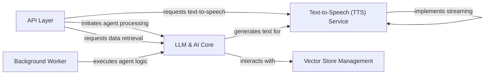

## Component Details

This graph illustrates the core components of the Docsgpt system, focusing on the central intelligence provided by the LLM & AI Core, its interaction with the API Layer and Background Worker for request handling, and its dependencies on Text-to-Speech and Vector Store Management for specific functionalities. The main flow involves the API Layer receiving user requests, which are then processed by the LLM & AI Core, potentially asynchronously via the Background Worker. The LLM & AI Core leverages various AI models, tools, and retrieval mechanisms, including the Vector Store Management for RAG, to generate responses. These responses can then be converted to speech by the Text-to-Speech Service before being returned to the user.

### API Layer
This component exposes various API endpoints for interacting with the Docsgpt system, handling requests for answers, search, and text-to-speech.

**Related Classes/Methods**:

- `application.api.user.routes.TextToSpeech:post` (full file reference)
- <a href="https://github.com/arc53/docsgpt/blob/master/application/api/answer/routes.py#L266-L380" target="_blank" rel="noopener noreferrer">`application.api.answer.routes:complete_stream` (266:380)</a>
- <a href="https://github.com/arc53/docsgpt/blob/master/application/api/answer/routes.py#L428-L567" target="_blank" rel="noopener noreferrer">`application.api.answer.routes.Stream:post` (428:567)</a>
- <a href="https://github.com/arc53/docsgpt/blob/master/application/api/answer/routes.py#L609-L774" target="_blank" rel="noopener noreferrer">`application.api.answer.routes.Answer:post` (609:774)</a>
- <a href="https://github.com/arc53/docsgpt/blob/master/application/api/answer/routes.py#L808-L885" target="_blank" rel="noopener noreferrer">`application.api.answer.routes.Search:post` (808:885)</a>

### Background Worker
The Background Worker component is responsible for executing agent logic in asynchronous tasks, often triggered by webhooks, to avoid blocking the main API thread.

**Related Classes/Methods**:

- <a href="https://github.com/arc53/docsgpt/blob/master/application/worker.py#L126-L192" target="_blank" rel="noopener noreferrer">`application.worker:run_agent_logic` (126:192)</a>
- <a href="https://github.com/arc53/docsgpt/blob/master/application/worker.py#L512-L550" target="_blank" rel="noopener noreferrer">`application.worker:agent_webhook_worker` (512:550)</a>

### LLM & AI Core
The central intelligence component, responsible for interacting with various Large Language Models (LLMs), orchestrating AI agents, managing tools, and performing information retrieval (RAG) to generate responses.

**Related Classes/Methods**:

- <a href="https://github.com/arc53/docsgpt/blob/master/application/llm/llm_creator.py#L29-L35" target="_blank" rel="noopener noreferrer">`application.llm.llm_creator.LLMCreator.create_llm` (29:35)</a>
- <a href="https://github.com/arc53/docsgpt/blob/master/application/llm/base.py#L7-L66" target="_blank" rel="noopener noreferrer">`docsgpt.application.llm.base.BaseLLM` (7:66)</a>
- <a href="https://github.com/arc53/docsgpt/blob/master/application/llm/openai.py#L10-L306" target="_blank" rel="noopener noreferrer">`docsgpt.application.llm.openai.OpenAILLM` (10:306)</a>
- <a href="https://github.com/arc53/docsgpt/blob/master/application/llm/openai.py#L309-L325" target="_blank" rel="noopener noreferrer">`docsgpt.application.llm.openai.AzureOpenAILLM` (309:325)</a>
- <a href="https://github.com/arc53/docsgpt/blob/master/application/llm/google_ai.py#L11-L313" target="_blank" rel="noopener noreferrer">`docsgpt.application.llm.google_ai.GoogleLLM` (11:313)</a>
- <a href="https://github.com/arc53/docsgpt/blob/master/application/llm/anthropic.py#L5-L50" target="_blank" rel="noopener noreferrer">`docsgpt.application.llm.anthropic.AnthropicLLM` (5:50)</a>
- <a href="https://github.com/arc53/docsgpt/blob/master/application/llm/huggingface.py#L4-L68" target="_blank" rel="noopener noreferrer">`docsgpt.application.llm.huggingface.HuggingFaceLLM` (4:68)</a>
- <a href="https://github.com/arc53/docsgpt/blob/master/application/llm/novita.py#L5-L32" target="_blank" rel="noopener noreferrer">`docsgpt.application.llm.novita.NovitaLLM` (5:32)</a>
- <a href="https://github.com/arc53/docsgpt/blob/master/application/llm/premai.py#L5-L38" target="_blank" rel="noopener noreferrer">`docsgpt.application.llm.premai.PremAILLM` (5:38)</a>
- <a href="https://github.com/arc53/docsgpt/blob/master/application/llm/docsgpt_provider.py#L7-L131" target="_blank" rel="noopener noreferrer">`docsgpt.application.llm.docsgpt_provider.DocsGPTAPILLM` (7:131)</a>
- <a href="https://github.com/arc53/docsgpt/blob/master/application/llm/sagemaker.py#L61-L140" target="_blank" rel="noopener noreferrer">`docsgpt.application.llm.sagemaker.SagemakerAPILLM` (61:140)</a>
- <a href="https://github.com/arc53/docsgpt/blob/master/application/llm/groq.py#L5-L32" target="_blank" rel="noopener noreferrer">`docsgpt.application.llm.groq.GroqLLM` (5:32)</a>
- <a href="https://github.com/arc53/docsgpt/blob/master/application/llm/llama_cpp.py#L27-L55" target="_blank" rel="noopener noreferrer">`docsgpt.application.llm.llama_cpp.LlamaCpp` (27:55)</a>
- `docsgpt.application.agents.llm_handler` (full file reference)
- <a href="https://github.com/arc53/docsgpt/blob/master/application/agents/agent_creator.py#L12-L16" target="_blank" rel="noopener noreferrer">`application.agents.agent_creator.AgentCreator.create_agent` (12:16)</a>
- <a href="https://github.com/arc53/docsgpt/blob/master/application/agents/react_agent.py#L26-L229" target="_blank" rel="noopener noreferrer">`docsgpt.application.agents.react_agent.ReActAgent` (26:229)</a>
- <a href="https://github.com/arc53/docsgpt/blob/master/application/agents/classic_agent.py#L12-L64" target="_blank" rel="noopener noreferrer">`docsgpt.application.agents.classic_agent.ClassicAgent` (12:64)</a>
- <a href="https://github.com/arc53/docsgpt/blob/master/application/agents/base.py#L17-L277" target="_blank" rel="noopener noreferrer">`docsgpt.application.agents.base.BaseAgent` (17:277)</a>
- <a href="https://github.com/arc53/docsgpt/blob/master/application/agents/tools/tool_manager.py#L9-L42" target="_blank" rel="noopener noreferrer">`application.agents.tools.tool_manager.ToolManager` (9:42)</a>
- <a href="https://github.com/arc53/docsgpt/blob/master/application/agents/tools/api_tool.py#L7-L72" target="_blank" rel="noopener noreferrer">`application.agents.tools.api_tool.APITool` (7:72)</a>
- <a href="https://github.com/arc53/docsgpt/blob/master/application/retriever/retriever_creator.py#L15-L20" target="_blank" rel="noopener noreferrer">`application.retriever.retriever_creator.RetrieverCreator.create_retriever` (15:20)</a>
- <a href="https://github.com/arc53/docsgpt/blob/master/application/retriever/classic_rag.py#L9-L124" target="_blank" rel="noopener noreferrer">`docsgpt.application.retriever.classic_rag.ClassicRAG` (9:124)</a>
- <a href="https://github.com/arc53/docsgpt/blob/master/application/retriever/duckduck_search.py#L9-L111" target="_blank" rel="noopener noreferrer">`docsgpt.application.retriever.duckduck_search.DuckDuckSearch` (9:111)</a>
- <a href="https://github.com/arc53/docsgpt/blob/master/application/retriever/brave_search.py#L10-L112" target="_blank" rel="noopener noreferrer">`docsgpt.application.retriever.brave_search.BraveRetSearch` (10:112)</a>

### Text-to-Speech (TTS) Service
This component provides functionalities for converting text into speech using various TTS providers like Google TTS or Elevenlabs, including handling streaming audio.

**Related Classes/Methods**:

- <a href="https://github.com/arc53/docsgpt/blob/master/application/tts/google_tts.py#L7-L19" target="_blank" rel="noopener noreferrer">`application.tts.google_tts.GoogleTTS` (7:19)</a>
- <a href="https://github.com/arc53/docsgpt/blob/master/application/tts/google_tts.py#L12-L19" target="_blank" rel="noopener noreferrer">`application.tts.google_tts.GoogleTTS.text_to_speech` (12:19)</a>
- <a href="https://github.com/arc53/docsgpt/blob/master/application/tts/elevenlabs.py#L9-L66" target="_blank" rel="noopener noreferrer">`application.tts.elevenlabs.ElevenlabsTTS` (9:66)</a>
- <a href="https://github.com/arc53/docsgpt/blob/master/application/tts/elevenlabs.py#L16-L17" target="_blank" rel="noopener noreferrer">`application.tts.elevenlabs.ElevenlabsTTS:text_to_speech` (16:17)</a>
- <a href="https://github.com/arc53/docsgpt/blob/master/application/tts/elevenlabs.py#L19-L53" target="_blank" rel="noopener noreferrer">`application.tts.elevenlabs.ElevenlabsTTS:_text_to_speech_websocket` (19:53)</a>
- <a href="https://github.com/arc53/docsgpt/blob/master/application/tts/elevenlabs.py#L69-L80" target="_blank" rel="noopener noreferrer">`application.tts.elevenlabs:test_elevenlabs_websocket` (69:80)</a>

### Vector Store Management
This component handles the creation and interaction with vector stores, which are crucial for storing and retrieving document embeddings used in retrieval-augmented generation (RAG).

**Related Classes/Methods**:

- <a href="https://github.com/arc53/docsgpt/blob/master/application/vectorstore/vector_creator.py#L18-L22" target="_blank" rel="noopener noreferrer">`application.vectorstore.vector_creator.VectorCreator.create_vectorstore` (18:22)</a>

### [FAQ](https://github.com/CodeBoarding/GeneratedOnBoardings/tree/main?tab=readme-ov-file#faq)