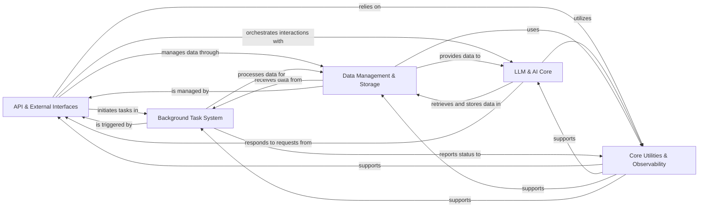

## Component Details

The DocsGPT application provides an AI-powered documentation interaction system. The main flow involves an API Gateway handling user requests, which are then processed by the LLM & AI Core for intelligent responses, often leveraging data managed by the Data Management & Storage component. Long-running tasks are offloaded to the Background Task System, while Core Utilities & Observability provide foundational support across all components.

### API & External Interfaces
Serves as the primary entry point for all external and internal interactions, handling incoming API requests, authenticating users, and routing requests. It also manages integrations with external platforms like chat applications.

**Related Classes/Methods**:

- <a href="https://github.com/arc53/docsgpt/blob/master/application/api/answer/routes.py#L384-L567" target="_blank" rel="noopener noreferrer">`docsgpt.application.api.answer.routes:Stream` (384:567)</a>
- <a href="https://github.com/arc53/docsgpt/blob/master/application/api/answer/routes.py#L576-L774" target="_blank" rel="noopener noreferrer">`docsgpt.application.api.answer.routes:Answer` (576:774)</a>
- <a href="https://github.com/arc53/docsgpt/blob/master/application/api/answer/routes.py#L778-L885" target="_blank" rel="noopener noreferrer">`docsgpt.application.api.answer.routes:Search` (778:885)</a>
- <a href="https://github.com/arc53/docsgpt/blob/master/application/app.py#L92-L102" target="_blank" rel="noopener noreferrer">`docsgpt.application.app:authenticate_request` (92:102)</a>
- `docsgpt.application.api.user.routes` (full file reference)
- `docsgpt.application.api.internal.routes` (full file reference)
- <a href="https://github.com/arc53/docsgpt/blob/master/application/auth.py#L6-L28" target="_blank" rel="noopener noreferrer">`application.auth.handle_auth` (6:28)</a>
- `docsgpt.extensions.chatwoot.app` (full file reference)
- `docsgpt.extensions.discord.bot` (full file reference)

### LLM & AI Core
The central intelligence component, responsible for interacting with various Large Language Models (LLMs), orchestrating AI agents, managing tools, and performing information retrieval (RAG) to generate responses.

**Related Classes/Methods**:

- <a href="https://github.com/arc53/docsgpt/blob/master/application/llm/llm_creator.py#L29-L35" target="_blank" rel="noopener noreferrer">`application.llm.llm_creator.LLMCreator.create_llm` (29:35)</a>
- <a href="https://github.com/arc53/docsgpt/blob/master/application/llm/base.py#L7-L66" target="_blank" rel="noopener noreferrer">`docsgpt.application.llm.base.BaseLLM` (7:66)</a>
- <a href="https://github.com/arc53/docsgpt/blob/master/application/llm/openai.py#L10-L306" target="_blank" rel="noopener noreferrer">`docsgpt.application.llm.openai.OpenAILLM` (10:306)</a>
- <a href="https://github.com/arc53/docsgpt/blob/master/application/llm/openai.py#L309-L325" target="_blank" rel="noopener noreferrer">`docsgpt.application.llm.openai.AzureOpenAILLM` (309:325)</a>
- <a href="https://github.com/arc53/docsgpt/blob/master/application/llm/google_ai.py#L11-L313" target="_blank" rel="noopener noreferrer">`docsgpt.application.llm.google_ai.GoogleLLM` (11:313)</a>
- <a href="https://github.com/arc53/docsgpt/blob/master/application/llm/anthropic.py#L5-L50" target="_blank" rel="noopener noreferrer">`docsgpt.application.llm.anthropic.AnthropicLLM` (5:50)</a>
- <a href="https://github.com/arc53/docsgpt/blob/master/application/llm/huggingface.py#L4-L68" target="_blank" rel="noopener noreferrer">`docsgpt.application.llm.huggingface.HuggingFaceLLM` (4:68)</a>
- <a href="https://github.com/arc53/docsgpt/blob/master/application/llm/novita.py#L5-L32" target="_blank" rel="noopener noreferrer">`docsgpt.application.llm.novita.NovitaLLM` (5:32)</a>
- <a href="https://github.com/arc53/docsgpt/blob/master/application/llm/premai.py#L5-L38" target="_blank" rel="noopener noreferrer">`docsgpt.application.llm.premai.PremAILLM` (5:38)</a>
- <a href="https://github.com/arc53/docsgpt/blob/master/application/llm/docsgpt_provider.py#L7-L131" target="_blank" rel="noopener noreferrer">`docsgpt.application.llm.docsgpt_provider.DocsGPTAPILLM` (7:131)</a>
- <a href="https://github.com/arc53/docsgpt/blob/master/application/llm/sagemaker.py#L61-L140" target="_blank" rel="noopener noreferrer">`docsgpt.application.llm.sagemaker.SagemakerAPILLM` (61:140)</a>
- <a href="https://github.com/arc53/docsgpt/blob/master/application/llm/groq.py#L5-L32" target="_blank" rel="noopener noreferrer">`docsgpt.application.llm.groq.GroqLLM` (5:32)</a>
- <a href="https://github.com/arc53/docsgpt/blob/master/application/llm/llama_cpp.py#L27-L55" target="_blank" rel="noopener noreferrer">`docsgpt.application.llm.llama_cpp.LlamaCpp` (27:55)</a>
- `docsgpt.application.agents.llm_handler` (full file reference)
- <a href="https://github.com/arc53/docsgpt/blob/master/application/tts/google_tts.py#L7-L19" target="_blank" rel="noopener noreferrer">`application.tts.google_tts.GoogleTTS` (7:19)</a>
- <a href="https://github.com/arc53/docsgpt/blob/master/application/tts/elevenlabs.py#L9-L66" target="_blank" rel="noopener noreferrer">`application.tts.elevenlabs.ElevenlabsTTS` (9:66)</a>
- <a href="https://github.com/arc53/docsgpt/blob/master/application/agents/agent_creator.py#L12-L16" target="_blank" rel="noopener noreferrer">`application.agents.agent_creator.AgentCreator.create_agent` (12:16)</a>
- <a href="https://github.com/arc53/docsgpt/blob/master/application/agents/react_agent.py#L26-L229" target="_blank" rel="noopener noreferrer">`docsgpt.application.agents.react_agent.ReActAgent` (26:229)</a>
- <a href="https://github.com/arc53/docsgpt/blob/master/application/agents/classic_agent.py#L12-L64" target="_blank" rel="noopener noreferrer">`docsgpt.application.agents.classic_agent.ClassicAgent` (12:64)</a>
- <a href="https://github.com/arc53/docsgpt/blob/master/application/agents/base.py#L17-L277" target="_blank" rel="noopener noreferrer">`docsgpt.application.agents.base.BaseAgent` (17:277)</a>
- <a href="https://github.com/arc53/docsgpt/blob/master/application/agents/tools/tool_manager.py#L9-L42" target="_blank" rel="noopener noreferrer">`application.agents.tools.tool_manager.ToolManager` (9:42)</a>
- <a href="https://github.com/arc53/docsgpt/blob/master/application/agents/tools/api_tool.py#L7-L72" target="_blank" rel="noopener noreferrer">`application.agents.tools.api_tool.APITool` (7:72)</a>
- <a href="https://github.com/arc53/docsgpt/blob/master/application/retriever/retriever_creator.py#L15-L20" target="_blank" rel="noopener noreferrer">`application.retriever.retriever_creator.RetrieverCreator.create_retriever` (15:20)</a>
- <a href="https://github.com/arc53/docsgpt/blob/master/application/retriever/classic_rag.py#L9-L124" target="_blank" rel="noopener noreferrer">`docsgpt.application.retriever.classic_rag.ClassicRAG` (9:124)</a>
- <a href="https://github.com/arc53/docsgpt/blob/master/application/retriever/duckduck_search.py#L9-L111" target="_blank" rel="noopener noreferrer">`docsgpt.application.retriever.duckduck_search.DuckDuckSearch` (9:111)</a>
- <a href="https://github.com/arc53/docsgpt/blob/master/application/retriever/brave_search.py#L10-L112" target="_blank" rel="noopener noreferrer">`docsgpt.application.retriever.brave_search.BraveRetSearch` (10:112)</a>

### Data Management & Storage
Manages the entire lifecycle of data, including document ingestion, parsing, chunking, embedding, and persistent storage in various databases and vector stores, as well as file storage.

**Related Classes/Methods**:

- <a href="https://github.com/arc53/docsgpt/blob/master/application/vectorstore/vector_creator.py#L18-L22" target="_blank" rel="noopener noreferrer">`application.vectorstore.vector_creator.VectorCreator.create_vectorstore` (18:22)</a>
- <a href="https://github.com/arc53/docsgpt/blob/master/application/vectorstore/base.py#L53-L89" target="_blank" rel="noopener noreferrer">`docsgpt.application.vectorstore.base.BaseVectorStore` (53:89)</a>
- <a href="https://github.com/arc53/docsgpt/blob/master/application/vectorstore/mongodb.py#L7-L177" target="_blank" rel="noopener noreferrer">`docsgpt.application.vectorstore.mongodb.MongoDBVectorStore` (7:177)</a>
- <a href="https://github.com/arc53/docsgpt/blob/master/application/vectorstore/elasticsearch.py#L6-L207" target="_blank" rel="noopener noreferrer">`docsgpt.application.vectorstore.elasticsearch.ElasticsearchStore` (6:207)</a>
- <a href="https://github.com/arc53/docsgpt/blob/master/application/vectorstore/faiss.py#L20-L115" target="_blank" rel="noopener noreferrer">`docsgpt.application.vectorstore.faiss.FaissStore` (20:115)</a>
- <a href="https://github.com/arc53/docsgpt/blob/master/application/vectorstore/qdrant.py#L5-L48" target="_blank" rel="noopener noreferrer">`docsgpt.application.vectorstore.qdrant.QdrantStore` (5:48)</a>
- <a href="https://github.com/arc53/docsgpt/blob/master/application/vectorstore/milvus.py#L9-L38" target="_blank" rel="noopener noreferrer">`docsgpt.application.vectorstore.milvus.MilvusStore` (9:38)</a>
- <a href="https://github.com/arc53/docsgpt/blob/master/application/vectorstore/lancedb.py#L6-L119" target="_blank" rel="noopener noreferrer">`docsgpt.application.vectorstore.lancedb.LanceDBVectorStore` (6:119)</a>
- <a href="https://github.com/arc53/docsgpt/blob/master/application/parser/embedding_pipeline.py#L26-L86" target="_blank" rel="noopener noreferrer">`docsgpt.application.parser.embedding_pipeline:embed_and_store_documents` (26:86)</a>
- <a href="https://github.com/arc53/docsgpt/blob/master/application/parser/embedding_pipeline.py#L10-L23" target="_blank" rel="noopener noreferrer">`docsgpt.application.parser.embedding_pipeline:add_text_to_store_with_retry` (10:23)</a>
- <a href="https://github.com/arc53/docsgpt/blob/master/application/vectorstore/base.py#L7-L24" target="_blank" rel="noopener noreferrer">`docsgpt.application.vectorstore.base.EmbeddingsWrapper` (7:24)</a>
- <a href="https://github.com/arc53/docsgpt/blob/master/application/vectorstore/base.py#L28-L51" target="_blank" rel="noopener noreferrer">`docsgpt.application.vectorstore.base.EmbeddingsSingleton` (28:51)</a>
- <a href="https://github.com/arc53/docsgpt/blob/master/application/core/mongo_db.py#L9-L15" target="_blank" rel="noopener noreferrer">`application.core.mongo_db.MongoDB.get_client` (9:15)</a>
- <a href="https://github.com/arc53/docsgpt/blob/master/application/api/answer/routes.py#L153-L251" target="_blank" rel="noopener noreferrer">`docsgpt.application.api.answer.routes:save_conversation` (153:251)</a>
- <a href="https://github.com/arc53/docsgpt/blob/master/application/api/answer/routes.py#L89-L118" target="_blank" rel="noopener noreferrer">`docsgpt.application.api.answer.routes:get_agent_key` (89:118)</a>
- <a href="https://github.com/arc53/docsgpt/blob/master/application/api/answer/routes.py#L121-L134" target="_blank" rel="noopener noreferrer">`docsgpt.application.api.answer.routes:get_data_from_api_key` (121:134)</a>
- <a href="https://github.com/arc53/docsgpt/blob/master/application/api/answer/routes.py#L137-L142" target="_blank" rel="noopener noreferrer">`docsgpt.application.api.answer.routes:get_retriever` (137:142)</a>
- <a href="https://github.com/arc53/docsgpt/blob/master/application/api/answer/routes.py#L254-L263" target="_blank" rel="noopener noreferrer">`docsgpt.application.api.answer.routes:get_prompt` (254:263)</a>
- <a href="https://github.com/arc53/docsgpt/blob/master/application/api/answer/routes.py#L888-L916" target="_blank" rel="noopener noreferrer">`docsgpt.application.api.answer.routes:get_attachments_content` (888:916)</a>
- <a href="https://github.com/arc53/docsgpt/blob/master/application/parser/file/bulk.py#L37-L183" target="_blank" rel="noopener noreferrer">`application.parser.file.bulk.SimpleDirectoryReader` (37:183)</a>
- <a href="https://github.com/arc53/docsgpt/blob/master/application/parser/file/base_parser.py#L8-L38" target="_blank" rel="noopener noreferrer">`docsgpt.application.parser.file.base_parser.BaseParser` (8:38)</a>
- `docsgpt.application.parser.file.tabular_parser` (full file reference)
- <a href="https://github.com/arc53/docsgpt/blob/master/application/parser/file/json_parser.py#L7-L57" target="_blank" rel="noopener noreferrer">`docsgpt.application.parser.file.json_parser.JSONParser` (7:57)</a>
- <a href="https://github.com/arc53/docsgpt/blob/master/application/parser/file/base.py#L9-L19" target="_blank" rel="noopener noreferrer">`docsgpt.application.parser.file.base.BaseReader` (9:19)</a>
- <a href="https://github.com/arc53/docsgpt/blob/master/application/parser/file/rst_parser.py#L13-L201" target="_blank" rel="noopener noreferrer">`docsgpt.application.parser.file.rst_parser.RstParser` (13:201)</a>
- <a href="https://github.com/arc53/docsgpt/blob/master/application/parser/file/openapi3_parser.py#L11-L51" target="_blank" rel="noopener noreferrer">`docsgpt.application.parser.file.openapi3_parser.OpenAPI3Parser` (11:51)</a>
- <a href="https://github.com/arc53/docsgpt/blob/master/application/parser/file/pptx_parser.py#L9-L75" target="_blank" rel="noopener noreferrer">`docsgpt.application.parser.file.pptx_parser.PPTXParser` (9:75)</a>
- <a href="https://github.com/arc53/docsgpt/blob/master/application/parser/file/markdown_parser.py#L14-L145" target="_blank" rel="noopener noreferrer">`docsgpt.application.parser.file.markdown_parser.MarkdownParser` (14:145)</a>
- <a href="https://github.com/arc53/docsgpt/blob/master/application/parser/schema/base.py#L9-L34" target="_blank" rel="noopener noreferrer">`application.parser.schema.base.Document` (9:34)</a>
- <a href="https://github.com/arc53/docsgpt/blob/master/application/parser/chunking.py#L9-L118" target="_blank" rel="noopener noreferrer">`application.parser.chunking.Chunker` (9:118)</a>
- <a href="https://github.com/arc53/docsgpt/blob/master/application/parser/remote/crawler_markdown.py#L10-L139" target="_blank" rel="noopener noreferrer">`application.parser.remote.crawler_markdown.CrawlerLoader` (10:139)</a>
- <a href="https://github.com/arc53/docsgpt/blob/master/application/parser/remote/crawler_loader.py#L9-L65" target="_blank" rel="noopener noreferrer">`application.parser.remote.crawler_loader.CrawlerLoader` (9:65)</a>
- <a href="https://github.com/arc53/docsgpt/blob/master/application/parser/remote/github_loader.py#L8-L58" target="_blank" rel="noopener noreferrer">`application.parser.remote.github_loader.GitHubLoader` (8:58)</a>
- <a href="https://github.com/arc53/docsgpt/blob/master/application/parser/remote/base.py#L9-L19" target="_blank" rel="noopener noreferrer">`application.parser.remote.base.BaseRemote` (9:19)</a>
- <a href="https://github.com/arc53/docsgpt/blob/master/application/parser/remote/web_loader.py#L19-L45" target="_blank" rel="noopener noreferrer">`application.parser.remote.web_loader.WebLoader` (19:45)</a>
- <a href="https://github.com/arc53/docsgpt/blob/master/application/parser/remote/sitemap_loader.py#L7-L82" target="_blank" rel="noopener noreferrer">`application.parser.remote.sitemap_loader.SitemapLoader` (7:82)</a>
- <a href="https://github.com/arc53/docsgpt/blob/master/application/storage/storage_creator.py#L19-L24" target="_blank" rel="noopener noreferrer">`application.storage.storage_creator.StorageCreator.get_storage` (19:24)</a>
- <a href="https://github.com/arc53/docsgpt/blob/master/application/storage/s3.py#L13-L120" target="_blank" rel="noopener noreferrer">`application.storage.s3.S3Storage` (13:120)</a>
- <a href="https://github.com/arc53/docsgpt/blob/master/application/storage/local.py#L9-L103" target="_blank" rel="noopener noreferrer">`application.storage.local.LocalStorage` (9:103)</a>

### Background Task System
Manages and executes asynchronous tasks in the background, such as document ingestion, remote content synchronization, and processing agent webhooks, preventing long-running operations from blocking the main application thread.

**Related Classes/Methods**:

- `docsgpt.application.worker` (full file reference)
- `docsgpt.application.api.user.tasks` (full file reference)
- <a href="https://github.com/arc53/docsgpt/blob/master/application/celery_init.py#L17-L20" target="_blank" rel="noopener noreferrer">`docsgpt.application.celery_init:config_loggers` (17:20)</a>

### Core Utilities & Observability
Provides foundational services including general-purpose utility functions, comprehensive logging for application activities and errors, and caching mechanisms to enhance performance and responsiveness across the system.

**Related Classes/Methods**:

- `docsgpt.application.utils` (full file reference)
- <a href="https://github.com/arc53/docsgpt/blob/master/application/error.py#L14-L15" target="_blank" rel="noopener noreferrer">`docsgpt.application.error:bad_request` (14:15)</a>
- `docsgpt.application.logging` (full file reference)
- `docsgpt.application.usage` (full file reference)
- `docsgpt.application.cache` (full file reference)
- <a href="https://github.com/arc53/docsgpt/blob/master/application/api/answer/routes.py#L570-L572" target="_blank" rel="noopener noreferrer">`docsgpt.application.api.answer.routes:error_stream_generate` (570:572)</a>

### [FAQ](https://github.com/CodeBoarding/GeneratedOnBoardings/tree/main?tab=readme-ov-file#faq)