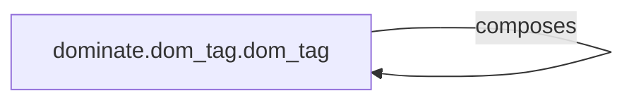

## Details

The DOM Element Model subsystem is primarily encapsulated within the dominate.dom_tag module, with the dominate.dom_tag.dom_tag class serving as its central component. This module defines the core abstractions for representing and manipulating HTML elements programmatically. This internal structure exemplifies the Composite Pattern, where individual dom_tag objects can be treated uniformly whether they are simple elements or complex elements containing other elements. The methods within dom_tag work cohesively to maintain the integrity and manipulability of the HTML element representation.

### dominate.dom_tag.dom_tag
This is the fundamental building block of the DOM within the `dominate` library. It represents a single HTML element, managing its attributes, child elements, and parent relationships. It provides the API for constructing and manipulating the hierarchical structure of an HTML document.

**Related Classes/Methods**:

- <a href="https://github.com/Knio/dominate/blob/master/dominate/dom_tag.py" target="_blank" rel="noopener noreferrer">`dominate.dom_tag.dom_tag:__init__`</a>
- <a href="https://github.com/Knio/dominate/blob/master/dominate/dom_tag.py" target="_blank" rel="noopener noreferrer">`dominate.dom_tag.dom_tag:add`</a>
- <a href="https://github.com/Knio/dominate/blob/master/dominate/dom_tag.py" target="_blank" rel="noopener noreferrer">`dominate.dom_tag.dom_tag:__iadd__`</a>
- <a href="https://github.com/Knio/dominate/blob/master/dominate/dom_tag.py" target="_blank" rel="noopener noreferrer">`dominate.dom_tag.dom_tag:set_attribute`</a>
- <a href="https://github.com/Knio/dominate/blob/master/dominate/dom_tag.py" target="_blank" rel="noopener noreferrer">`dominate.dom_tag.dom_tag:delete_attribute`</a>
- <a href="https://github.com/Knio/dominate/blob/master/dominate/dom_tag.py" target="_blank" rel="noopener noreferrer">`dominate.dom_tag.dom_tag:get`</a>
- <a href="https://github.com/Knio/dominate/blob/master/dominate/dom_tag.py" target="_blank" rel="noopener noreferrer">`dominate.dom_tag.dom_tag:__contains__`</a>
- <a href="https://github.com/Knio/dominate/blob/master/dominate/dom_tag.py" target="_blank" rel="noopener noreferrer">`dominate.dom_tag.dom_tag:clear`</a>
- <a href="https://github.com/Knio/dominate/blob/master/dominate/dom_tag.py" target="_blank" rel="noopener noreferrer">`dominate.dom_tag.dom_tag:_add_to_ctx`</a>
- <a href="https://github.com/Knio/dominate/blob/master/dominate/dom_tag.py" target="_blank" rel="noopener noreferrer">`dominate.dom_tag.dom_tag:_get_thread_context`</a>
- <a href="https://github.com/Knio/dominate/blob/master/dominate/dom_tag.py" target="_blank" rel="noopener noreferrer">`dominate.dom_tag.dom_tag:clean_pair`</a>
- <a href="https://github.com/Knio/dominate/blob/master/dominate/dom_tag.py" target="_blank" rel="noopener noreferrer">`dominate.dom_tag.dom_tag:clean_attribute`</a>

### [FAQ](https://github.com/CodeBoarding/GeneratedOnBoardings/tree/main?tab=readme-ov-file#faq)