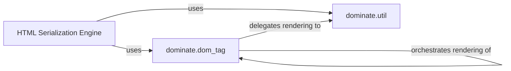

## Details

HTML Serialization Engine Subsystem

### HTML Serialization Engine [[Expand]](./HTML_Serialization_Engine.md)
The overarching logical unit responsible for the entire process of converting the in-memory DOM structure into a serialized HTML string. It orchestrates the rendering of elements, attributes, and diverse content types.

**Related Classes/Methods**:

- <a href="https://github.com/Knio/dominate/blob/master/dominate/dom_tag.py" target="_blank" rel="noopener noreferrer">`dominate.dom_tag`</a>
- <a href="https://github.com/Knio/dominate/blob/master/dominate/util.py" target="_blank" rel="noopener noreferrer">`dominate.util`</a>

### dominate.dom_tag
This is the fundamental component representing individual HTML elements (e.g., `div`, `p`, `a`). It manages the element's attributes and its children. It contains the primary rendering logic (`_render`, `_render_children`, `__unicode__`) that initiates and recursively processes the element and its nested content to produce HTML.

**Related Classes/Methods**:

- <a href="https://github.com/Knio/dominate/blob/master/dominate/dom_tag.py" target="_blank" rel="noopener noreferrer">`dominate.dom_tag:_render`</a>
- <a href="https://github.com/Knio/dominate/blob/master/dominate/dom_tag.py" target="_blank" rel="noopener noreferrer">`dominate.dom_tag:_render_children`</a>
- <a href="https://github.com/Knio/dominate/blob/master/dominate/dom_tag.py" target="_blank" rel="noopener noreferrer">`dominate.dom_tag:__unicode__`</a>

### dominate.util
This component provides specialized utility classes and functions that handle the rendering of various non-standard or specific content types within the DOM. This includes raw HTML, escaped text, container elements, and lazy-loaded content (`container._render`, `lazy._render`, `text._render`), ensuring they are correctly integrated into the final HTML output.

**Related Classes/Methods**:

- <a href="https://github.com/Knio/dominate/blob/master/dominate/util.py" target="_blank" rel="noopener noreferrer">`dominate.util:container._render`</a>
- <a href="https://github.com/Knio/dominate/blob/master/dominate/util.py" target="_blank" rel="noopener noreferrer">`dominate.util:lazy._render`</a>
- <a href="https://github.com/Knio/dominate/blob/master/dominate/util.py" target="_blank" rel="noopener noreferrer">`dominate.util:text._render`</a>

### [FAQ](https://github.com/CodeBoarding/GeneratedOnBoardings/tree/main?tab=readme-ov-file#faq)