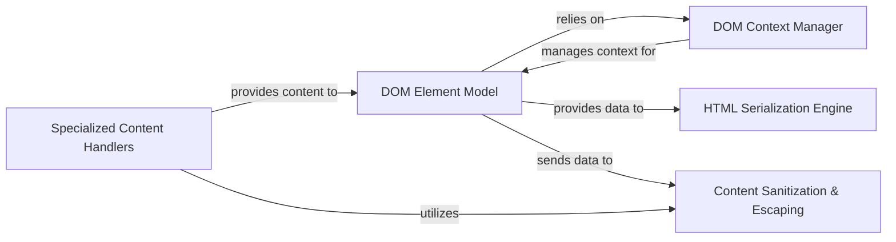

## Details

The `dominate` library's architecture is centered around a robust `DOM Element Model` that serves as the in-memory representation of an HTML document. This model is programmatically constructed, often with the aid of the `DOM Context Manager` which simplifies the creation of nested HTML structures through Python's `with` statements. As elements and content are added to the `DOM Element Model`, the `Content Sanitization & Escaping` component acts as a crucial gatekeeper, ensuring that all data is properly formatted and secure, preventing common web vulnerabilities. For diverse content integration, `Specialized Content Handlers` provide flexible ways to embed raw HTML, file content, or even system command outputs directly into the DOM. Once the DOM is fully constructed, the `HTML Serialization Engine` takes over, efficiently traversing the `DOM Element Model` and transforming it into a well-formed HTML string, ready for output. This clear separation of concerns allows for a flexible, secure, and intuitive approach to programmatic HTML generation.

### DOM Element Model [[Expand]](./DOM_Element_Model.md)
The core representation of HTML elements and their hierarchical structure. It manages attributes, children, and parent relationships.

**Related Classes/Methods**:

- <a href="https://github.com/Knio/dominate/blob/master/dominate/dom_tag.py" target="_blank" rel="noopener noreferrer">`dominate/dom_tag.py:__init__`</a>
- <a href="https://github.com/Knio/dominate/blob/master/dominate/dom_tag.py" target="_blank" rel="noopener noreferrer">`dominate/dom_tag.py:add`</a>
- <a href="https://github.com/Knio/dominate/blob/master/dominate/dom_tag.py" target="_blank" rel="noopener noreferrer">`dominate/dom_tag.py:set_attribute`</a>
- <a href="https://github.com/Knio/dominate/blob/master/dominate/dom_tag.py" target="_blank" rel="noopener noreferrer">`dominate/dom_tag.py:delete_attribute`</a>
- <a href="https://github.com/Knio/dominate/blob/master/dominate/dom_tag.py" target="_blank" rel="noopener noreferrer">`dominate/dom_tag.py:get`</a>
- <a href="https://github.com/Knio/dominate/blob/master/dominate/dom_tag.py" target="_blank" rel="noopener noreferrer">`dominate/dom_tag.py:clear`</a>

### DOM Context Manager
Manages the current parent element context, enabling a natural, nested syntax for DOM construction using `with` statements.

**Related Classes/Methods**:

- <a href="https://github.com/Knio/dominate/blob/master/dominate/dom_tag.py" target="_blank" rel="noopener noreferrer">`dominate/dom_tag.py:__enter__`</a>
- <a href="https://github.com/Knio/dominate/blob/master/dominate/dom_tag.py" target="_blank" rel="noopener noreferrer">`dominate/dom_tag.py:__exit__`</a>
- <a href="https://github.com/Knio/dominate/blob/master/dominate/dom_tag.py" target="_blank" rel="noopener noreferrer">`dominate/dom_tag.py:_add_to_ctx`</a>
- <a href="https://github.com/Knio/dominate/blob/master/dominate/dom_tag.py" target="_blank" rel="noopener noreferrer">`dominate/dom_tag.py:_get_thread_context`</a>
- <a href="https://github.com/Knio/dominate/blob/master/dominate/dom_tag.py" target="_blank" rel="noopener noreferrer">`dominate/dom_tag.py:_get_async_context_id`</a>

### HTML Serialization Engine [[Expand]](./HTML_Serialization_Engine.md)
Transforms the in-memory DOM Element Model into a valid HTML string.

**Related Classes/Methods**:

- <a href="https://github.com/Knio/dominate/blob/master/dominate/dom_tag.py" target="_blank" rel="noopener noreferrer">`dominate/dom_tag.py:_render`</a>
- <a href="https://github.com/Knio/dominate/blob/master/dominate/dom_tag.py" target="_blank" rel="noopener noreferrer">`dominate/dom_tag.py:_render_children`</a>
- <a href="https://github.com/Knio/dominate/blob/master/dominate/dom_tag.py" target="_blank" rel="noopener noreferrer">`dominate/dom_tag.py:__unicode__`</a>
- <a href="https://github.com/Knio/dominate/blob/master/dominate/util.py" target="_blank" rel="noopener noreferrer">`dominate/util.py:container._render`</a>
- <a href="https://github.com/Knio/dominate/blob/master/dominate/util.py" target="_blank" rel="noopener noreferrer">`dominate/util.py:lazy._render`</a>
- <a href="https://github.com/Knio/dominate/blob/master/dominate/util.py" target="_blank" rel="noopener noreferrer">`dominate/util.py:text._render`</a>

### Content Sanitization & Escaping
Ensures the safety and correctness of HTML output by properly escaping special characters and sanitizing attribute names and values.

**Related Classes/Methods**:

- <a href="https://github.com/Knio/dominate/blob/master/dominate/dom_tag.py" target="_blank" rel="noopener noreferrer">`dominate/dom_tag.py:clean_pair`</a>
- <a href="https://github.com/Knio/dominate/blob/master/dominate/dom_tag.py" target="_blank" rel="noopener noreferrer">`dominate/dom_tag.py:clean_attribute`</a>
- <a href="https://github.com/Knio/dominate/blob/master/dominate/util.py" target="_blank" rel="noopener noreferrer">`dominate/util.py:escape`</a>
- <a href="https://github.com/Knio/dominate/blob/master/dominate/util.py" target="_blank" rel="noopener noreferrer">`dominate/util.py:unescape`</a>

### Specialized Content Handlers
Provides utilities for embedding various content types (raw HTML, file content, system command output) directly into the DOM.

**Related Classes/Methods**:

- <a href="https://github.com/Knio/dominate/blob/master/dominate/util.py" target="_blank" rel="noopener noreferrer">`dominate/util.py:include`</a>
- <a href="https://github.com/Knio/dominate/blob/master/dominate/util.py" target="_blank" rel="noopener noreferrer">`dominate/util.py:raw`</a>
- <a href="https://github.com/Knio/dominate/blob/master/dominate/util.py" target="_blank" rel="noopener noreferrer">`dominate/util.py:text`</a>
- <a href="https://github.com/Knio/dominate/blob/master/dominate/util.py" target="_blank" rel="noopener noreferrer">`dominate/util.py:system`</a>

### [FAQ](https://github.com/CodeBoarding/GeneratedOnBoardings/tree/main?tab=readme-ov-file#faq)