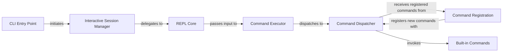

## Details

The Command-Line Interface (CLI) & Shell subsystem of `drgn` provides the primary user-facing interface for interactive debugging and command execution. It serves as the main entry point for users to interact with the `drgn` debugger.

### CLI Entry Point
Initializes the `drgn` environment, loads necessary debugging symbols, and orchestrates the start of the interactive debugging session. It acts as the initial bootstrap for the entire CLI experience.

**Related Classes/Methods**:

- <a href="https://github.com/osandov/drgn/blob/main/drgn/cli.py#L370-L637" target="_blank" rel="noopener noreferrer">`drgn.cli._main`:370-637</a>

### Interactive Session Manager
Manages the overall interactive debugging session lifecycle. This includes setting up the console, handling high-level session parameters (e.g., pager setup), and delegating to the REPL for user interaction.

**Related Classes/Methods**:

- <a href="https://github.com/osandov/drgn/blob/main/drgn/cli.py#L640-L728" target="_blank" rel="noopener noreferrer">`drgn.cli.run_interactive`:640-728</a>

### REPL Core
Provides the fundamental Read-Eval-Print Loop (REPL) functionality. It handles reading user input from the console, managing the interactive prompt, and passing the input for execution.

**Related Classes/Methods**:

- <a href="https://github.com/osandov/drgn/blob/main/drgn/internal/repl.py#L53-L54" target="_blank" rel="noopener noreferrer">`drgn.internal.repl.interact`:53-54</a>

### Command Executor
Takes the raw source code or commands entered by the user in the REPL, performs initial parsing, and dispatches them for execution. It also handles basic error reporting for execution failures.

**Related Classes/Methods**:

- <a href="https://github.com/osandov/drgn/blob/main/drgn/internal/repl.py#L61-L80" target="_blank" rel="noopener noreferrer">`drgn.internal.repl.runsource`:61-80</a>

### Command Dispatcher
Acts as the central router for all commands. It determines whether the input corresponds to a registered `drgn` command or a standard shell command, and then invokes the appropriate handler. This component is crucial for the "Interpreter Pattern."

**Related Classes/Methods**:

- <a href="https://github.com/osandov/drgn/blob/main/drgn/commands/__init__.py" target="_blank" rel="noopener noreferrer">`drgn.commands.__init__.run`</a>

### Command Registration
Provides the mechanism for extending the `drgn` CLI by allowing Python functions to be registered as discoverable `drgn` commands. It often handles argument parsing setup for these commands, embodying the "Extensible/Plugin Architecture."

**Related Classes/Methods**:

- <a href="https://github.com/osandov/drgn/blob/main/drgn/commands/__init__.py#L970-L989" target="_blank" rel="noopener noreferrer">`drgn.commands.__init__.decorator`:970-989</a>

### Built-in Commands
Implement the specific logic and functionality for various debugging commands provided out-of-the-box by `drgn`. This includes commands for crash analysis, expression evaluation, and help.

**Related Classes/Methods**:

- <a href="https://github.com/osandov/drgn/blob/main/drgn/commands/crash.py" target="_blank" rel="noopener noreferrer">`drgn.commands.crash`</a>
- <a href="https://github.com/osandov/drgn/blob/main/drgn/commands/crash.py#L137-L158" target="_blank" rel="noopener noreferrer">`drgn.commands.crash.run`:137-158</a>
- <a href="https://github.com/osandov/drgn/blob/main/drgn/commands/crash.py#L101-L135" target="_blank" rel="noopener noreferrer">`drgn.commands.crash._run`:101-135</a>
- <a href="https://github.com/osandov/drgn/blob/main/drgn/commands/_builtin/crash" target="_blank" rel="noopener noreferrer">`drgn.commands._builtin.crash`</a>

### [FAQ](https://github.com/CodeBoarding/GeneratedOnBoardings/tree/main?tab=readme-ov-file#faq)