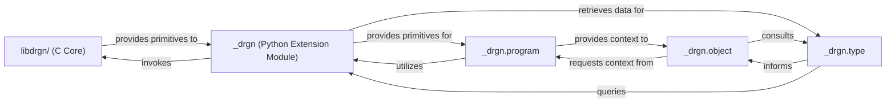

## Details

The drgn debugging framework is structured around a robust C core (libdrgn/ (C Core)) that handles low-level memory interaction, symbol resolution, and DWARF parsing. This core functionality is exposed to the Python environment through a dedicated Python extension module (_drgn (Python Extension Module)), which acts as a binding layer. Building upon these primitives, the _drgn.program component establishes and manages the debugging session's context, orchestrating higher-level operations. Data structures and values within the target's memory are represented by _drgn.object, which leverages _drgn.type to interpret type information from debugging symbols, enabling intuitive, type-aware memory manipulation within Python. This architecture ensures a clear separation of concerns, with the C core providing performance-critical primitives and the Python layers offering a flexible and user-friendly interface for debugging.

### libdrgn/ (C Core)
The fundamental, performance-critical C engine of drgn. It directly interacts with the target system's memory, resolves symbols, parses DWARF debugging information, and handles low-level operations for live kernel or crash dump analysis. It serves as the primary executor of all debugging primitives.

**Related Classes/Methods**:

- <a href="https://github.com/osandov/drgn/blob/main/libdrgn" target="_blank" rel="noopener noreferrer">`libdrgn`</a>

### _drgn (Python Extension Module)
This component acts as the direct interface and binding layer between the Python environment and the libdrgn C core. It translates Python function calls into corresponding C calls, manages data type conversions, and exposes the raw, low-level primitives of the C engine to the Python API.

**Related Classes/Methods**:

- <a href="https://github.com/osandov/drgn/blob/main/drgn/commands/_builtin/crash/system.py#L71-L91" target="_blank" rel="noopener noreferrer">`_drgn`:71-91</a>

### _drgn.program
Manages the overarching context of a debugging session. It is responsible for loading and managing debugging symbols, providing a unified access point to the target's memory space, and orchestrating higher-level debugging operations that require global session awareness. It serves as the central orchestrator for a debugging session.

**Related Classes/Methods**:

- <a href="https://github.com/osandov/drgn/blob/main/_drgn.pyi#L64-L1315" target="_blank" rel="noopener noreferrer">`_drgn.program`:64-1315</a>

### _drgn.object
Provides a Pythonic, object-oriented abstraction for data structures and values residing in the target system's memory. It enables users to intuitively navigate complex data structures, access fields, dereference pointers, and perform type-aware casting, making low-level memory manipulation more accessible within Python scripts.

**Related Classes/Methods**:

- <a href="https://github.com/osandov/drgn/blob/main/_drgn.pyi" target="_blank" rel="noopener noreferrer">`_drgn.object`</a>

### _drgn.type
Represents and interprets type information obtained from debugging symbols (e.g., DWARF). It is crucial for drgn to understand the layout, size, and member offsets of C/C++ types within the target's memory, which is essential for accurate data interpretation and manipulation by other components.

**Related Classes/Methods**:

- <a href="https://github.com/osandov/drgn/blob/main/_drgn.pyi" target="_blank" rel="noopener noreferrer">`_drgn.type`</a>

### [FAQ](https://github.com/CodeBoarding/GeneratedOnBoardings/tree/main?tab=readme-ov-file#faq)