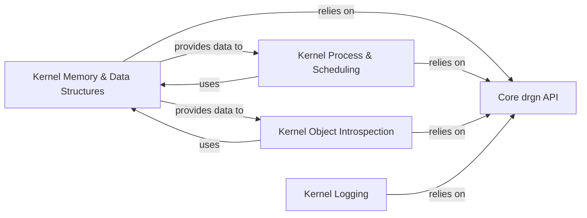

## Details

The `drgn.helpers.linux` subsystem is a collection of Python modules designed to provide high-level helper functions for analyzing the Linux kernel using the core `drgn` library. This analysis consolidates the original components into a more streamlined set of five, optimizing for both documentation clarity and diagram generation. The subsystem provides a comprehensive set of Python-based helper modules designed to facilitate in-depth analysis of the Linux kernel. At its core, the Core drgn API offers fundamental low-level access to kernel memory, types, and symbols, serving as the bedrock for all higher-level functionalities. Building upon this foundation, the subsystem organizes its capabilities into specialized components: Kernel Memory & Data Structures for dissecting memory layouts and common kernel data structures; Kernel Process & Scheduling for examining task states and CPU management; Kernel Object Introspection for exploring filesystem structures, kernel modules, and symbols; and Kernel Logging for accessing kernel log messages. This modular architecture allows for targeted analysis of various kernel aspects, with all helper components ultimately relying on the core `drgn` API for their underlying interactions with the live kernel or crash dump.

### Core drgn API
The foundational layer of `drgn`, providing direct low-level access to kernel memory, types, and symbols. All other helper components rely on this core API for basic data access and manipulation.

**Related Classes/Methods**:

- <a href="https://github.com/osandov/drgn/blob/main/_drgn.pyi" target="_blank" rel="noopener noreferrer">`drgn.Object`</a>

### Kernel Memory & Data Structures
Encapsulates functionalities for analyzing kernel memory (e.g., page tables, slab caches) and common kernel data structures like linked lists and red-black trees. It provides utilities for navigating and interpreting memory layouts and complex data structures within the kernel.

**Related Classes/Methods**:

- <a href="https://github.com/osandov/drgn/blob/main/" target="_blank" rel="noopener noreferrer">`drgn.helpers.linux.mm`</a>
- <a href="https://github.com/osandov/drgn/blob/main/" target="_blank" rel="noopener noreferrer">`drgn.helpers.linux.slab`</a>
- <a href="https://github.com/osandov/drgn/blob/main/" target="_blank" rel="noopener noreferrer">`drgn.helpers.linux.list`</a>
- <a href="https://github.com/osandov/drgn/blob/main/" target="_blank" rel="noopener noreferrer">`drgn.helpers.linux.rbtree`</a>

### Kernel Process & Scheduling
Focuses on inspecting kernel processes, tasks, and CPU scheduling mechanisms. It allows for retrieving task states, analyzing CPU runqueues, and understanding CPU mask operations.

**Related Classes/Methods**:

- <a href="https://github.com/osandov/drgn/blob/main/" target="_blank" rel="noopener noreferrer">`drgn.helpers.linux.sched`</a>
- <a href="https://github.com/osandov/drgn/blob/main/" target="_blank" rel="noopener noreferrer">`drgn.helpers.linux.cpumask`</a>

### Kernel Object Introspection
Provides tools for examining various kernel objects and their properties, including the Virtual File System (VFS), dynamically loaded kernel modules, and kernel symbols. It enables path lookups, module identification, and symbol resolution.

**Related Classes/Methods**:

- <a href="https://github.com/osandov/drgn/blob/main/" target="_blank" rel="noopener noreferrer">`drgn.helpers.linux.fs`</a>
- <a href="https://github.com/osandov/drgn/blob/main/" target="_blank" rel="noopener noreferrer">`drgn.helpers.linux.module`</a>
- <a href="https://github.com/osandov/drgn/blob/main/" target="_blank" rel="noopener noreferrer">`drgn.helpers.linux.kallsyms`</a>

### Kernel Logging
Offers an interface to access and format kernel log messages from the `printk` buffer, facilitating the analysis of kernel events and debugging information.

**Related Classes/Methods**:

- <a href="https://github.com/osandov/drgn/blob/main/" target="_blank" rel="noopener noreferrer">`drgn.helpers.linux.printk`</a>

### [FAQ](https://github.com/CodeBoarding/GeneratedOnBoardings/tree/main?tab=readme-ov-file#faq)