```mermaid
graph LR
    User["User"]
    Command_Line_Interface_CLI_Shell["Command-Line Interface (CLI) & Shell"]
    Python_API_Core_Utilities["Python API & Core Utilities"]
    Linux_Kernel_Helpers["Linux Kernel Helpers"]
    Core_Debugging_Engine_C_Python_Bindings_["Core Debugging Engine (C/Python Bindings)"]
    Target_System["Target System"]
    Contributed_Scripts_Examples["Contributed Scripts & Examples"]
    User -- "Interacts With" --> Command_Line_Interface_CLI_Shell
    Command_Line_Interface_CLI_Shell -- "Dispatches Commands To" --> Python_API_Core_Utilities
    Python_API_Core_Utilities -- "Invokes Low-Level Operations On" --> Core_Debugging_Engine_C_Python_Bindings_
    Core_Debugging_Engine_C_Python_Bindings_ -- "Interacts With" --> Target_System
    Target_System -- "Provides Data To" --> Core_Debugging_Engine_C_Python_Bindings_
    Linux_Kernel_Helpers -- "Utilizes Abstractions From" --> Python_API_Core_Utilities
    Contributed_Scripts_Examples -- "Built On Top Of" --> Linux_Kernel_Helpers
    Contributed_Scripts_Examples -- "Built On Top Of" --> Python_API_Core_Utilities
    Python_API_Core_Utilities -- "Provides Results To" --> Command_Line_Interface_CLI_Shell
    click Command_Line_Interface_CLI_Shell href "https://github.com/CodeBoarding/GeneratedOnBoardings/blob/main/drgn/Command_Line_Interface_CLI_Shell.md" "Details"
    click Python_API_Core_Utilities href "https://github.com/CodeBoarding/GeneratedOnBoardings/blob/main/drgn/Python_API_Core_Utilities.md" "Details"
    click Linux_Kernel_Helpers href "https://github.com/CodeBoarding/GeneratedOnBoardings/blob/main/drgn/Linux_Kernel_Helpers.md" "Details"
    click Core_Debugging_Engine_C_Python_Bindings_ href "https://github.com/CodeBoarding/GeneratedOnBoardings/blob/main/drgn/Core_Debugging_Engine_C_Python_Bindings_.md" "Details"
```

## Details

The `drgn` debugging tool is structured to provide a powerful, interactive interface for low-level system introspection, particularly for the Linux kernel. The architecture centers around a `Command-Line Interface (CLI) & Shell` that serves as the primary user entry point. This CLI dispatches commands to the `Python API & Core Utilities`, which acts as a crucial abstraction layer. This Python layer, in turn, invokes low-level operations on the `Core Debugging Engine (C/Python Bindings)`. The `Core Debugging Engine` is the direct interface to the `Target System`, handling memory access, symbol resolution, and raw data interaction. Specialized `Linux Kernel Helpers` are built upon the `Python API & Core Utilities` to simplify kernel-specific debugging tasks. Finally, `Contributed Scripts & Examples` leverage both the core Python API and kernel helpers to provide higher-level debugging functionalities. Data flows from the `Target System` up through the `Core Debugging Engine` and `Python API` to be presented to the `User` via the `CLI`.

### User
The end-user interacting with the drgn system. This component represents an external actor and does not have internal source code references within the project.

**Related Classes/Methods**: _None_

### Command-Line Interface (CLI) & Shell [[Expand]](./Command_Line_Interface_CLI_Shell.md)
The primary user-facing interface for drgn, enabling interactive debugging sessions and command execution. It acts as the main entry point for users.

**Related Classes/Methods**:

- <a href="https://github.com/osandov/drgn/blob/main/drgn/cli.py" target="_blank" rel="noopener noreferrer">`drgn.cli.py`</a>
- <a href="https://github.com/osandov/drgn/blob/main/drgn/internal/repl.py" target="_blank" rel="noopener noreferrer">`drgn/internal/repl.py`</a>
- <a href="https://github.com/osandov/drgn/blob/main/drgn/commands/" target="_blank" rel="noopener noreferrer">`drgn/commands/`</a>

### Python API & Core Utilities [[Expand]](./Python_API_Core_Utilities.md)
The foundational Python layer providing abstract interfaces to the low-level debugging engine, including core data structures, object representations, and general-purpose utilities. This component acts as the bridge between the CLI/helpers and the C core.

**Related Classes/Methods**:

- <a href="https://github.com/osandov/drgn/blob/main/drgn/__init__.py" target="_blank" rel="noopener noreferrer">`drgn/__init__.py`</a>
- <a href="https://github.com/osandov/drgn/blob/main/drgn/helpers/common/" target="_blank" rel="noopener noreferrer">`drgn/helpers/common/`</a>
- <a href="https://github.com/osandov/drgn/blob/main/util.py" target="_blank" rel="noopener noreferrer">`util.py`</a>

### Linux Kernel Helpers [[Expand]](./Linux_Kernel_Helpers.md)
A specialized set of Python functions built on the Python API & Core Utilities to simplify interaction with Linux kernel-specific data structures and subsystems.

**Related Classes/Methods**:

- <a href="https://github.com/osandov/drgn/blob/main/drgn/helpers/linux/" target="_blank" rel="noopener noreferrer">`drgn/helpers/linux/`</a>

### Core Debugging Engine (C/Python Bindings) [[Expand]](./Core_Debugging_Engine_C_Python_Bindings_.md)
The low-level C core of drgn, responsible for direct interaction with the target system's memory, symbols, and raw kernel structures. Its functionalities are exposed to Python via bindings.

**Related Classes/Methods**:

- <a href="https://github.com/osandov/drgn/blob/main/_drgn.pyi" target="_blank" rel="noopener noreferrer">`_drgn.pyi`</a>
- <a href="https://github.com/osandov/drgn/blob/main/libdrgn/" target="_blank" rel="noopener noreferrer">`libdrgn/`</a>
- <a href="https://github.com/osandov/drgn/blob/main/_drgn.pyi#L64-L1315" target="_blank" rel="noopener noreferrer">`_drgn.program`:64-1315</a>
- <a href="https://github.com/osandov/drgn/blob/main/_drgn.pyi" target="_blank" rel="noopener noreferrer">`_drgn.object`</a>
- <a href="https://github.com/osandov/drgn/blob/main/_drgn.pyi" target="_blank" rel="noopener noreferrer">`_drgn.type`</a>

### Target System
The system (e.g., a running kernel, a crash dump) being debugged or introspected by drgn. This component represents an external system and does not have internal source code references within the project.

**Related Classes/Methods**: _None_

### Contributed Scripts & Examples
A collection of higher-level Python scripts demonstrating drgn's capabilities for specific debugging tasks, built using the Python API & Core Utilities and Linux Kernel Helpers.

**Related Classes/Methods**:

- <a href="https://github.com/osandov/drgn/blob/main/contrib/" target="_blank" rel="noopener noreferrer">`contrib/`</a>

### [FAQ](https://github.com/CodeBoarding/GeneratedOnBoardings/tree/main?tab=readme-ov-file#faq)