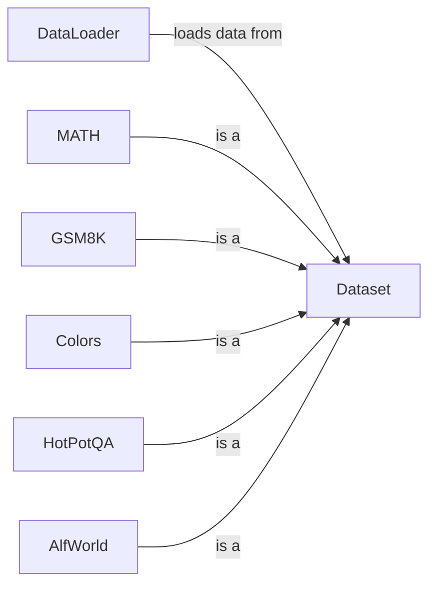

## Component Details

The Data Management component in DSPy provides a set of tools for loading, processing, and managing datasets used for training and evaluating DSPy programs. It offers a unified interface for accessing data from various sources, including local files and Hugging Face datasets. The core functionality includes dataset loading, splitting, sampling, and dataset-specific preprocessing. The component is designed to be extensible, allowing users to easily add support for new dataset formats and sources.

### Dataset
The Dataset class serves as the base class for all datasets within DSPy. It defines common methods for dataset manipulation, such as splitting into training, development, and testing sets, shuffling, sampling, and setting a seed for reproducibility. It provides a consistent interface for interacting with different types of datasets.
- **Related Classes/Methods**: `dspy.datasets.dataset.Dataset`

### DataLoader
The DataLoader class is responsible for loading datasets from various file formats and sources, including Hugging Face datasets, CSV files, Pandas DataFrames, JSON files, Parquet files, and RM format. It provides a unified interface for accessing data regardless of the underlying storage format. It simplifies the process of integrating diverse data sources into DSPy programs.
- **Related Classes/Methods**: `dspy.datasets.dataloader.DataLoader`

### MATH
The MATH class represents the MATH dataset, which contains mathematical problems and solutions. It inherits from the base Dataset class and likely implements dataset-specific preprocessing or evaluation metrics. It provides a structured way to access and utilize the MATH dataset within DSPy.
- **Related Classes/Methods**: `dspy.datasets.math.MATH`

### GSM8K
The GSM8K class represents the GSM8K dataset, which contains grade school math problems. It inherits from the base Dataset class and likely includes dataset-specific preprocessing and an evaluation metric. It provides a structured way to access and utilize the GSM8K dataset within DSPy.
- **Related Classes/Methods**: `dspy.datasets.gsm8k.GSM8K`, `dspy.datasets.gsm8k:gsm8k_metric`

### Colors
The Colors class represents a dataset of colors, potentially used for tasks involving color recognition or generation. It inherits from the base Dataset class and may include specific data transformations or evaluation methods. It provides a structured way to access and utilize the Colors dataset within DSPy.
- **Related Classes/Methods**: `dspy.datasets.colors.Colors`

### HotPotQA
The HotPotQA class represents the HotPotQA dataset, a question answering dataset requiring multi-hop reasoning. It inherits from the base Dataset class and likely includes dataset-specific preprocessing and evaluation metrics. It provides a structured way to access and utilize the HotPotQA dataset within DSPy.
- **Related Classes/Methods**: `dspy.datasets.hotpotqa.HotPotQA`

### AlfWorld
The AlfWorld class represents the AlfWorld dataset, an interactive text-based game environment. It includes methods for interacting with the environment and managing sessions. It provides a structured way to access and utilize the AlfWorld dataset within DSPy.
- **Related Classes/Methods**: `dspy.datasets.alfworld.alfworld.AlfWorld`, `dspy.datasets.alfworld.alfworld.EnvPool`
