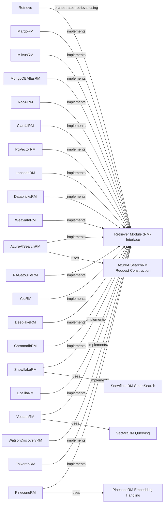

## Component Details

The Knowledge Integration component in DSPy focuses on retrieving relevant information from external sources to enhance program capabilities. The core of this component is the `Retrieve` class, which orchestrates the retrieval process using various Retriever Modules (RMs). These RMs, such as `AzureAISearchRM`, `MarqoRM`, `PineconeRM`, and others, each interface with a specific external knowledge source like vector databases or search engines. The `Retrieve` class takes a query, passes it to the configured RMs, and returns the combined retrieved passages. This allows DSPy programs to dynamically access and incorporate external knowledge, improving their accuracy and adaptability.

### Retrieve
The `Retrieve` class is the central orchestrator for knowledge retrieval. It receives a query and uses one or more Retriever Modules to fetch relevant passages from external sources. It manages the retrieval process and returns the combined results.
- **Related Classes/Methods**: `dspy.retrieve.retrieve.Retrieve`, `dspy.retrieve.retrieve.Retrieve:__call__`, `dspy.retrieve.retrieve.Retrieve:forward`

### Retriever Module (RM) Interface
The Retriever Module (RM) interface defines the contract for interacting with specific external knowledge sources. Each RM implementation is responsible for connecting to and querying its respective source, such as a vector database or search engine. They all implement a `forward` method that takes a query and returns relevant passages.
- **Related Classes/Methods**: `dspy.retrieve.azureaisearch_rm.AzureAISearchRM`, `dspy.retrieve.marqo_rm.MarqoRM`, `dspy.retrieve.milvus_rm.MilvusRM`, `dspy.retrieve.mongodb_atlas_rm.MongoDBAtlasRM`, `dspy.retrieve.neo4j_rm.Neo4jRM`, `dspy.retrieve.clarifai_rm.ClarifaiRM`, `dspy.retrieve.pgvector_rm.PgVectorRM`, `dspy.retrieve.lancedb_rm.LancedbRM`, `dspy.retrieve.databricks_rm.DatabricksRM`, `dspy.retrieve.weaviate_rm.WeaviateRM`, `dspy.retrieve.ragatouille_rm.RAGatouilleRM`, `dspy.retrieve.snowflake_rm.SnowflakeRM`, `dspy.retrieve.vectara_rm.VectaraRM`, `dspy.retrieve.you_rm.YouRM`, `dspy.retrieve.deeplake_rm.DeeplakeRM`, `dspy.retrieve.chromadb_rm.ChromadbRM`, `dspy.retrieve.epsilla_rm.EpsillaRM`, `dspy.retrieve.pinecone_rm.PineconeRM`, `dspy.retrieve.watson_discovery_rm.WatsonDiscoveryRM`, `dspy.retrieve.falkordb_rm.FalkordbRM`

### SnowflakeRM SmartSearch
The `SmartSearch` class within `SnowflakeRM` enhances search capabilities by automatically filtering JSON data. It takes a query and filters the data based on sample values, improving the relevance of search results.
- **Related Classes/Methods**: `dspy.retrieve.snowflake_rm.SmartSearch:__init__`, `dspy.retrieve.snowflake_rm.SmartSearch:forward`

### PineconeRM Embedding Handling
The `PineconeRM` class includes methods for handling embeddings, specifically the `_get_embeddings` method. This method is responsible for generating or retrieving embeddings for the input query, which are then used to perform similarity searches in Pinecone.
- **Related Classes/Methods**: `dspy.retrieve.pinecone_rm.PineconeRM:_get_embeddings`

### VectaraRM Querying
The `VectaraRM` class uses the `_vectara_query` method to interact with the Vectara API. This method constructs and sends the query to Vectara, handles the response, and extracts the relevant passages.
- **Related Classes/Methods**: `dspy.retrieve.vectara_rm.VectaraRM:_vectara_query`

### AzureAISearchRM Request Construction
The `AzureAISearchRM` class uses the `azure_search_request` method to construct the search request to Azure AI Search. This method formats the query and any additional parameters into a request that is compatible with the Azure AI Search API.
- **Related Classes/Methods**: `dspy.retrieve.azureaisearch_rm.AzureAISearchRM:azure_search_request`
