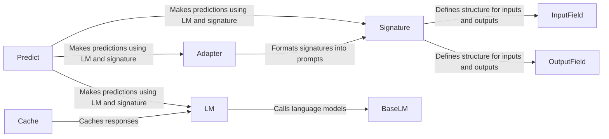

## Component Details

The LM Interaction Management component orchestrates the interaction between the DSPy framework and various Language Models (LMs). It encompasses signature definition, prompt formatting, LM invocation, response parsing, and caching. The core flow involves defining a signature using `Signature` and related classes, adapting this signature into a prompt using an `Adapter`, sending the prompt to an LM via `BaseLM` and its implementations, and then parsing the LM's response back into a structured format. Caching is employed to optimize performance by storing and retrieving LM responses.

### Signature
The `Signature` class and its metaclass `SignatureMeta` define the structure of LM inputs and outputs. It allows for specifying input and output fields, instructions, and other metadata that guide prompt construction and response parsing. It acts as a contract between the program and the LM.
- **Related Classes/Methods**: `dspy.signatures.signature.Signature`, `dspy.signatures.signature.SignatureMeta`

### InputField
The `InputField` class represents an input field in a signature. It defines the type and description of an input field, which is used to format the prompt for the language model.
- **Related Classes/Methods**: `dspy.signatures.field.InputField`

### OutputField
The `OutputField` class represents an output field in a signature. It defines the type and description of an output field, which is used to parse the response from the language model.
- **Related Classes/Methods**: `dspy.signatures.field.OutputField`

### Adapter
The `Adapter` class (and its subclasses like `ChatAdapter` and `JSONAdapter`) is responsible for transforming a `Signature` into a prompt suitable for a specific LM or prompt format. It handles the complexities of prompt engineering and ensures that the LM receives the input in the expected format.
- **Related Classes/Methods**: `dspy.adapters.base.Adapter`, `dspy.adapters.chat_adapter.ChatAdapter`, `dspy.adapters.json_adapter.JSONAdapter`, `dspy.adapters.two_step_adapter.TwoStepAdapter`

### BaseLM
The `BaseLM` class serves as an abstract interface for interacting with different Language Models. It defines the core methods for sending requests to LMs and processing their responses, abstracting away the specific API details of each LM provider.
- **Related Classes/Methods**: `dspy.clients.base_lm.BaseLM`

### LM
The `LM` class is a concrete implementation of `BaseLM` that provides methods for launching, killing, finetuning, and reinforcing language models. It also handles caching of language model responses.
- **Related Classes/Methods**: `dspy.clients.lm.LM`

### Cache
The `Cache` class is responsible for storing and retrieving LM responses to improve efficiency and reduce API costs. It provides a simple interface for caching responses based on the input prompt.
- **Related Classes/Methods**: `dspy.clients.cache.Cache`

### Predict
The `Predict` class orchestrates the entire prediction process. It takes a `Signature`, input values, an `Adapter`, and an `LM`, and uses them to generate a prediction. It formats the input into a prompt, calls the LM, and parses the response.
- **Related Classes/Methods**: `dspy.predict.predict.Predict`
