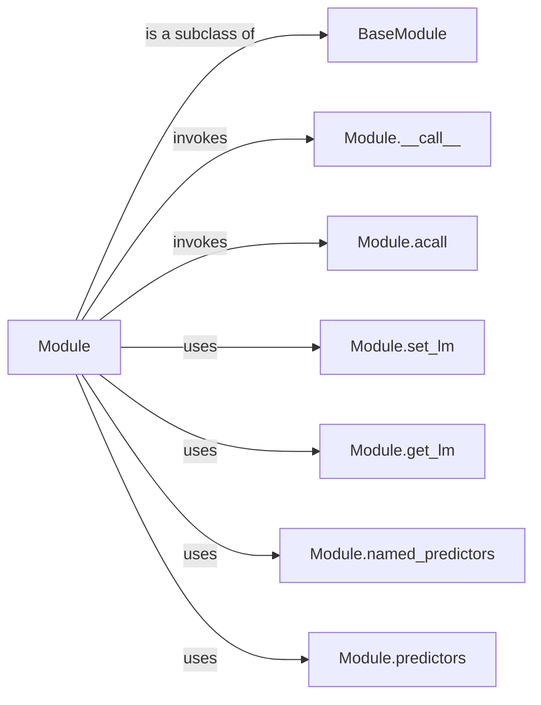

## Component Details

The Module Composition and Execution component in DSPy provides a foundation for building modular and reusable programs. It revolves around the `BaseModule` and `Module` classes, which enable the creation of complex data processing pipelines by composing smaller, self-contained units. Modules encapsulate language model calls, manage parameters and state, and facilitate scalable program design. The core functionality lies in the `Module` class's ability to define and execute program logic through its `__call__` and `acall` methods, interacting with predictors and sub-modules to achieve the desired outcome.

### BaseModule
The `BaseModule` class serves as the foundation for all modules in DSPy. It provides core functionalities for managing parameters, sub-modules, and saving/loading module state. It enables the creation of reusable components with configurable parameters and internal state, forming the building blocks for more complex programs.
- **Related Classes/Methods**: `dspy.primitives.module.BaseModule`

### Module
The `Module` class, a subclass of `BaseModule`, represents a program or a component of a program. It extends `BaseModule` with language model specific functionalities, such as setting and getting the language model (`set_lm`, `get_lm`) and managing predictors (`named_predictors`, `predictors`). It serves as the primary interface for interacting with language models within a DSPy program.
- **Related Classes/Methods**: `dspy.primitives.module.Module`

### Module.__call__
The `__call__` method of the `Module` class is invoked when a `Module` instance is called like a function. It executes the program logic defined within the module, orchestrating the calls to predictors and other sub-modules. This method is central to the execution of DSPy programs, defining the flow of data and control within a module.
- **Related Classes/Methods**: `dspy.primitives.module.Module.__call__`

### Module.acall
The `acall` method is the asynchronous version of the `__call__` method, enabling asynchronous execution of the module's program logic. This allows for non-blocking execution of modules, improving the performance and responsiveness of DSPy programs.
- **Related Classes/Methods**: `dspy.primitives.module.Module.acall`

### Module.set_lm
The `set_lm` method allows setting the language model to be used by the module. This enables dynamic configuration of the language model at runtime, allowing for flexibility in choosing the appropriate language model for a given task.
- **Related Classes/Methods**: `dspy.primitives.module.Module.set_lm`

### Module.get_lm
The `get_lm` method retrieves the language model currently used by the module. This provides access to the configured language model, allowing for inspection and modification of the language model settings.
- **Related Classes/Methods**: `dspy.primitives.module.Module.get_lm`

### Module.named_predictors
The `named_predictors` method returns a list of named predictors within the module. This provides a way to access and manage the predictors used by the module, allowing for inspection and modification of the predictor settings.
- **Related Classes/Methods**: `dspy.primitives.module.Module.named_predictors`

### Module.predictors
The `predictors` method returns a list of predictors within the module. This provides a way to access and manage the predictors used by the module, allowing for inspection and modification of the predictor settings.
- **Related Classes/Methods**: `dspy.primitives.module.Module.predictors`
