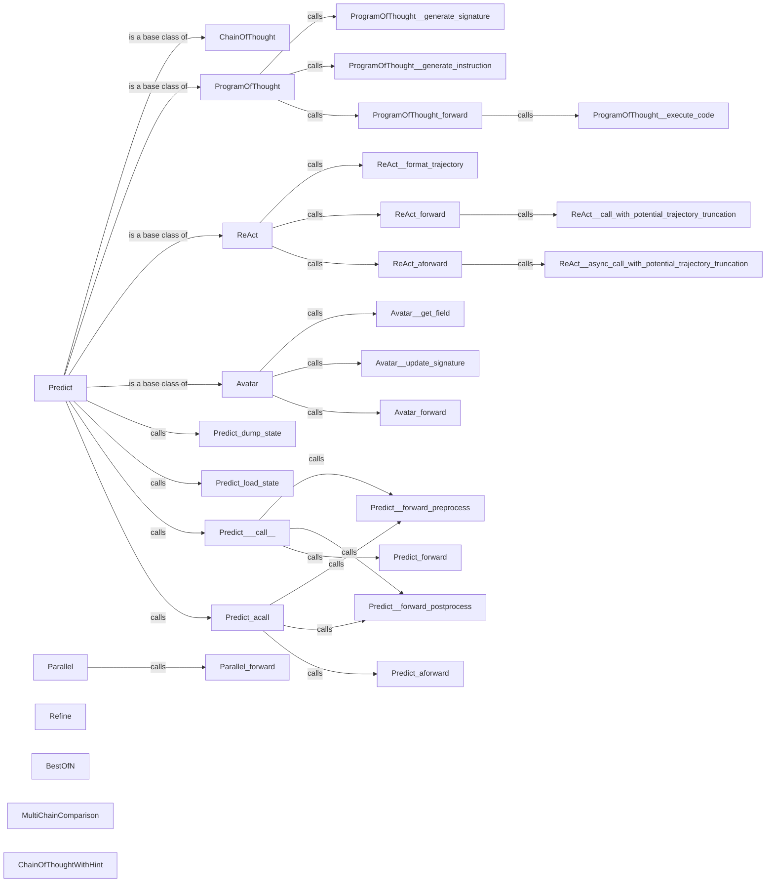

## Component Details

The Prediction Strategies component in DSPy provides a flexible framework for generating predictions using language models. It offers a variety of strategies, each tailored to different prompting and reasoning approaches. The core of this component is the `Predict` class, which serves as a base for other prediction models. Subclasses like `ChainOfThought`, `ProgramOfThought`, `ReAct`, and `Avatar` extend `Predict` to implement specific reasoning patterns. These strategies allow DSPy to tackle complex tasks by leveraging the power of LMs in a structured and controlled manner. The `Parallel`, `Refine`, `BestOfN`, `MultiChainComparison`, and `ChainOfThoughtWithHint` components provide additional ways to enhance and refine the prediction process.

### Predict
The base class for prediction models in dspy. It handles the overall prediction flow, including preprocessing, forward pass execution, and postprocessing. It also manages state dumping and loading.
- **Related Classes/Methods**: `dspy.predict.predict.Predict`, `dspy.predict.predict.Predict:__init__`, `dspy.predict.predict.Predict:__call__`, `dspy.predict.predict.Predict:acall`, `dspy.predict.predict.Predict:_forward_preprocess`, `dspy.predict.predict.Predict:_forward_postprocess`, `dspy.predict.predict.Predict:forward`, `dspy.predict.predict.Predict:aforward`

### ChainOfThought
A prediction model that implements chain-of-thought reasoning. It extends the Predict class and provides a forward pass that generates a chain of intermediate thoughts before producing the final output.
- **Related Classes/Methods**: `dspy.predict.chain_of_thought.ChainOfThought`, `dspy.predict.chain_of_thought.ChainOfThought:__init__`, `dspy.predict.chain_of_thought.ChainOfThought:forward`, `dspy.predict.chain_of_thought.ChainOfThought:aforward`

### ProgramOfThought
A prediction model that executes a program to generate the final output. It involves generating a signature and instruction, and then executing the code.
- **Related Classes/Methods**: `dspy.predict.program_of_thought.ProgramOfThought`, `dspy.predict.program_of_thought.ProgramOfThought:__init__`, `dspy.predict.program_of_thought.ProgramOfThought:_generate_signature`, `dspy.predict.program_of_thought.ProgramOfThought:_generate_instruction`, `dspy.predict.program_of_thought.ProgramOfThought:_execute_code`, `dspy.predict.program_of_thought.ProgramOfThought:forward`

### ReAct
A prediction model that implements the ReAct (Reasoning and Acting) paradigm. It interacts with the environment through a series of reasoning and action steps to achieve a goal.
- **Related Classes/Methods**: `dspy.predict.react.ReAct`, `dspy.predict.react.ReAct:__init__`, `dspy.predict.react.ReAct:_format_trajectory`, `dspy.predict.react.ReAct:forward`, `dspy.predict.react.ReAct:aforward`, `dspy.predict.react.ReAct:_call_with_potential_trajectory_truncation`, `dspy.predict.react.ReAct:_async_call_with_potential_trajectory_truncation`

### Avatar
A prediction model that uses an avatar to interact with the environment. It gets fields, updates signatures, and performs a forward pass.
- **Related Classes/Methods**: `dspy.predict.avatar.avatar.Avatar`, `dspy.predict.avatar.avatar.Avatar:__init__`, `dspy.predict.avatar.avatar.Avatar:_get_field`, `dspy.predict.avatar.avatar.Avatar:_update_signature`, `dspy.predict.avatar.avatar.Avatar:forward`

### Parallel
A prediction model that runs multiple predictions in parallel.
- **Related Classes/Methods**: `dspy.predict.parallel.Parallel`, `dspy.predict.parallel.Parallel:forward`, `dspy.predict.parallel.Parallel:__call__`

### Refine
A prediction model that refines the prediction.
- **Related Classes/Methods**: `dspy.predict.refine.Refine:forward`, `dspy.predict.refine:inspect_modules`, `dspy.predict.refine:recursive_mask`

### BestOfN
A prediction model that returns the best prediction out of N predictions.
- **Related Classes/Methods**: `dspy.predict.best_of_n.BestOfN:forward`

### MultiChainComparison
A prediction model that compares multiple chains of thought.
- **Related Classes/Methods**: `dspy.predict.multi_chain_comparison.MultiChainComparison`, `dspy.predict.multi_chain_comparison.MultiChainComparison:__init__`, `dspy.predict.multi_chain_comparison.MultiChainComparison:forward`

### ChainOfThoughtWithHint
A prediction model that uses chain of thought with a hint.
- **Related Classes/Methods**: `dspy.predict.chain_of_thought_with_hint.ChainOfThoughtWithHint`, `dspy.predict.chain_of_thought_with_hint.ChainOfThoughtWithHint:__init__`, `dspy.predict.chain_of_thought_with_hint.ChainOfThoughtWithHint:forward`
