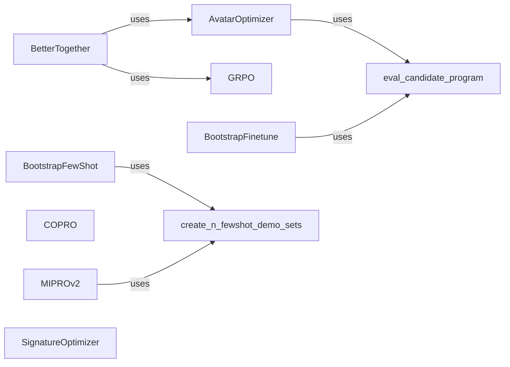

## Component Details

The Prompt Optimization and Teleprompting component in DSPy focuses on automating the process of discovering effective prompts and demonstrations for language models. It encompasses various strategies that aim to improve program performance by optimizing the inputs to LMs. This involves techniques like generating few-shot examples, refining prompts based on validation metrics, and combining multiple optimization strategies to achieve superior results. The core purpose is to enhance the effectiveness and efficiency of language model prompting through automated optimization techniques.

### BootstrapFewShot
BootstrapFewShot is a teleprompter that employs a bootstrap method to generate few-shot examples for prompting. It automates the creation of these examples to enhance prompt effectiveness, thereby improving the performance of language models by providing relevant context.
- **Related Classes/Methods**: `dspy.teleprompt.bootstrap.BootstrapFewShot`, `dspy.teleprompt.utils.create_n_fewshot_demo_sets`

### MIPROv2
MIPROv2 is a teleprompter that utilizes a meta-instruction prompt optimization approach to discover optimal prompts. It optimizes prompts by using meta-instructions to guide the optimization process, aiming to improve the overall performance of language models by refining the instructions provided.
- **Related Classes/Methods**: `dspy.teleprompt.mipro_optimizer_v2.MIPROv2`, `dspy.teleprompt.utils.create_n_fewshot_demo_sets`

### COPRO
COPRO is a teleprompter that employs a contrastive prompt optimization approach to identify optimal prompts. It optimizes prompts by contrasting positive and negative examples, enhancing the language model's ability to distinguish between relevant and irrelevant information, leading to improved performance.
- **Related Classes/Methods**: `dspy.teleprompt.copro_optimizer.COPRO`

### AvatarOptimizer
AvatarOptimizer optimizes prompts by generating positive and negative examples and using them to refine the prompt. It leverages examples to guide the prompt optimization process, improving the quality and relevance of prompts for language models.
- **Related Classes/Methods**: `dspy.teleprompt.avatar_optimizer.AvatarOptimizer`, `dspy.teleprompt.utils.eval_candidate_program`

### GRPO
GRPO (Gradient-based Prompt Optimization) is a technique that uses validation metrics to guide the prompt refinement process. It uses gradients to iteratively improve the prompt based on performance metrics, optimizing the prompt for better language model performance.
- **Related Classes/Methods**: `dspy.teleprompt.grpo.GRPO`

### BetterTogether
BetterTogether combines multiple prompt optimization strategies to achieve better performance than any single strategy alone. It leverages the strengths of different optimization techniques to achieve superior results in language model prompting.
- **Related Classes/Methods**: `dspy.teleprompt.bettertogether.BetterTogether`

### SignatureOptimizer
SignatureOptimizer optimizes the signature of a program to improve its performance. It focuses on optimizing the input and output signatures of the program, enhancing the efficiency and effectiveness of language model interactions.
- **Related Classes/Methods**: `dspy.teleprompt.signature_opt.SignatureOptimizer`

### BootstrapFinetune
BootstrapFinetune is a teleprompter that uses a bootstrap method to generate training data and then finetunes a language model on that data. It automates the process of creating training data and fine-tuning the model for better performance, leading to more accurate and efficient language models.
- **Related Classes/Methods**: `dspy.teleprompt.bootstrap_finetune.BootstrapFinetune`, `dspy.teleprompt.utils.eval_candidate_program`
