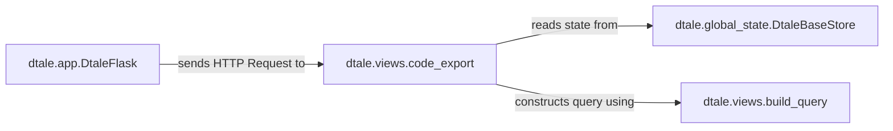

## Details

This analysis maps the conceptual roles involved in the code export feature to specific, verifiable components within the dtale codebase.

### dtale.app.DtaleFlask
The main Flask application class that serves as the web server entry point. It is responsible for routing incoming HTTP requests for code generation to the appropriate view function.

**Related Classes/Methods**:

- <a href="https://github.com/man-group/dtale/blob/master/dtale/app.py#L121-L293" target="_blank" rel="noopener noreferrer">`dtale.app.DtaleFlask` (121:293)</a>

### dtale.views.code_export
The core function that orchestrates the code generation process. Triggered by a frontend request, it retrieves the history of user actions from the session state, constructs the corresponding pandas operations, and assembles them into a complete, executable Python script. This function is the concrete implementation of the "Code Generation Service".

**Related Classes/Methods**:

- `dtale.views.code_export`

### dtale.global_state.DtaleBaseStore
An abstract base class defining the interface for session state management. It stores the sequence of data transformations, filters, and other operations performed by the user. Concrete implementations (`DtaleShelf`, `DtaleRedis`) provide the actual storage mechanism.

**Related Classes/Methods**:

- <a href="https://github.com/man-group/dtale/blob/master/dtale/global_state.py#L246-L248" target="_blank" rel="noopener noreferrer">`dtale.global_state.DtaleBaseStore` (246:248)</a>
- <a href="https://github.com/man-group/dtale/blob/master/dtale/global_state.py#L775-L824" target="_blank" rel="noopener noreferrer">`dtale.global_state.use_shelve_store.DtaleShelf` (775:824)</a>

### dtale.views.build_query
A utility function that constructs a pandas `DataFrame.query()` string from the filter state stored in the user's session. It iterates through active filters, invoking the appropriate filter logic to build the final query expression. This function is a key part of the "Query Builder" role.

**Related Classes/Methods**:

- `dtale.views.build_query`
- <a href="https://github.com/man-group/dtale/blob/master/dtale/column_filters.py#L27-L66" target="_blank" rel="noopener noreferrer">`dtale.column_filters.ColumnFilter` (27:66)</a>

### [FAQ](https://github.com/CodeBoarding/GeneratedOnBoardings/tree/main?tab=readme-ov-file#faq)