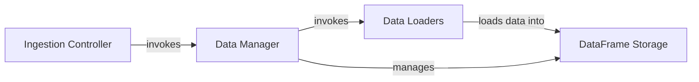

## Details

One paragraph explaining the functionality which is represented by this graph. What the main flow is and what is its purpose.

### Ingestion Controller
The primary Flask view that serves as the entry point for creating a D-Tale instance. It handles initial HTTP requests, parses parameters, and orchestrates the data loading process by invoking the Data Manager.

**Related Classes/Methods**:

- <a href="https://github.com/man-group/dtale/blob/master/dtale/app.py#L1-L1" target="_blank" rel="noopener noreferrer">`dtale.app.DtaleFlask.view_iframe` (1:1)</a>

### Data Manager
A central class that encapsulates a pandas DataFrame and its associated metadata. It contains the primary logic for data loading, storing the DataFrame, and managing its lifecycle within a global state.

**Related Classes/Methods**:

- <a href="https://github.com/man-group/dtale/blob/master/dtale/global_state.py#L44-L145" target="_blank" rel="noopener noreferrer">`dtale.global_state.DtaleInstance` (44:145)</a>

### Data Loaders
A set of functions responsible for loading data from various formats (e.g., CSV, DataFrame, Arctic) into a standardized pandas DataFrame. These loaders are invoked by the Data Manager during its initialization.

**Related Classes/Methods**:

- <a href="https://github.com/man-group/dtale/blob/master/dtale/global_state.py#L1-L1" target="_blank" rel="noopener noreferrer">`dtale.global_state.load_data` (1:1)</a>

### DataFrame Storage
The in-memory data store, implemented as a pandas DataFrame. This component represents the final, standardized state of the ingested data, ready for analysis and visualization. It is held and managed by the Data Manager (`DtaleInstance`).

**Related Classes/Methods**:

- <a href="https://github.com/man-group/dtale/blob/master/dtale/global_state.py#L1-L1" target="_blank" rel="noopener noreferrer">`dtale.global_state.DtaleData` (1:1)</a>

### [FAQ](https://github.com/CodeBoarding/GeneratedOnBoardings/tree/main?tab=readme-ov-file#faq)